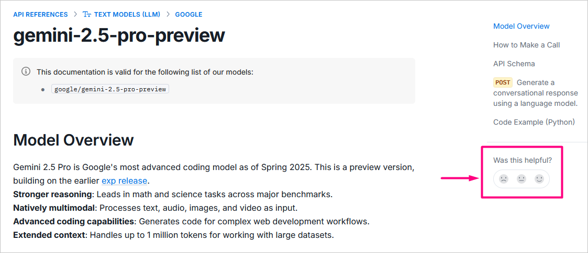

# 🧭 Documentation Map

This documentation portal is designed to help you choose and configure the AI **model** that best suits your needs—or one of our **solutions** (ready-to-use tools for specific practical tasks) from our available options and correctly integrate it into your code.&#x20;

Have suggestions for improvement? [**Let us know!**](https://forms.aimlapi.com/doc)

***

<table data-header-hidden data-full-width="false"><thead><tr><th width="281.09991455078125" valign="top"></th><th valign="top"></th></tr></thead><tbody><tr><td valign="top">

<strong>Start with this code block</strong>   🪁 Step-by-step example:

<a href="quickstart/setting-up.md">Setting Up</a>  🪁 Choose the SDK to use:

<a href="quickstart/supported-sdks.md">Supported SDKs</a>
</td><td valign="top"><pre class="language-python" data-overflow="wrap"><code class="lang-python">from openai import OpenAI

client = OpenAI(
    base_url="https://api.aimlapi.com/v1",
    api_key="&#x3C;YOUR_AIMLAPI_KEY>",    
)

response = client.chat.completions.create(
    model="gpt-4o",
    messages=[{"role": "user", "content": "Write a one-sentence story about numbers."}]
)

print(response.choices[0].message.content)
</code></pre></td></tr></tbody></table>

***

## Browse Models

Popular         |         [View all 200+ models >](api-references/model-database.md)

<table data-view="cards"><thead><tr><th></th><th></th><th></th><th data-hidden data-card-target data-type="content-ref"></th></tr></thead><tbody><tr><td><a href="api-references/text-models-llm/OpenAI/">ChatGPT</a></td><td></td><td></td><td><a href="api-references/text-models-llm/OpenAI/">OpenAI</a></td></tr><tr><td><a href="api-references/text-models-llm/DeepSeek/">DeepSeek</a></td><td></td><td></td><td><a href="api-references/text-models-llm/DeepSeek/">DeepSeek</a></td></tr><tr><td><a href="api-references/image-models/flux/">Flux</a></td><td></td><td></td><td><a href="api-references/image-models/flux/">flux</a></td></tr></tbody></table>

Select the model by its **Task**, by its **Developer** or by the supported **Capabilities**:


If you've already made your choice and know the model ID, use the [Search panel](https://docs.aimlapi.com/?q=) on your right.





[text-models-llm](api-references/text-models-llm/)



[image-models](api-references/image-models/)



[video-models](api-references/video-models/)



[music-models](api-references/music-models/)



[speech-models](api-references/speech-models/)



[moderation-safety-models](api-references/moderation-safety-models/)



[3d-generating-models](api-references/3d-generating-models/)



[vision-models](api-references/vision-models/)



[embedding-models](api-references/embedding-models/)




**Alibaba Cloud**:  [Text/Chat](api-references/text-models-llm/Alibaba-Cloud/)    [Image](api-references/video-models/alibaba-cloud/)    [Video](api-references/image-models/alibaba-cloud/)

**Anthracite**:    [Text/Chat](api-references/text-models-llm/Anthracite/)

<mark style="background-color:green;">**Anthropic**</mark>:    [Text/Chat](api-references/text-models-llm/Anthropic/)    [Embedding](api-references/embedding-models/Anthropic/)&#x20;

**Assembly AI:**    [Speech-To-Text](api-references/speech-models/speech-to-text/assembly-ai/)

**BAAI**:    [Embedding](api-references/embedding-models/BAAI/)

**ByteDance**:   [Image](api-references/video-models/bytedance/)   [Video](api-references/image-models/bytedance/)

**Cohere**:    [Text/Chat](api-references/text-models-llm/Cohere/)

<mark style="background-color:green;">**DeepSeek**</mark>:    [Text/Chat](api-references/text-models-llm/DeepSeek/)

**Deepgram**:    [Speech-To-Text](api-references/speech-voice-models/stt/Deepgram/)    [Text-to-Speech](api-references/speech-voice-models/tts/Deepgram/)

<mark style="background-color:green;">**ElevenLabs**</mark>**:**    [Text-to-Speech](api-references/speech-models/text-to-speech/elevenlabs/)   [Voice Chat](api-references/speech-models/voice-chat/elevenlabs/)    [Music](api-references/music-models/elevenlabs/)&#x20;

<mark style="background-color:green;">**Flux**</mark>:    [Image](api-references/image-models/flux/)

**Google**:    [Text/Chat](api-references/text-models-llm/Google/)   [Image](api-references/image-models/google/)   [Video](api-references/video-models/google/)   [Music](api-references/vision-models/ocr-optical-character-recognition/google/)   [Vision(OCR)](api-references/music-models/google/)   [Embedding](api-references/embedding-models/Google/)

<mark style="background-color:green;">**Kling AI**</mark>:    [Video](api-references/video-models/Kling-AI/)

**Meta**:    [Text/Chat](api-references/text-models-llm/Meta/)

<mark style="background-color:green;">**MiniMax**</mark>:    [Text/Chat](api-references/text-models-llm/MiniMax/)   [Video](api-references/video-models/MiniMax/)   [Music](api-references/music-models/MiniMax/)   [Voice-Chat](api-references/speech-models/voice-chat/)

**Mistral AI**:    [Text/Chat](api-references/text-models-llm/Mistral-AI/)   [Vision(OCR)](api-references/vision-models/ocr-optical-character-recognition/mistral-ai/)

**NVIDIA**:    [Text/Chat](api-references/text-models-llm/NVIDIA/)

<mark style="background-color:green;">**OpenAI**</mark>:    [Text/Chat](api-references/text-models-llm/OpenAI/)   [Image](api-references/image-models/OpenAI/)   [Speech-To-Text](api-references/speech-voice-models/stt/OpenAI/)   [Embedding](api-references/embedding-models/OpenAI/)

**Perplexity**:    [Text/Chat](api-references/text-models-llm/perplexity/)

**RecraftAI**:    [Image](api-references/image-models/RecraftAI/)

**Runway**:    [Video](api-references/video-models/runway/)

<mark style="background-color:green;">**Stability AI**</mark>:    [Image](api-references/image-models/Stability-AI/)   [Music](api-references/music-models/Stability-AI/)   [3D-Generation](api-references/3d-generating-models/Stability-AI/)

**Together AI**:    [Embedding](api-references/embedding-models/Together-AI/)

**xAI**:    [Text/Chat](api-references/text-models-llm/xAI/)

**Zhipu**:    [Text/Chat](api-references/text-models-llm/zhipu/)




[completion-or-chat-models.md](capabilities/completion-or-chat-models.md)



[streaming-mode.md](capabilities/streaming-mode.md)



[code-generation.md](capabilities/code-generation.md)



[thinking-reasoning.md](capabilities/thinking-reasoning.md)



[function-calling.md](capabilities/function-calling.md)



[image-to-text-vision.md](capabilities/image-to-text-vision.md)



[web-search.md](capabilities/web-search.md)




## Browse Solutions

* [AI Search Engine](solutions/ai-search-engine/) – if you need to create a project where information must be found on the internet and then presented to you in a structured format, use this solution.
* [OpenAI Assistants](solutions/openai/assistants/) – if you need to create tailored AI Assistants capable of handling customer support, data analysis, content generation, and more.&#x20;

***

## Going Deeper

<table data-header-hidden data-full-width="false"><thead><tr><th width="409.4000244140625"></th><th valign="top"></th></tr></thead><tbody><tr><td>
<strong>Use more text model capabilities in your project:</strong>  📖 <a href="capabilities/completion-or-chat-models.md">​Completion and Chat Completion</a>

📖 <a href="capabilities/function-calling.md">Function Calling</a>

📖 <a href="capabilities/streaming-mode.md">Streaming Mode</a>

📖 <a href="capabilities/image-to-text-vision.md">Vision in Text Models (Image-to-Text)</a>

📖 <a href="capabilities/code-generation.md">Code Generation</a>

📖 <a href="capabilities/thinking-reasoning.md">Thinking / Reasoning</a>

📖 <a href="capabilities/web-search.md">Web Search</a>  
</td><td valign="top">
<strong>Miscellaneous</strong>:  🔗  <a href="broken-reference">Integrations</a>

📗   <a href="broken-reference">Glossary</a>

⚠️  <a href="broken-reference">Errors and Messages</a>

❓    <a href="broken-reference">FAQ</a> ​

 
</td></tr><tr><td><strong>Learn more about developer-specific features:</strong>  📖 <a href="capabilities/anthropic.md">Features of Anthropic Models</a> </td><td valign="top"></td></tr></tbody></table>

## Have a Minute? Help Make the Docs Better!

We’re currently working on improving our documentation portal, and your feedback would be **incredibly** helpful! Take [**a quick 5-question survey**](https://tally.so/r/w4G9Er) (no personal info required!)

You can also rate each individual page using the built-in form on the right side of the screen:

<figure><figcaption></figcaption></figure>
