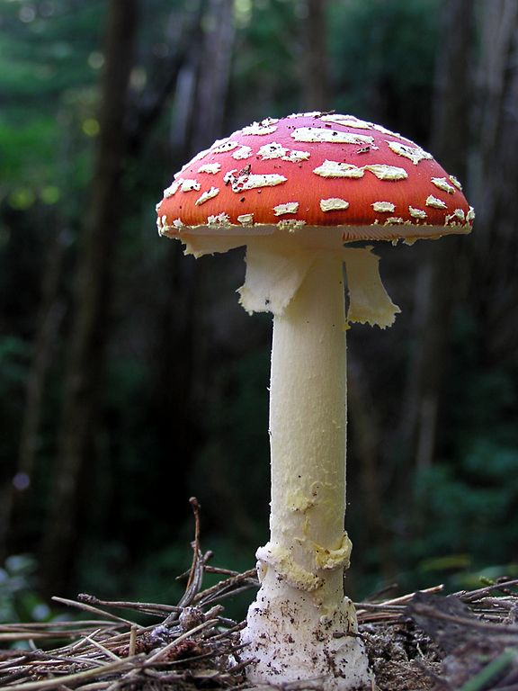

# triposr


{% column width="66.66666666666666%" %}

This documentation is valid for the following list of our models:

* `triposr`



{% column width="33.33333333333334%" %}
<a href="https://aimlapi.com/app/triposr" class="button primary">Try in Playground</a>



## Model Overview

A transformer-based model designed for rapid 3D object reconstruction from a single RGB image, capable of generating high-quality 3D meshes in under 0.5 seconds on an NVIDIA A100 GPU.

## Setup your API Key

If you don’t have an API key for the AI/ML API yet, feel free to use our [Quickstart guide](https://docs.aimlapi.com/quickstart/setting-up).

## API Schema


[OpenAPI triposr](https://raw.githubusercontent.com/aimlapi/api-docs/refs/heads/main/docs/api-references/3d-generating-models/Stability-AI/triposr.json)


## Example




```python
import requests
import json  # for getting a structured output with indentation 

def main():
    response = requests.post(
        "https://api.aimlapi.com/v1/images/generations",
        headers={
            # Insert your AIML API Key instead of <YOUR_AIMLAPI_KEY>:
            "Authorization": "Bearer <YOUR_AIMLAPI_KEY>",
            "Content-Type": "application/json",
        },
        json={
            "model": "triposr",
            "image_url": "https://raw.githubusercontent.com/aimlapi/api-docs/main/reference-files/mushroom.jpg",
        },
    )

    data = response.json()
    print(json.dumps(data, indent=2, ensure_ascii=False))


if __name__ == "__main__":
    main()
```





```javascript
async function main() {
  const response = await fetch("https://api.aimlapi.com/v1/images/generations", {
    method: "POST",
    headers: {
      // Insert your AIML API Key instead of <YOUR_AIMLAPI_KEY>
      "Authorization": "Bearer <YOUR_AIMLAPI_KEY>",
      "Content-Type": "application/json",
    },
    body: JSON.stringify({
      model: "triposr",
      image_url: "https://raw.githubusercontent.com/aimlapi/api-docs/main/reference-files/mushroom.jpg",
    }),
  });

  // Optional error handling (similar to raise_for_status)
  if (!response.ok) {
    const errorText = await response.text();
    throw new Error(`Request failed: ${response.status} ${errorText}`);
  }

  const data = await response.json();
  console.log(JSON.stringify(data, null, 2));
}

main().catch(console.error);
```




<details>

<summary>Response</summary>


```json5
{
  "model_mesh": {
    "url": "https://cdn.aimlapi.com/flamingo/files/b/0a93d66e/obumlgU3dCJFg0B-km4Yi_model.glb",
    "content_type": "application/octet-stream",
    "file_name": "model.glb",
    "file_size": 1291912
  },
  "timings": {
    "prepare": 3.6838808893226087,
    "generation": 0.0709337661974132,
    "export": 0.6907037640921772
  },
  "remeshing_dir": null,
  "requestId": "019d2ee5-582a-7c83-93f2-2fcbad002d43",
  "meta": {
    "usage": {
      "credits_used": 182000
    }
  }
}
```


</details>

The example returns a textured 3D mesh in GLB file format.

For clarity, we took several screenshots of our mushroom from different angles in an online GLB viewer. As you can see, the model understands the shape, but preserving the pattern on the back side (which was not visible on the reference image) could be improved:

<table data-header-hidden><thead><tr><th valign="top"></th><th></th><th></th></tr></thead><tbody><tr><td valign="top"></td><td></td><td></td></tr></tbody></table>

Compare them with [the reference image](https://raw.githubusercontent.com/aimlapi/api-docs/main/reference-files/mushroom.jpg):

<table data-header-hidden><thead><tr><th width="279"></th><th data-hidden></th><th data-hidden></th></tr></thead><tbody><tr><td></td><td></td><td></td></tr></tbody></table>


Try to choose reference images where the target object is not obstructed by other objects and does not blend into the background. Depending on the complexity of the object, you may need to experiment with the resolution of the reference image to achieve a satisfactory mesh.

