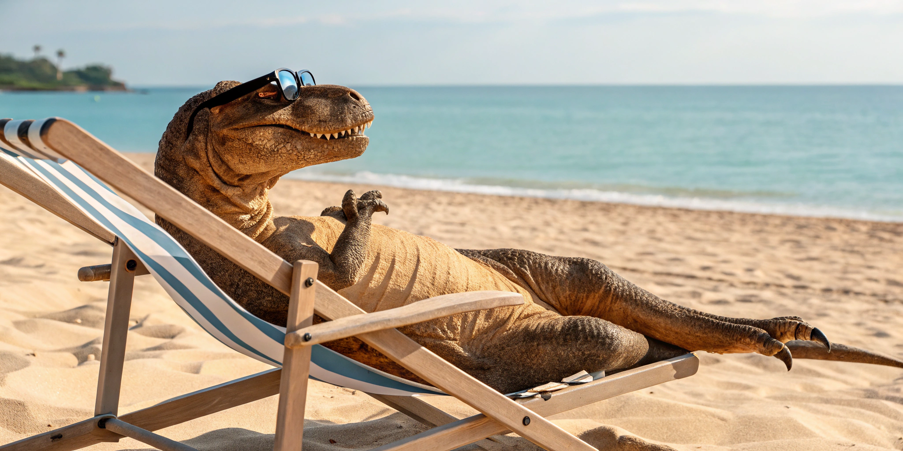
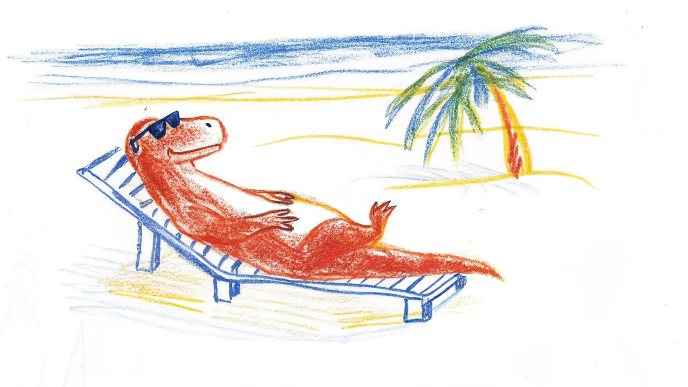
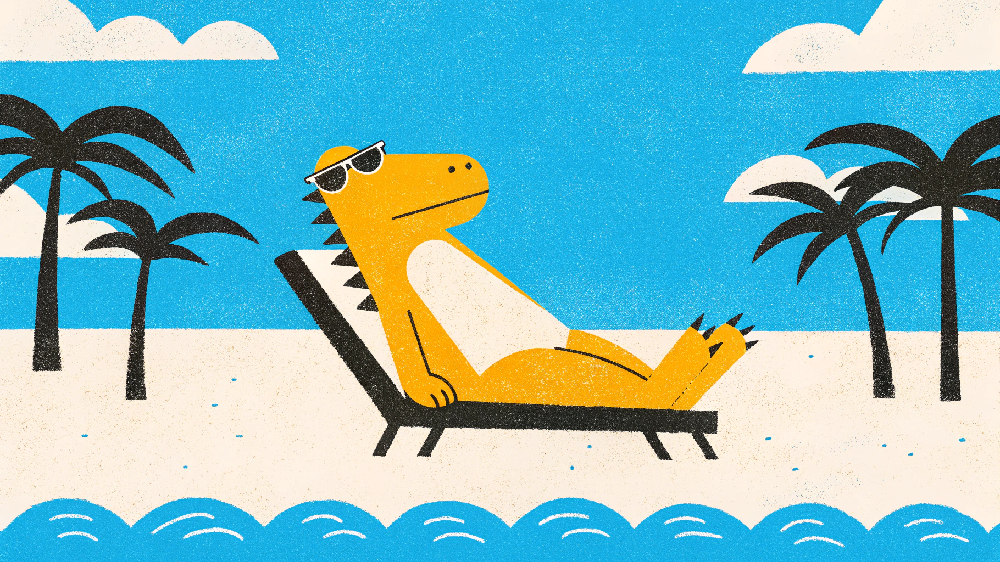
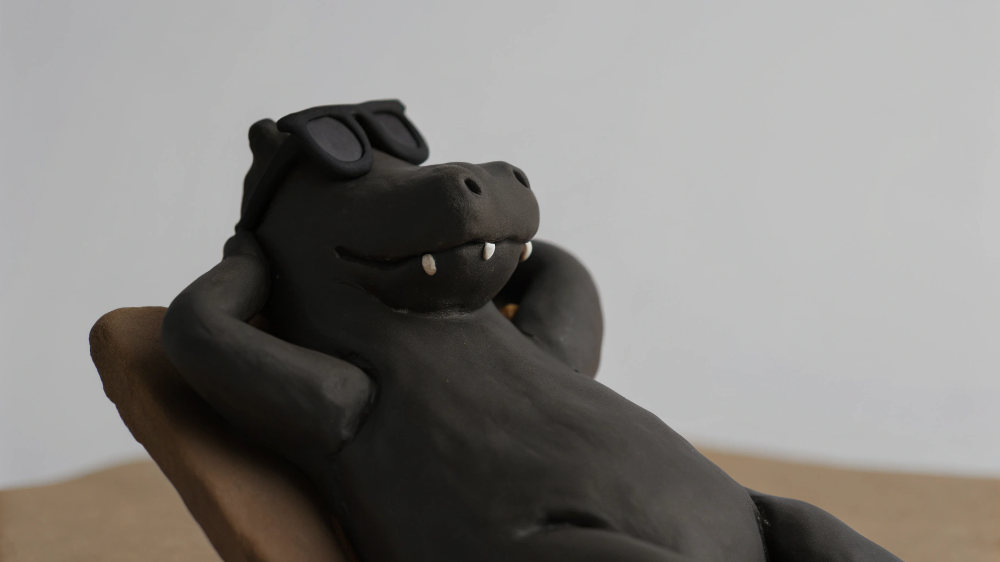

# Recraft v3


This documentation is valid for the following list of our models:

* `recraft-v3`


## Model Overview

A state-of-the-art image generation model specifically designed for professional designers, featuring advanced text generation capabilities, anatomical accuracy, and precise style control. It stands out for its ability to generate images with extended text content and vector art support.

## Setup your API Key

If you don’t have an API key for the AI/ML API yet, feel free to use our [Quickstart guide](https://docs.aimlapi.com/quickstart/setting-up).

## API Schema


[OpenAPI recraft-v3](https://raw.githubusercontent.com/aimlapi/api-docs/refs/heads/main/docs/api-references/image-models/RecraftAI/recraft-v3.json)


## Quick Example

Let's generate an image using a simple prompt.




```python
import requests
import json

def main():
    response = requests.post(
        "https://api.aimlapi.com/v1/images/generations",
        headers={
            # Insert your AIML API Key instead of <YOUR_AIMLAPI_KEY>:
            "Authorization": "Bearer <YOUR_AIMLAPI_KEY>",
            "Content-Type": "application/json",
        },
        json={
            "prompt": "A T-Rex relaxing on a beach, lying on a sun lounger and wearing sunglasses.",
            "model": "recraft-v3"
        }
    )

    data = response.json()
    print(json.dumps(data, indent=2, ensure_ascii=False))

if __name__ == "__main__":
    main()
```





```javascript
async function main() {
  const response = await fetch('https://api.aimlapi.com/v1/images/generations', {
    method: 'POST',
    headers: {
      // Insert your AIML API Key instead of <YOUR_AIMLAPI_KEY>:
      'Authorization': 'Bearer <YOUR_AIMLAPI_KEY>',
      'Content-Type': 'application/json',
    },
    body: JSON.stringify({
      model: 'recraft-v3',
      prompt: 'A T-Rex relaxing on a beach, lying on a sun lounger and wearing sunglasses. Realistic photo.',
      
    }),
  });

  const data = await response.json();
  console.log(data);
}

main();
```




<details>

<summary>Response</summary>


```json5
{
  images: [
    {
      url: 'https://cdn.aimlapi.com/eagle/files/koala/Z1MUK5lqaL70uC5Mn6Rlj_image.webp',
      content_type: 'image/webp',
      file_name: 'image.webp',
      file_size: 347808
    }
  ]
}
```


</details>

We obtained the following 2048x1024 image by running this code example:

<figure><figcaption></figcaption></figure>

One of **recraft-v3**’s strengths is its wide range of supported styles. By default, it generates realistic images, but we tried a few others—here’s what we got:

<details>

<summary>Style Experiments</summary>

<figure><figcaption><p><code>"style": "digital_illustration/infantile_sketch"</code></p></figcaption></figure>

<figure><figcaption><p><code>"style": "vector_illustration"</code></p></figcaption></figure>


When the `'vector_illustration'` style is selected, the model generates an SVG vector format! For preview purposes, we took a screenshot  ☝️️


<figure><figcaption><p><code>"style": "digital_illustration/2d_art_poster"</code></p></figcaption></figure>

<figure><figcaption><p><code>"style": "digital_illustration/handmade_3d"</code></p></figcaption></figure>

</details>
