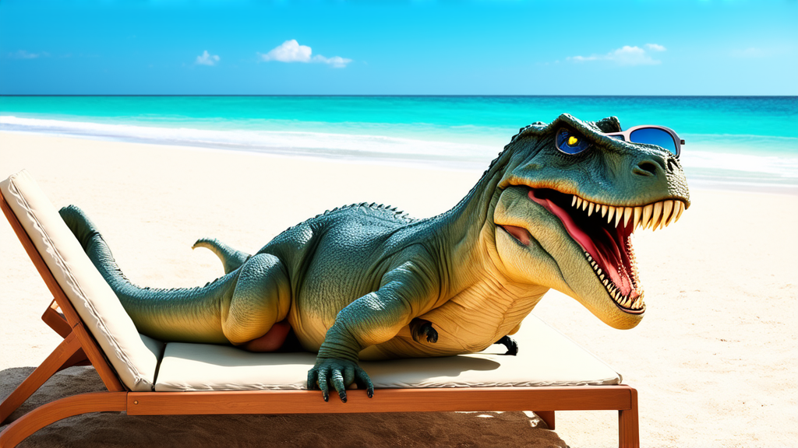

# Stable Diffusion v3 Medium


This documentation is valid for the following list of our models:

* `stable-diffusion-v3-medium`


## Model Overview

An advanced text-to-image generation model that utilizes a Multimodal Diffusion Transformer (MMDiT) architecture to produce high-quality images from textual descriptions.

## Setup your API Key

If you don’t have an API key for the AI/ML API yet, feel free to use our [Quickstart guide](https://docs.aimlapi.com/quickstart/setting-up).

## API Schema


[OpenAPI stable-diffusion-v3-medium](https://raw.githubusercontent.com/aimlapi/api-docs/refs/heads/main/docs/api-references/image-models/Stability-AI/stable-diffusion-v3-medium.json)


## Quick Example

Let's generate an image using a simple prompt.




```python
import requests
import json

def main():
    response = requests.post(
        "https://api.aimlapi.com/v1/images/generations",
        headers={
            # Insert your AIML API Key instead of <YOUR_AIMLAPI_KEY>:
            "Authorization": "Bearer <YOUR_AIMLAPI_KEY>",
            "Content-Type": "application/json",
        },
        json={
            "prompt": "A T-Rex relaxing on a beach, lying on a sun lounger and wearing sunglasses.",
            "model": "stable-diffusion-v3-medium",
            "image_size": "landscape_16_9"
        }
    )

    data = response.json()
    print(json.dumps(data, indent=2, ensure_ascii=False))

if __name__ == "__main__":
    main()
```





```javascript
async function main() {
  const response = await fetch('https://api.aimlapi.com/v1/images/generations', {
    method: 'POST',
    headers: {
      // Insert your AIML API Key instead of <YOUR_AIMLAPI_KEY>:
      'Authorization': 'Bearer <YOUR_AIMLAPI_KEY>',
      'Content-Type': 'application/json',
    },
    body: JSON.stringify({
      model: 'stable-diffusion-v3-medium',
      prompt: 'A T-Rex relaxing on a beach, lying on a sun lounger and wearing sunglasses. Realistic photo.',
      image_size: 'landscape_16_9'
    }),
  });

  const data = await response.json();
  console.log(data);
}

main();
```




<details>

<summary>Response</summary>


```json5
{
  images: [
    {
      url: 'https://cdn.aimlapi.com/squirrel/files/monkey/pAs554_StzWBkrLMgTH5a.png',
      width: 1024,
      height: 576,
      content_type: 'image/jpeg'
    }
  ],
  timings: { inference: 1.1477893170085736 },
  seed: 3544609846964942300,
  has_nsfw_concepts: [ false ],
  prompt: 'A T-Rex relaxing on a beach, lying on a sun lounger and wearing sunglasses. Realistic photo.',
  num_images: 1
}
```


</details>

We obtained the following 1024x576 image by running this code example:

<figure><figcaption><p><code>"A T-Rex relaxing on a beach, lying on a sun lounger and wearing sunglasses."</code></p></figcaption></figure>
