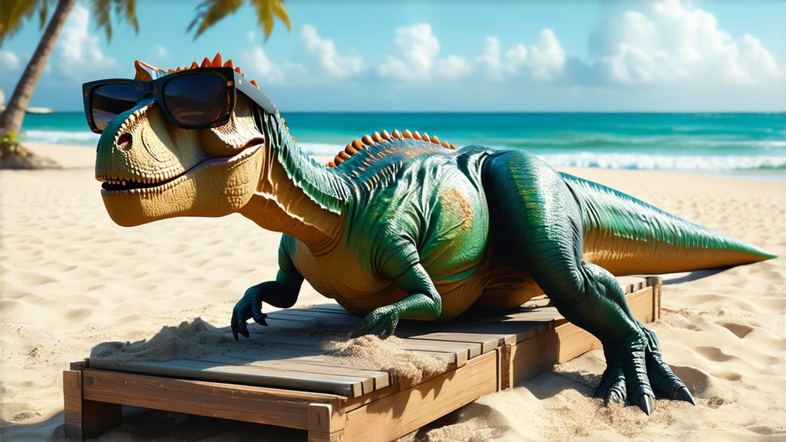
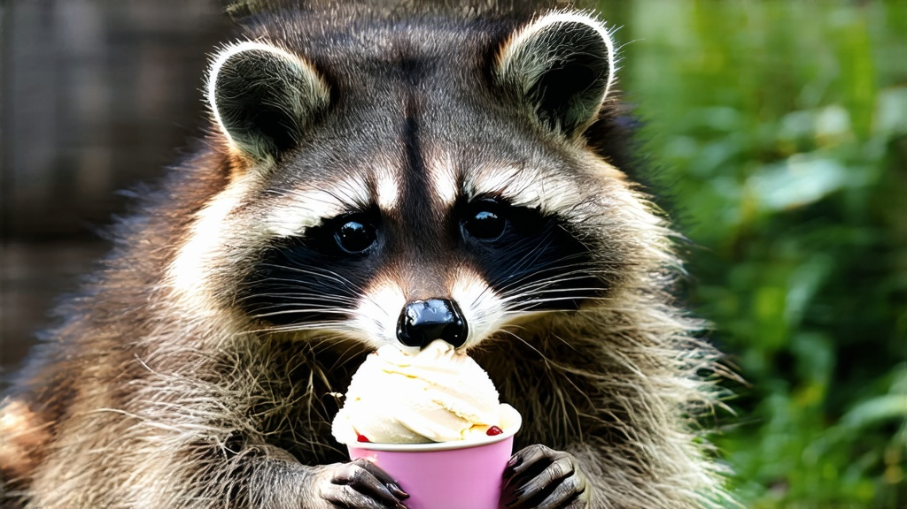
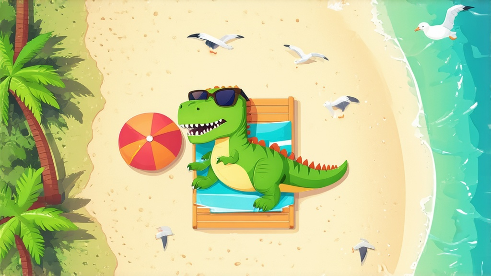

# Stable Diffusion v3.5 Large


This documentation is valid for the following list of our models:

* `stable-diffusion-v35-large`


## Model Overview

A state-of-the-art text-to-image generative model designed to create high-resolution images based on textual prompts. It excels in producing diverse and high-quality outputs, making it suitable for professional applications.

## Setup your API Key

If you don’t have an API key for the AI/ML API yet, feel free to use our [Quickstart guide](https://docs.aimlapi.com/quickstart/setting-up).

## API Schema


[OpenAPI stable-diffusion-v35-large](https://raw.githubusercontent.com/aimlapi/api-docs/refs/heads/main/docs/api-references/image-models/Stability-AI/stable-diffusion-v35-large.json)


## Quick Example

Let's generate an image using a simple prompt.




```python
import requests


def main():
    response = requests.post(
        "https://api.aimlapi.com/v1/images/generations",
        headers={
            # Insert your AIML API Key instead of <YOUR_AIMLAPI_KEY>:
            "Authorization": "Bearer <YOUR_AIMLAPI_KEY>",
            "Content-Type": "application/json",
        },
        json={
            "prompt": "A T-Rex relaxing on a beach, lying on a sun lounger and wearing sunglasses.",
            "model": "stable-diffusion-v35-large",
            "image_size": "landscape_16_9"
            "num_inference_steps": 40,
        }
    )

    response.raise_for_status()
    data = response.json()

    print("Generation:", data)


if __name__ == "__main__":
    main()
```





```javascript
async function main() {
  try {
    const response = await fetch('https://api.aimlapi.com/v1/images/generations', {
      method: 'POST',
      headers: {
        // Insert your AIML API Key instead of <YOUR_AIMLAPI_KEY>:
        'Authorization': 'Bearer <YOUR_AIMLAPI_KEY>',
        'Content-Type': 'application/json',
      },
      body: JSON.stringify({
        prompt: 'A T-Rex relaxing on a beach, lying on a sun lounger and wearing sunglasses.',
        model: 'stable-diffusion-v35-large',
        image_size: 'landscape_16_9',
        num_inference_steps: 40,
      }),
    });

    if (!response.ok) {
      throw new Error(`HTTP error! Status: ${response.status}`);
    }

    const data = await response.json();
    console.log('Generation:', data);

  } catch (error) {
    console.error('Error:', error);
  }
}

main();
```




<details>

<summary>Response</summary>


```json5
Generation: {'images': [{'url': 'https://cdn.aimlapi.com/eagle/files/elephant/j_c4eu3gJwADYRTb7_3M1.jpeg', 'width': 1024, 'height': 576, 'content_type': 'image/jpeg'}], 'timings': {'inference': 4.801230997079983}, 'seed': 5821854872171531000, 'has_nsfw_concepts': [False], 'prompt': 'A T-Rex relaxing on a beach, lying on a sun lounger and wearing sunglasses.'}
```


</details>

We obtained the following 1024x576 image by running this code example:

<figure><figcaption><p><code>"A T-Rex relaxing on a beach, lying on a sun lounger and wearing sunglasses."</code></p></figcaption></figure>

<details>

<summary>Extra pictures</summary>

<figure><figcaption><p><code>"A highly detailed T-Rex relaxing on a sunny beach, lying on a wooden sun lounger and wearing stylish sunglasses. Its skin is covered in realistic, finely textured scales with natural color variations — rough and weathered like that of large reptiles. Sunlight reflects subtly off the individual scales. The background includes palm trees, gentle waves, and soft sand partially covering the T-Rex's feet. The scene is rendered with cinematic lighting and a natural color palette."</code><br><code>"num_inference_steps": 40</code></p></figcaption></figure>

<figure><figcaption><p><code>"Racoon eating ice-cream"</code></p></figcaption></figure>

<figure><figcaption><p><code>"A T-Rex relaxing on a beach, lying on a sun lounger and wearing sunglasses. Vector illustration style. Top-down view, with visible palm trees, seagulls, and a strip of water."</code><br><code>"num_inference_steps": 40</code></p></figcaption></figure>

</details>
