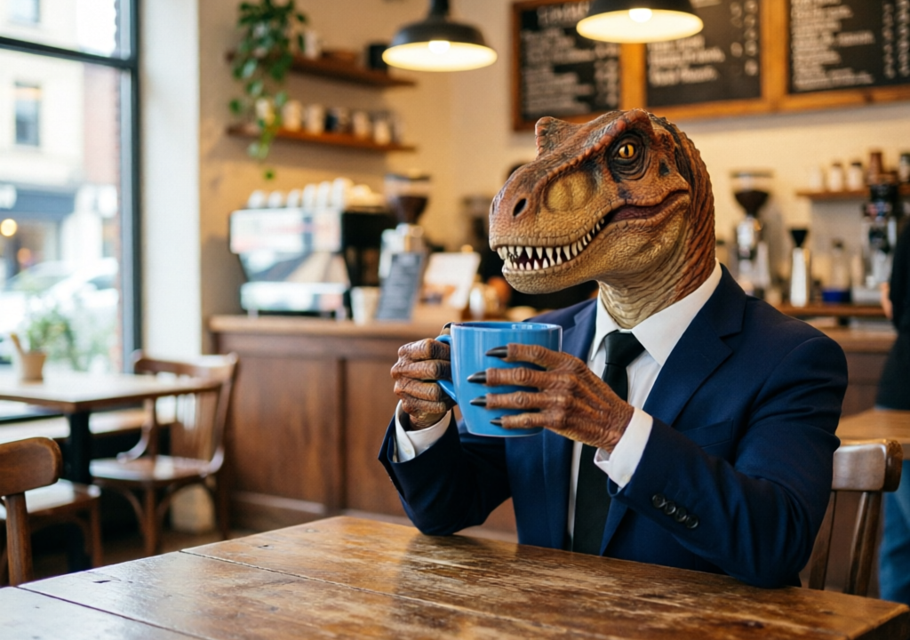

# qwen-image-2.0


{% column width="66.66666666666666%" %}

This documentation is valid for the following list of our models:

* `alibaba/qwen-image-2-0`



{% column width="33.33333333333334%" %}
<a href="https://aimlapi.com/app/qwen-image-2-0" class="button primary">Try in Playground</a>



## Model Overview

A text-to-image model designed for accurate text rendering and general image generation. \
It provides good quality outputs with strong prompt adherence.

## Setup your API Key

If you don’t have an API key for the AI/ML API yet, feel free to use our [Quickstart guide](https://docs.aimlapi.com/quickstart/setting-up).

## API Schema


[OpenAPI qwen-image-2-0](https://raw.githubusercontent.com/aimlapi/api-docs/refs/heads/main/docs/api-references/image-models/Alibaba-Cloud/qwen-image-2-0.json)


## Quick Example

Let's generate an image of the specified size using a simple prompt.




```python
import requests
import json  # for getting a structured output with indentation

def main():
    response = requests.post(
        "https://api.aimlapi.com/v1/images/generations",
        headers={
            # Insert your AIML API Key instead of <YOUR_AIMLAPI_KEY>:
            "Authorization": "Bearer <YOUR_AIMLAPI_KEY>",
            "Content-Type": "application/json",
        },
        json={
            "model": "alibaba/qwen-image-2-0",
            "prompt": "Combine the images so the dino is wearing a business suit, sitting in a cozy small café, drinking from the mug. Blur the background slightly to create a bokeh effect.",
            "image_urls": [
                "https://raw.githubusercontent.com/aimlapi/api-docs/main/reference-files/t-rex.png",
                "https://raw.githubusercontent.com/aimlapi/api-docs/main/reference-files/blue-mug.jpg"
            ],
            "image_size": "landscape_4_3"
        }
    )

    data = response.json()
    print(json.dumps(data, indent=2, ensure_ascii=False))

if __name__ == "__main__":
    main()
```





```javascript
const response = await fetch('https://api.aimlapi.com/v1/images/generations', {
  method: 'POST',
  headers: {
    // Insert your AIML API Key instead of <YOUR_AIMLAPI_KEY>:
    'Authorization': 'Bearer <YOUR_AIMLAPI_KEY>',
    'Content-Type': 'application/json',
  },
  body: JSON.stringify({
    model: 'alibaba/qwen-image-2-0',
    prompt: 'Combine the images so the dino is wearing a business suit, sitting in a cozy small café, drinking from the mug. Blur the background slightly to create a bokeh effect.',
    image_urls: [
      'https://raw.githubusercontent.com/aimlapi/api-docs/main/reference-files/t-rex.png',
      'https://raw.githubusercontent.com/aimlapi/api-docs/main/reference-files/blue-mug.jpg'
    ],
    image_size: 'landscape_4_3'     
  }),
});

const data = await response.json();
console.log(JSON.stringify(data, null, 2));
```




<details>

<summary>Response</summary>


```json5
{
  "created": 1777511878231,
  "data": [
    {
      "url": "https://cdn.aimlapi.com/generations/alligator/1777511876852-c1d0e5a6-6935-48ea-9326-53877e1fc6e4.png"
    }
  ],
  "meta": {
    "usage": {
      "credits_used": 91000,
      "usd_spent": 0.0455
    }
  }
}
```


</details>

<table data-full-width="true"><thead><tr><th width="442.0667724609375" valign="top">Reference Images</th><th valign="top">Generated Image</th></tr></thead><tbody><tr><td valign="top"></td><td valign="top"></td></tr><tr><td valign="top"></td><td valign="top"></td></tr></tbody></table>
