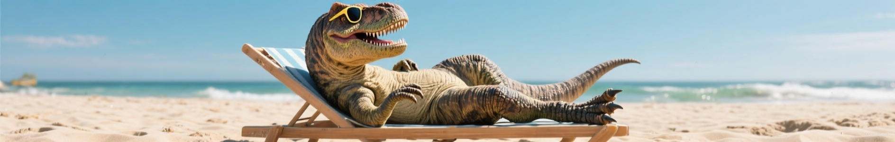

# Seedream 3.0


This documentation is valid for the following list of our models:

* `bytedance/seedream-3.0`


## Model Overview

This bilingual (Chinese-English) image generation model supports arbitrary image dimensions — as long as the product of width and height remains within a generous limit (up to 2K). It offers faster response times, improved rendering of small text and layouts, stronger visual aesthetics and structural consistency, and high fidelity in fine details.

## Setup your API Key

If you don’t have an API key for the AI/ML API yet, feel free to use our [Quickstart guide](https://docs.aimlapi.com/quickstart/setting-up).

## API Schema


[OpenAPI bytedance-seedream-3-0](https://raw.githubusercontent.com/aimlapi/api-docs/refs/heads/main/docs/api-references/image-models/ByteDance/seedream-3.0.json)


## Quick Example

Let's generate an image of the specified size using a simple prompt.




```python
import requests
import json

def main():
    response = requests.post(
        "https://api.aimlapi.com/v1/images/generations",
        headers={
            # Insert your AIML API Key instead of <YOUR_AIMLAPI_KEY>:
            "Authorization": "Bearer <YOUR_AIMLAPI_KEY>",
            "Content-Type": "application/json",
        },
        json={
            "model": "bytedance/seedream-3.0",
            "prompt": "A T-Rex relaxing on a beach, lying on a sun lounger and wearing sunglasses.",
            "aspect_ratio": "16:9",        
        }
    )

    data = response.json()
    print(json.dumps(data, indent=2, ensure_ascii=False))

if __name__ == "__main__":
    main()
```





```javascript
async function main() {
  const response = await fetch('https://api.aimlapi.com/v1/images/generations', {
    method: 'POST',
    headers: {
      // Insert your AIML API Key instead of <YOUR_AIMLAPI_KEY>:
      'Authorization': 'Bearer <YOUR_AIMLAPI_KEY>',
      'Content-Type': 'application/json',
    },
    body: JSON.stringify({
      model: 'bytedance/seedream-3.0',
      prompt: 'A T-Rex relaxing on a beach, lying on a sun lounger and wearing sunglasses.',
      aspect_ratio: '16:9',
    }),
  });

  const data = await response.json();
  console.log('Generation:', data);
}

main();
```




<details>

<summary>Response</summary>


```json5
Generation: {'created': 1751616711, 'data': [{'url': 'https://ark-content-generation-v2-ap-southeast-1.tos-ap-southeast-1.volces.com/seedream-3-0-t2i/02175161671039622600af416b2ca58c9c8a1e1bf93fac0335693.jpeg?X-Tos-Algorithm=TOS4-HMAC-SHA256&X-Tos-Credential=AKLTYjg3ZjNlOGM0YzQyNGE1MmI2MDFiOTM3Y2IwMTY3OTE%2F20250704%2Fap-southeast-1%2Ftos%2Frequest&X-Tos-Date=20250704T081151Z&X-Tos-Expires=86400&X-Tos-Signature=76ad6d2e0eb218521b9ce0bfdc98eaf2aa683e9a0d3840624fb4d413a1fd360e&X-Tos-SignedHeaders=host&x-tos-process=image%2Fwatermark%2Cimage_YXNzZXRzL3dhdGVybWFyay5wbmc_eC10b3MtcHJvY2Vzcz1pbWFnZS9yZXNpemUsUF81'}]}
```


</details>

We obtained the following 1888x301 image by running this code example:

<figure><figcaption><p><code>'A T-Rex relaxing on a beach, lying on a sun lounger and wearing sunglasses.'</code></p></figcaption></figure>

Here’s an example of a 555×543 image generated using the same prompt:

<div align="left"><figure><figcaption><p><code>'A T-Rex relaxing on a beach, lying on a sun lounger</code> <br><code>and wearing sunglasses.'</code></p></figcaption></figure></div>
