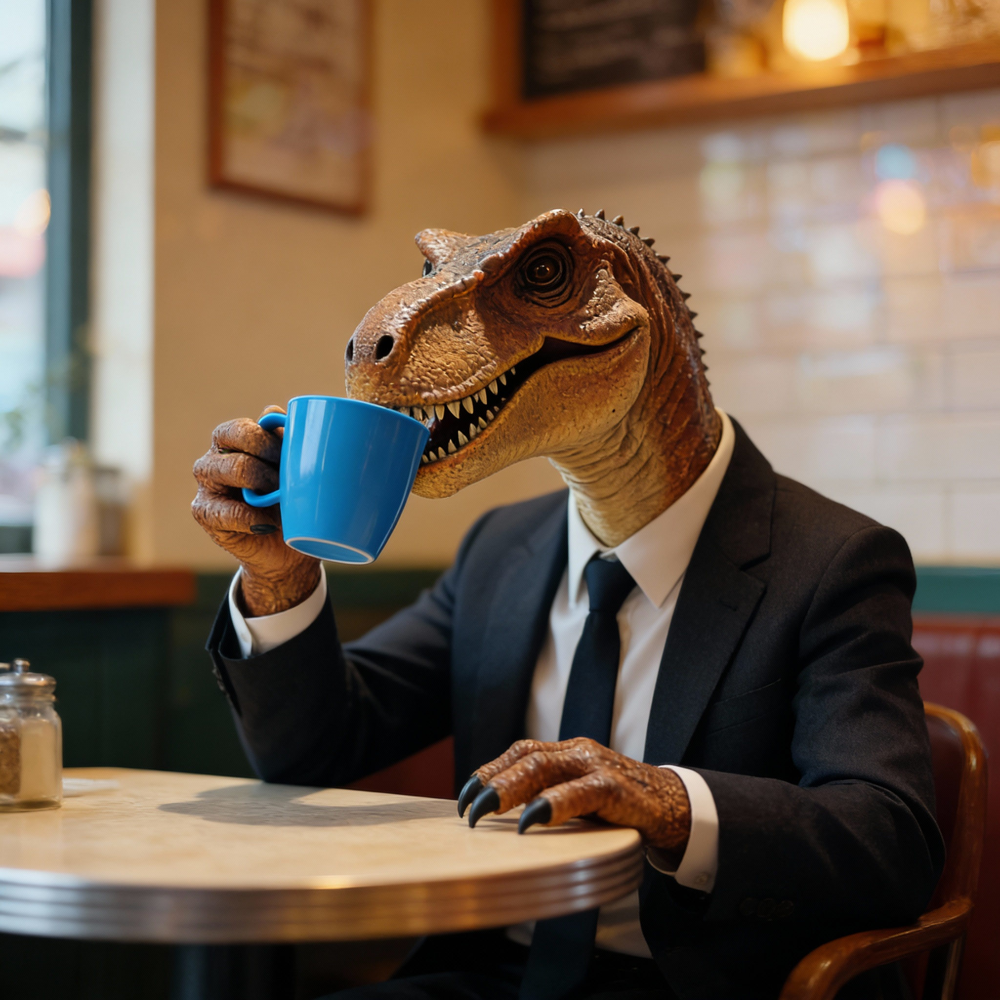

# Seedream 4.5


{% column width="66.66666666666666%" %}

This documentation is valid for the following list of our models:

* `bytedance/seedream-4-5`



{% column width="33.33333333333334%" %}
<a href="https://aimlapi.com/app/bytedance/seedream-4-5" class="button primary">Try in Playground</a>



## Model Overview

The model combines both text-to-image and image-to-image capabilities. Compared to [Seedream 4.0](seedream-v4-edit-image-to-image.md), this model significantly improves editing consistency (preserving subject details, lighting, and color tone), the quality of portraits and small text.

## Setup your API Key

If you don’t have an API key for the AI/ML API yet, feel free to use our [Quickstart guide](https://docs.aimlapi.com/quickstart/setting-up).

## API Schema


[OpenAPI seedream-4-5](https://raw.githubusercontent.com/aimlapi/api-docs/refs/heads/main/docs/api-references/image-models/ByteDance/seedream-4-5.json)


## Quick Example

Let's generate a new image using the one from [the flux/dev Quick Example](../flux/flux-dev.md#quick-example) as a reference — and make a simple change to it with a prompt.




```python
import requests
import json  # for getting a structured output with indentation

def main():
    response = requests.post(
        "https://api.aimlapi.com/v1/images/generations",
        headers={
            # Insert your AIML API Key instead of <YOUR_AIMLAPI_KEY>:
            "Authorization": "Bearer <YOUR_AIMLAPI_KEY>",
            "Content-Type": "application/json",
        },
        json={
            "model": "bytedance/seedream-4-5",
            "prompt": "Combine the images so the T-Rex is wearing a business suit, sitting in a cozy small café, drinking from the mug. Blur the background slightly to create a bokeh effect.",
            "image_urls": [
                "https://raw.githubusercontent.com/aimlapi/api-docs/main/reference-files/t-rex.png",
                "https://raw.githubusercontent.com/aimlapi/api-docs/main/reference-files/blue-mug.jpg"
            ]
        }
    )

    data = response.json()
    print(json.dumps(data, indent=2, ensure_ascii=False))

if __name__ == "__main__":
    main()
```





```javascript
async function main() {
  const response = await fetch('https://api.aimlapi.com/v1/images/generations', {
    method: 'POST',
    headers: {
      // Insert your AIML API Key instead of <YOUR_AIMLAPI_KEY>:
      'Authorization': 'Bearer <YOUR_AIMLAPI_KEY>',
      'Content-Type': 'application/json',
    },
    body: JSON.stringify({
      model: 'bytedance/seedream-4-5',
      prompt: 'Combine the images so the T-Rex is wearing a business suit, sitting in a cozy small café, drinking from the mug. Blur the background slightly to create a bokeh effect.',
      image_urls: [
                "https://raw.githubusercontent.com/aimlapi/api-docs/main/reference-files/t-rex.png",
                "https://raw.githubusercontent.com/aimlapi/api-docs/main/reference-files/blue-mug.jpg"
            ]
    }),
  });

  const data = await response.json();
  console.log(data);
}

main();
```




<details>

<summary>Response</summary>


```json5
{
  "data": [
    {
      "url": "https://cdn.aimlapi.com/bison/seedream-4-5/02176522545211712014becacfaf8a37949eaec3c8139753caaae_0.jpeg?X-Tos-Algorithm=TOS4-HMAC-SHA256&X-Tos-Credential=AKLTYWJkZTExNjA1ZDUyNDc3YzhjNTM5OGIyNjBhNDcyOTQ%2F20251208%2Fap-southeast-1%2Ftos%2Frequest&X-Tos-Date=20251208T202437Z&X-Tos-Expires=86400&X-Tos-Signature=9be05c928d39a74abc5c06bff5759a28449256d72f1d062933479f279bc672cb&X-Tos-SignedHeaders=host",
      "size": "2048x2048"
    }
  ],
  "meta": {
    "usage": {
      "credits_used": 84000
    }
  }
}
```


</details>

<table data-full-width="true"><thead><tr><th width="442.0667724609375" valign="top">Reference Images</th><th valign="top">Generated Image</th></tr></thead><tbody><tr><td valign="top"><div><figure><figcaption><p>Image #1</p></figcaption></figure></div></td><td valign="top"><div><figure><figcaption><p><kbd><code>"Combine the images so the T-Rex is wearing a business suit, sitting in a cozy small café, drinking from the mug. Blur the background slightly to create a bokeh effect."</code></kbd></p></figcaption></figure></div></td></tr><tr><td valign="top"><div><figure><figcaption><p>Image #2</p></figcaption></figure></div></td><td valign="top"></td></tr></tbody></table>
