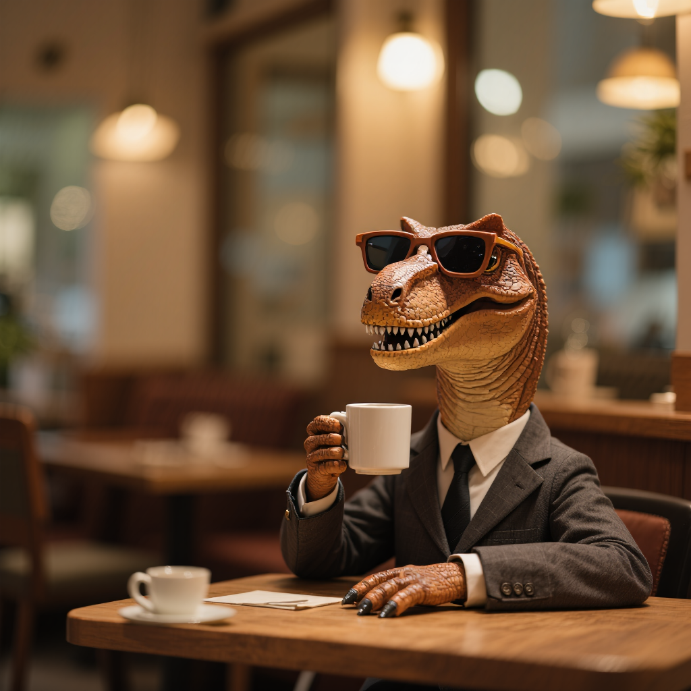

# USO (Image-to-Image)


{% column width="66.66666666666666%" %}

This documentation is valid for the following list of our models:

* `bytedance/uso`



{% column width="33.33333333333334%" %}
<a href="https://aimlapi.com/app/bytedance/uso" class="button primary">Try in Playground</a>



## Model Overview

USO (Unified Style-Subject Optimized) — a single model that seamlessly combines style-based and subject-based image generation.

## Setup your API Key

If you don’t have an API key for the AI/ML API yet, feel free to use our [Quickstart guide](https://docs.aimlapi.com/quickstart/setting-up).

## API Schema


[OpenAPI uso](https://raw.githubusercontent.com/aimlapi/api-docs/refs/heads/main/docs/api-references/image-models/ByteDance/uso.json)


## Quick Example

Let's generate an image of the specified size using a simple prompt.




```python
import requests
import json  # for getting a structured output with indentation

response = requests.post(
    "https://api.aimlapi.com/v1/images/generations",
    headers={
        # Insert your AIML API Key instead of <YOUR_AIMLAPI_KEY>:
        "Authorization":"Bearer <YOUR_AIMLAPI_KEY>",
        "Content-Type":"application/json",
    },
    json={
        "model":"bytedance/uso",
        "prompt": "The T-Rex is wearing a business suit, sitting in a cozy small café, drinking from a mug. Blur the background slightly to create a bokeh effect.",
        "image_urls": [ 
             "https://raw.githubusercontent.com/aimlapi/api-docs/main/reference-files/t-rex.png"
        ]
    }
)

data = response.json()
print(json.dumps(data, indent=2, ensure_ascii=False))
```





```javascript
const response = await fetch('https://api.aimlapi.com/v1/images/generations', {
  method: 'POST',
  headers: {
    // Insert your AIML API Key instead of <YOUR_AIMLAPI_KEY>:
    'Authorization': 'Bearer <YOUR_AIMLAPI_KEY>',
    'Content-Type': 'application/json',
  },
  body: JSON.stringify({
    model: 'bytedance/uso',
    prompt: 'The T-Rex is wearing a business suit, sitting in a cozy small café, drinking from a mug. Blur the background slightly to create a bokeh effect.',
    image_urls: [
      'https://raw.githubusercontent.com/aimlapi/api-docs/main/reference-files/t-rex.png'
    ],        
  }),
});

const data = await response.json();
console.log(JSON.stringify(data, null, 2));
```




<details>

<summary>Response</summary>


```json5
{
  "images": [
    {
      "url": "https://cdn.aimlapi.com/eagle/files/penguin/sMMWnB7wyBK8o_XiAohle.png",
      "content_type": "image/png",
      "file_name": null,
      "file_size": null,
      "width": 1024,
      "height": 1024
    }
  ],
  "seed": 351168504,
  "has_nsfw_concepts": [
    false
  ],
  "prompt": "The T-Rex is wearing a business suit, sitting in a cozy small café, drinking from a mug. Blur the background slightly to create a bokeh effect.",
  "timings": {
    "inference": 10.547778039996047
  },
  "data": [
    {
      "url": "https://cdn.aimlapi.com/eagle/files/penguin/sMMWnB7wyBK8o_XiAohle.png",
      "content_type": "image/png",
      "file_name": null,
      "file_size": null,
      "width": 1024,
      "height": 1024
    }
  ],
  "meta": {
    "usage": {
      "tokens_used": 420000
    }
  }
}
```


</details>

<table data-full-width="false"><thead><tr><th>Reference Image</th><th>Generated Image</th></tr></thead><tbody><tr><td><div><figure><figcaption><p>(original)</p></figcaption></figure></div></td><td><div><figure><figcaption><p><code>"The T-Rex is wearing a business suit, sitting in a cozy small café, drinking from a mug. Blur the background slightly to create a bokeh effect."</code></p></figcaption></figure></div></td></tr></tbody></table>
