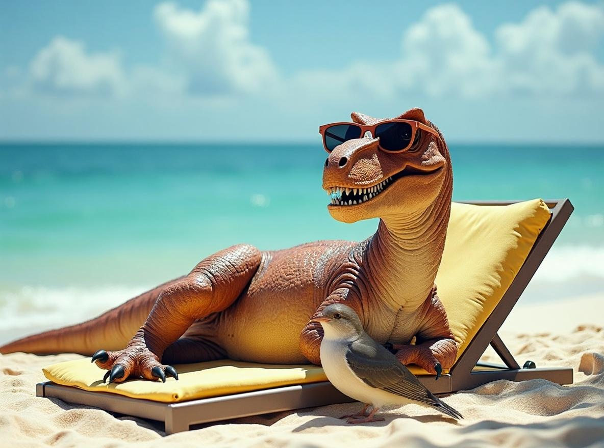

# flux/kontext-pro/image-to-image


{% column width="66.66666666666666%" %}

This documentation is valid for the following list of our models:

* `flux/kontext-pro/image-to-image`



{% column width="33.33333333333334%" %}
<a href="https://aimlapi.com/app/?model=flux/kontext-pro/image-to-image&#x26;mode=image" class="button primary">Try in Playground</a>



## Model Overview

An image-to-image model that modifies only what the prompt instructs, leaving the rest of the image untouched.

<table data-full-width="true"><thead><tr><th width="290.26666259765625">Model</th><th width="593">Properties of Generated Images</th></tr></thead><tbody><tr><td><code>flux/kontext-pro/image-to-image</code></td><td>Format: <strong>JPEG, PNG</strong><br>Image size can't be set directly — only a preset aspect ratio can be chosen.<br>Default aspect ratio and size: <strong>16:9</strong>, <strong>1184</strong>x<strong>880</strong> (well, not quite 16:9)</td></tr></tbody></table>

## Setup your API Key

If you don’t have an API key for the AI/ML API yet, feel free to use our [Quickstart guide](https://docs.aimlapi.com/quickstart/setting-up).

## API Schema


[OpenAPI flux-kontext-pro-image-to-image](https://raw.githubusercontent.com/aimlapi/api-docs/refs/heads/main/docs/api-references/image-models/flux/flux-kontext-pro-image-to-image.json)


## Quick Example

Let's generate a new image using the one from the [flux/dev Quick Example](flux-dev.md#quick-example) as a reference — and make a simple change to it with a prompt.




```python
import requests
import json  # for getting a structured output with indentation 

def main():
    response = requests.post(
        "https://api.aimlapi.com/v1/images/generations",
        headers={
            # Insert your AIML API Key instead of <YOUR_AIMLAPI_KEY>:
            "Authorization": "Bearer <YOUR_AIMLAPI_KEY>",
            "Content-Type": "application/json",
        },
        json={
            "model": "flux/kontext-pro/image-to-image",
            "image_url": "https://raw.githubusercontent.com/aimlapi/api-docs/main/reference-files/t-rex.png",  # URL of the reference picture
            "prompt": "Add a bird to the foreground of the photo.",
        }
    )

    data = response.json()
    print(json.dumps(data, indent=2, ensure_ascii=False))

if __name__ == "__main__":
    main()
```





```javascript
const response = await fetch('https://api.aimlapi.com/v1/images/generations', {
  method: 'POST',
  headers: {
    // Insert your AIML API Key instead of <YOUR_AIMLAPI_KEY>:
    'Authorization': 'Bearer <YOUR_AIMLAPI_KEY>',
    'Content-Type': 'application/json',
  },
  body: JSON.stringify({
    model: 'flux/kontext-pro/image-to-image',
    prompt: 'Add a bird to the foreground of the photo.',
    image_url: 'https://raw.githubusercontent.com/aimlapi/api-docs/main/reference-files/t-rex.png',        
  }),
});

const data = await response.json();
console.log(JSON.stringify(data, null, 2));
```




<details>

<summary>Response</summary>


```json5
{
  "images": [
    {
      "url": "https://cdn.aimlapi.com/squirrel/files/panda/qMuknweKekEYlj9-RdUNt_f0706e451d674554a4c03f2489cf7d5a.jpg",
      "content_type": "image/jpeg",
      "file_name": null,
      "file_size": null,
      "width": 1184,
      "height": 880
    }
  ],
  "timings": {},
  "seed": 3959063143,
  "has_nsfw_concepts": [
    false
  ],
  "prompt": "Add a bird to the foreground of the photo."
}
```


</details>

| Reference Image                                                                                                    | Generated Image                                                                                                                                             |
| ------------------------------------------------------------------------------------------------------------------ | ----------------------------------------------------------------------------------------------------------------------------------------------------------- |
| <div><figure><figcaption></figcaption></figure></div> | <div><figure><figcaption></figcaption></figure></div> |

<details>

<summary>More generated images</summary>

| <div><figure><figcaption><p><code>"Add a crown to the T-rex's head."</code></p></figcaption></figure></div>                                                                                                                                                                   | <div><figure><figcaption><p><code>"Add a couple of silver wings"</code></p></figcaption></figure></div>                                                                                                                             |
| ----------------------------------------------------------------------------------------------------------------------------------------------------------------------------------------------------------------------------------------------------------------------------------------------------------------------------------------------------------------------------------- | ----------------------------------------------------------------------------------------------------------------------------------------------------------------------------------------------------------------------------------------------------------------------------------------------------------------------------------------- |
| <div><figure><figcaption><p><code>"Remove the dinosaur. Place a book and a bouquet of wildflowers in blue and pink tones on the lounge chair. Let a light foamy surf gently wash the bottom of the chair. Don't change anything else."</code></p></figcaption></figure></div> | <div><figure><figcaption><p><code>"Make the dinosaur sit on a lounge chair with its back to the camera, looking toward the water. The setting sun has almost disappeared below the horizon."</code></p></figcaption></figure></div> |

</details>

## Example #2: Combine two images

This time, we’ll pass two images to the model: our dinosaur and a solid blue mug. We'll ask the model to place the dinosaur onto the mug as a print.

<details>

<summary>Our input images</summary>

| <div><figure><figcaption><p>Our chilling T-rex</p></figcaption></figure></div> | <div><figure><figcaption><p>Our blue mug</p></figcaption></figure></div> |
| ------------------------------------------------------------------------------------------------------------------------------------------- | ------------------------------------------------------------------------------------------------------------------------------------ |

</details>




```python
import requests
import json  # for getting a structured output with indentation

def main():
    response = requests.post(
        "https://api.aimlapi.com/v1/images/generations",
        headers={
            # Insert your AIML API Key instead of <YOUR_AIMLAPI_KEY>:
            "Authorization": "Bearer <YOUR_AIMLAPI_KEY>",
            "Content-Type": "application/json",
        },
        json={
            "prompt": "Place this image with the t-rex on this mug from the second image as a print. Make it look fit and natural.",
            "model": "flux/kontext-pro/image-to-image",
            "image_url": [     # URLs of two reference pictures
                "https://zovi0.github.io/public_misc/flux-dev-t-rex.png", 
                "https://zovi0.github.io/public_misc/blue-mug.jpg"
            ]
        }
    )

    data = response.json()
    print(json.dumps(data, indent=2, ensure_ascii=False))


if __name__ == "__main__":
    main()
```





```javascript
const main = async () => {
  const response = await fetch('https://api.aimlapi.com/v1/images/generations', {
    method: 'POST',
    headers: {
      Authorization: 'Bearer <YOUR_API_KEY>',
      'Content-Type': 'application/json',
    },
    body: JSON.stringify({
      model: 'flux/kontext-pro/text-to-image',
      prompt: 'Place this image with the t-rex on this mug from the second image as a print. Make it look fit and natural.',
      image_url: [     // URLs of two reference pictures
        'https://zovi0.github.io/public_misc/flux-dev-t-rex.png', 
        'https://zovi0.github.io/public_misc/blue-mug.jpg'
      ],
    }),
  }).then((res) => res.json());

  console.log(response);
};

main();
```




<details>

<summary>Response</summary>


```json5
{
  "images": [
    {
      "url": "https://cdn.aimlapi.com/squirrel/files/lion/rXRknU80d-8ywPnLBq4G8_59b65fe44d8046a38ab9e524a5a8b61c.jpg",
      "width": 1184,
      "height": 880,
      "content_type": "image/jpeg"
    }
  ],
  "timings": {},
  "seed": 1068148133,
  "has_nsfw_concepts": [
    false
  ],
  "prompt": "Place this image with the t-rex on this mug from the second image as a print. Make it look fit and natural."
}
```


</details>

<figure><figcaption><p><code>"Place this image with the t-rex on this mug from the second image as a print. Make it look fit and natural."</code></p></figcaption></figure>
