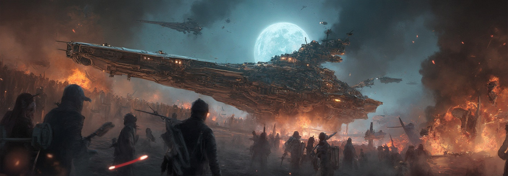

# flux-realism


This documentation is valid for the following list of our models:

* `flux-realism`


## Model Overview

A state-of-the-art model designed to generate photorealistic images from textual descriptions. \
It allows users to create lifelike visuals without the need for extensive realism-related prompts.

<table><thead><tr><th width="201" valign="top">Model</th><th>Generated image properties</th></tr></thead><tbody><tr><td valign="top"><code>flux-realism</code></td><td>Format: <strong>JPG</strong><br>Min size: <strong>512</strong>x<strong>512</strong><br>Max size: <strong>1536</strong>x<strong>1536</strong><br>Default size: <strong>1024</strong>x<strong>768</strong><br><mark style="background-color:yellow;">For both height and width, the value must be a multiple of 32.</mark></td></tr></tbody></table>

## Setup your API Key

If you don’t have an API key for the AI/ML API yet, feel free to use our [Quickstart guide](https://docs.aimlapi.com/quickstart/setting-up).

## Submit a request

### API Schema


[flux-realism.json](../Black-Forest-Labs/flux-realism.json)


## Quick Example

Let's generate an image of the specified size using a simple prompt.


The maximum value for both width and height is `1536`, and the minimum is `512`. \
The value must be a multiple of 32.



```python
import requests


def main():
    response = requests.post(
        "https://api.aimlapi.com/v1/images/generations",
        headers={
            # Insert your AIML API Key instead of <YOUR_AIMLAPI_KEY>:
            "Authorization": "Bearer <YOUR_AIMLAPI_KEY>",
            "Content-Type": "application/json",
        },
        json={
            "prompt": "Epic battle of spaceships",
            "model": "flux-realism",
            'image_size': {
                "width": 1472,
                "height": 512
            }
        }
    )

    response.raise_for_status()
    data = response.json()

    print("Generation:", data)


if __name__ == "__main__":
    main()

```


<details>

<summary>Response</summary>


```json5
Generation: {'images': [{'url': 'https://cdn.aimlapi.com/eagle/files/elephant/nUJYdUrH6sLhgw2K2Z3hR_91336d262dc64dce8644c7c6f5adb11b.jpg', 'width': 1472, 'height': 512, 'content_type': 'image/jpeg'}], 'timings': {'inference': 5.585701048956253}, 'seed': 3110284405, 'has_nsfw_concepts': [False], 'prompt': 'Epic battle of spaceships'}
```


</details>

We obtained the following 1472x512 image by running this code example:

<figure><figcaption></figcaption></figure>
