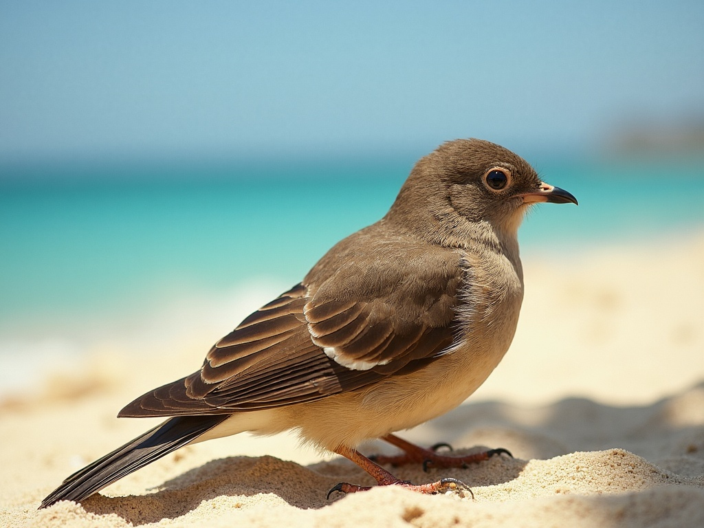

# flux/srpo/image-to-image


{% column width="75%" %}

This documentation is valid for the following list of our models:

* `flux/srpo/image-to-image`



{% column width="25%" %}
<a href="https://aimlapi.com/app/?model=flux/srpo/image-to-image&#x26;mode=image" class="button primary">Try in Playground</a>



## Model Overview

[flux/dev/image-to-image](flux-dev-image-to-image.md) model upgraded with Tencent’s SRPO technique.

<table><thead><tr><th width="220" valign="top">Model</th><th>Generated image properties</th></tr></thead><tbody><tr><td valign="top"><code>flux/srpo/image-to-image</code></td><td>Format: <strong>JPEG</strong>, <strong>PNG</strong><br>Fixed size: Matches the dimensions of the reference image.</td></tr></tbody></table>

## Setup your API Key

If you don’t have an API key for the AI/ML API yet, feel free to use our [Quickstart guide](https://docs.aimlapi.com/quickstart/setting-up).

## API Schema


[OpenAPI flux-srpo-image-to-image](https://raw.githubusercontent.com/aimlapi/api-docs/refs/heads/main/docs/api-references/image-models/flux/flux-srpo-image-to-image.json)


## Quick Example

Let's generate a new image using the one from the [flux/dev Quick Example](flux-dev.md#quick-example) as a reference — and make a simple change to it with a prompt.




```python
import requests
import json  # for getting a structured output with indentation

def main():
    response = requests.post(
        "https://api.aimlapi.com/v1/images/generations",
        headers={
            # Insert your AIML API Key instead of <YOUR_AIMLAPI_KEY>:
            "Authorization": "Bearer <YOUR_AIMLAPI_KEY>",
            "Content-Type": "application/json",
        },
        json={
            "model": "flux/srpo/image-to-image",
            "prompt": "Add a bird to the foreground of the photo.",
            "image_url": "https://raw.githubusercontent.com/aimlapi/api-docs/main/reference-files/t-rex.png",
            "strength": 0.9
        }
    )

    data = response.json()
    print(json.dumps(data, indent=2, ensure_ascii=False))

if __name__ == "__main__":
    main()
```





```javascript
async function main() {
  const response = await fetch('https://api.aimlapi.com/v1/images/generations', {
    method: 'POST',
    headers: {
      // Insert your AIML API Key instead of <YOUR_AIMLAPI_KEY>:
      'Authorization': 'Bearer <YOUR_AIMLAPI_KEY>',
      'Content-Type': 'application/json',
    },
    body: JSON.stringify({
      model: 'flux/srpo/image-to-image',
      prompt: 'A T-Rex relaxing on a beach, lying on a sun lounger and wearing sunglasses.',
      image_url: 'https://raw.githubusercontent.com/aimlapi/api-docs/main/reference-files/t-rex.png',
      strength: 0.9,
    }),
  });

  const data = await response.json();
  console.log(data);
}

main();
```




<details>

<summary>Response</summary>


```json5
{
  "images": [
    {
      "url": "https://v3b.fal.media/files/b/koala/1TOtgew8As_QBlCyKy4Z-.jpg",
      "width": 1024,
      "height": 768,
      "content_type": "image/jpeg"
    }
  ],
  "timings": {
    "inference": 0.947831045370549
  },
  "seed": 484902001,
  "has_nsfw_concepts": [
    false
  ],
  "prompt": "Add a bird to the foreground of the photo.",
  "data": [
    {
      "url": "https://v3b.fal.media/files/b/koala/1TOtgew8As_QBlCyKy4Z-.jpg",
      "width": 1024,
      "height": 768,
      "content_type": "image/jpeg"
    }
  ],
  "meta": {
    "usage": {
      "tokens_used": 52500
    }
  }
}
```


</details>

| Reference Image                                                           | Generated Image                                                                            |
| ------------------------------------------------------------------------- | ------------------------------------------------------------------------------------------ |
|  |  |
