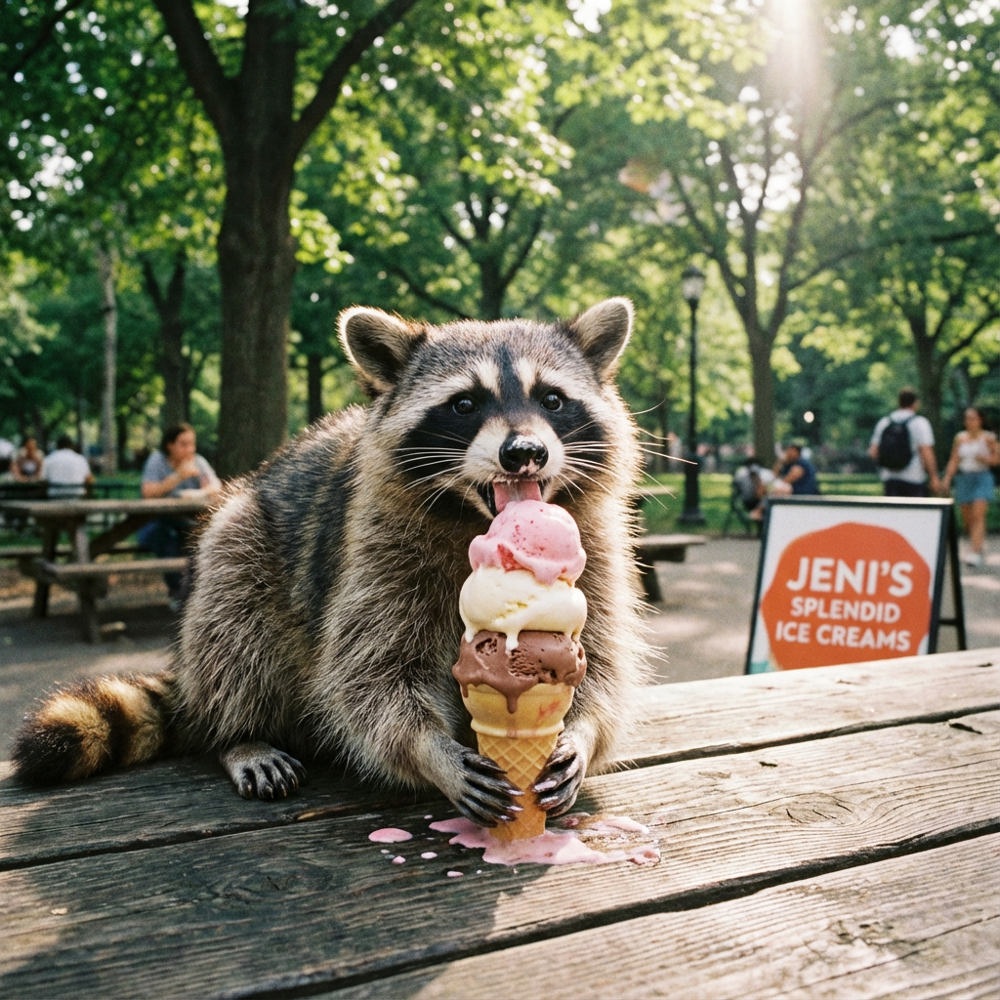

# Nano Banana Pro (Gemini 3 Pro Image)


{% column width="66.66666666666666%" %}

This documentation is valid for the following list of our models:

* `google/nano-banana-pro`
* `google/gemini-3-pro-image-preview`



Both IDs listed above refer to the same model; we support them for backward compatibility.



{% column width="33.33333333333334%" %}
<a href="https://aimlapi.com/app/google/gemini-3-pro-image-preview" class="button primary">Try in Playground</a>



## Model Overview <a href="#model-overview" id="model-overview"></a>

Google’s smartest text-to-image model as of the November 2025 preview release.

## Setup your API Key <a href="#setup-your-api-key" id="setup-your-api-key"></a>

If you don’t have an API key for the AI/ML API yet, feel free to use our [Quickstart guide](https://docs.aimlapi.com/quickstart/setting-up).

## API Schema


[OpenAPI gemini-3-pro-image-preview](https://raw.githubusercontent.com/aimlapi/api-docs/refs/heads/main/docs/api-references/image-models/Google/gemini-3-pro-image-preview.json)


## Quick Example

Let's generate an image of the specified aspect ratio using a simple prompt.




```python
import requests
import json

def main():
    response = requests.post(
        "https://api.aimlapi.com/v1/images/generations",
        headers={
            # Insert your AIML API Key instead of <YOUR_AIMLAPI_KEY>:
            "Authorization": "Bearer <YOUR_AIMLAPI_KEY>",
            "Content-Type": "application/json",
        },
        json={
            "model": "google/nano-banana-pro",
            "prompt": "Racoon eating ice-cream",
            "aspect_ratio": "1:1",
            "resolution": "1K"
        }
    )

    data = response.json()
    print(json.dumps(data, indent=2, ensure_ascii=False))

if __name__ == "__main__":
    main()
```





```javascript
async function main() {
  const response = await fetch('https://api.aimlapi.com/v1/images/generations', {
    method: 'POST',
    headers: {
      // Insert your AIML API Key instead of <YOUR_AIMLAPI_KEY>:
      'Authorization': 'Bearer <YOUR_AIMLAPI_KEY>',
      'Content-Type': 'application/json',
    },
    body: JSON.stringify({
      model: 'google/nano-banana-pro',
      prompt: 'Racoon eating ice-cream',
      aspect_ratio: '1:1',
      resolution: '1K'
    }),
  });

  const data = await response.json();
  console.log(data);
}

main();
```




<details>

<summary>Response</summary>


```json5
{
  "description": "",
  "data": [
    {
      "url": "https://cdn.aimlapi.com/flamingo/files/b/monkey/rvEPfEJe--7Nf41TwCGy3.png",
      "content_type": "image/png",
      "width": null,
      "height": null,
      "file_name": "rvEPfEJe--7Nf41TwCGy3.png"
    }
  ],
  "meta": {
    "usage": {
      "tokens_used": 315000
    }
  }
}
```


</details>

So we obtained the following 1024x1024 image by running this code example:

<figure><figcaption><p><code>"aspect_ratio": "1:1"</code>,  <code>"resolution": "1K"</code></p></figcaption></figure>

Here’s an example of the output using alternative `resolution` and `aspect_ratio` parameters:

<figure><figcaption><p><code>"aspect_ratio": "16:9"</code>,  <code>"resolution": "2K"</code></p></figcaption></figure>
