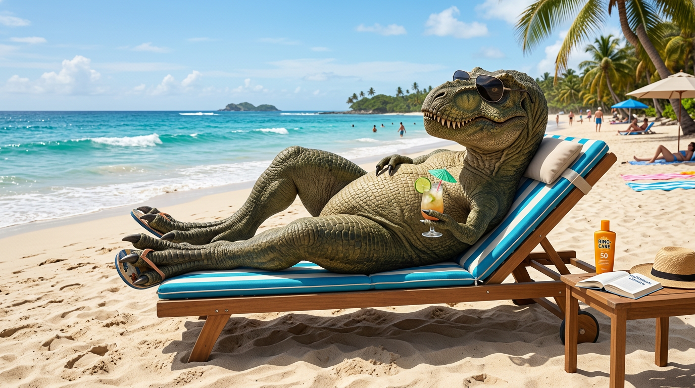

# Nano Banana 2 (Gemini 3.1 Flash Image)


{% column width="66.66666666666666%" %}

This documentation is valid for the following list of our models:

* `google/nano-banana-2`
* `google/gemini-3-1-flash-image-preview`



Both IDs listed above refer to the same model; we support them for backward compatibility.



{% column width="33.33333333333334%" %}
<a href="https://aimlapi.com/app/gemini-3-1-flash-image-preview" class="button primary">Try in Playground</a>



## Model Overview

A fast image generation model from Google DeepMind, optimized for low-latency and high-throughput text-to-image workflows. Ideal for interactive apps and real-time image generation.

## Setup your API Key

If you don’t have an API key for the AI/ML API yet, feel free to use our [Quickstart guide](https://docs.aimlapi.com/quickstart/setting-up).

## API Schema


[OpenAPI gemini-3-1-flash-image-preview](https://raw.githubusercontent.com/aimlapi/api-docs/refs/heads/main/docs/api-references/image-models/Google/gemini-3-1-flash-image-preview.json)


## Quick Example #1: Prompt Only

Let's generate an image of the specified size using a simple prompt.




```python
import requests
import json  # for getting a structured output with indentation

def main():
    response = requests.post(
        "https://api.aimlapi.com/v1/images/generations",
        headers={
            # Insert your AIML API Key instead of <YOUR_AIMLAPI_KEY>:
            "Authorization": "Bearer <YOUR_AIMLAPI_KEY>",
            "Content-Type": "application/json",
        },
        json={
            "model": "google/nano-banana-2",
            "prompt": "A T-Rex relaxing on a beach, lying on a sun lounger and wearing sunglasses.",
            "aspect_ratio": "16:9"
        }
    )

    data = response.json()
    print(json.dumps(data, indent=2, ensure_ascii=False))

if __name__ == "__main__":
    main()
```





```javascript
async function main() {
  const response = await fetch('https://api.aimlapi.com/v1/images/generations', {
    method: 'POST',
    headers: {
      // Insert your AIML API Key instead of <YOUR_AIMLAPI_KEY>:
      'Authorization': 'Bearer <YOUR_AIMLAPI_KEY>',
      'Content-Type': 'application/json',
    },
    body: JSON.stringify({
      model: 'google/nano-banana-2',
      prompt: 'A T-Rex relaxing on a beach, lying on a sun lounger and wearing sunglasses.',
      aspect_ratio: '16:9'
    }),
  });

  const data = await response.json();
  console.log('Generation:', data);
}

main();
```




<details>

<summary>Response</summary>


```json5
{
  "data": [
    {
      "mime_type": "image/png",
      "b64_json": null,
      "url": "https://cdn.aimlapi.com/generations/openai-image-generation/1772185796077-3fc5b418-64ab-4b12-80a4-40185b9fbb2a.png"
    }
  ],
  "meta": {
    "usage": {
      "credits_used": 178975
    }
  }
}
```


</details>

We obtained the following 1376x768 image by running this code example:

<figure><figcaption><p><code>"A T-Rex relaxing on a beach, lying on a sun lounger and wearing sunglasses."</code></p></figcaption></figure>

## Quick Example #2: Reference Images

Generate an image with the specified quality and aspect ratio using two input images and a prompt that defines how the images should be edited.




```python
import requests
import json

def main():
    response = requests.post(
        "https://api.aimlapi.com/v1/images/generations",
        headers={
            # Insert your AIML API Key instead of <YOUR_AIMLAPI_KEY>:
            "Authorization": "Bearer <YOUR_AIMLAPI_KEY>",
            "Content-Type": "application/json",
        },
        json={
            "model": "google/nano-banana-2",
            "image_urls": [
                "https://raw.githubusercontent.com/aimlapi/api-docs/main/reference-files/t-rex.png",
                "https://raw.githubusercontent.com/aimlapi/api-docs/main/reference-files/blue-mug.jpg"
            ],
            "prompt": "Combine the images so the T-Rex is wearing a business suit, sitting in a cozy small café, drinking from the mug. Blur the background slightly to create a bokeh effect.",
            "aspect_ratio": "4:3",
            "resolution": "1K"
        }
    )

    data = response.json()
    print(json.dumps(data, indent=2, ensure_ascii=False))

if __name__ == "__main__":
    main()
```





```javascript
async function main() {
    const response = await fetch('https://api.aimlapi.com/v1/images/generations', {
      method: 'POST',
      headers: {
        // Insert your AIML API Key instead of <YOUR_AIMLAPI_KEY>:
        'Authorization': 'Bearer <YOUR_AIMLAPI_KEY>',
        'Content-Type': 'application/json',
      },
      body: JSON.stringify({
        model: 'google/nano-banana-2',
        image_urls: [
                'https://raw.githubusercontent.com/aimlapi/api-docs/main/reference-files/t-rex.png',
                'https://raw.githubusercontent.com/aimlapi/api-docs/main/reference-files/blue-mug.jpg'
        ],
        prompt: 'Combine the images so the T-Rex is wearing a business suit, sitting in a cozy small café, drinking from the mug. Blur the background slightly to create a bokeh effect.',
        aspect_ratio: '4:3',
        resolution: '1K'
      }),
    });
}

main();
```




<details>

<summary>Response</summary>


```json5
{
  "data": [
    {
      "mime_type": "image/png",
      "b64_json": null,
      "url": "https://cdn.aimlapi.com/generations/openai-image-generation/1772189200920-5b1b6f2f-63e4-4d3b-b3f8-a540a2c0abd3.png"
    }
  ],
  "meta": {
    "usage": {
      "credits_used": 185093
    }
  }
}
```


</details>

<table data-full-width="true"><thead><tr><th width="389.7999267578125" valign="top">Reference Images</th><th valign="top">Generated Image</th></tr></thead><tbody><tr><td valign="top"><div><figure><figcaption><p>Image #1</p></figcaption></figure></div></td><td valign="top"><div><figure><figcaption><p><kbd><code>"Combine the images so the T-Rex is wearing a business suit, sitting in a cozy small café, drinking from the mug. Blur the background slightly to create a bokeh effect."</code></kbd></p></figcaption></figure></div></td></tr><tr><td valign="top"><div><figure><figcaption><p>Image #2</p></figcaption></figure></div></td><td valign="top"></td></tr></tbody></table>

Here’s an example of the output using alternative `resolution` and `aspect_ratio` parameters:

<figure><figcaption><p><code>"aspect_ratio": "16:9"</code>,  <code>"resolution": "2K"</code></p></figcaption></figure>
