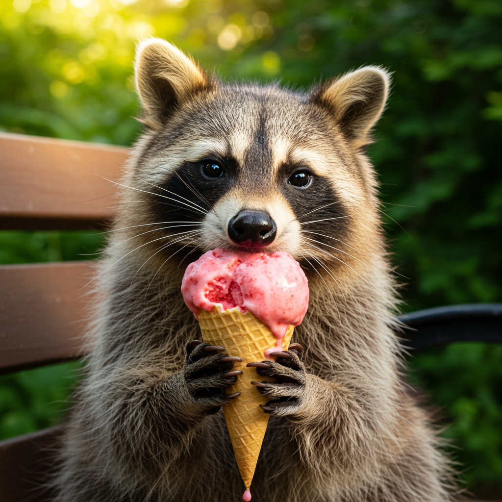

# Imagen 3


{% column width="75%" %}

This documentation is valid for the following list of our models:

* `imagen-3.0-generate-002`



{% column width="25%" %}
<a href="https://aimlapi.com/app/?model=imagen-3.0-generate-002&#x26;mode=image" class="button primary">Try in Playground</a>



## Model Overview <a href="#model-overview" id="model-overview"></a>

Google's latest text-to-image AI model, designed to generate high-quality, photorealistic images from text descriptions with improved detail, lighting, and fewer artifacts. It boasts enhanced natural language understanding and better text rendering.

## Setup your API Key <a href="#setup-your-api-key" id="setup-your-api-key"></a>

If you don’t have an API key for the AI/ML API yet, feel free to use our [Quickstart guide](https://docs.aimlapi.com/quickstart/setting-up).

## API Schema


[OpenAPI imagen-3](https://raw.githubusercontent.com/aimlapi/api-docs/refs/heads/main/docs/api-references/image-models/Google/imagen-3.0.json)


## Quick Example

Let's generate an image of the specified size using a simple prompt.




```python
import requests
import json  # for getting a structured output with indentation

def main():
    response = requests.post(
        "https://api.aimlapi.com/v1/images/generations",
        headers={
            # Insert your AIML API Key instead of <YOUR_AIMLAPI_KEY>:
            "Authorization": "Bearer <YOUR_AIMLAPI_KEY>",
            "Content-Type": "application/json",
        },
        json={
            "prompt": "Racoon eating ice-cream",
            "model": "imagen-3.0-generate-002",
            "convert_base64_to_url": True,
        }
    )

    data = response.json()
    print(json.dumps(data, indent=2, ensure_ascii=False))

if __name__ == "__main__":
    main()
```





```javascript
async function main() {
  const response = await fetch('https://api.aimlapi.com/v1/images/generations', {
    method: 'POST',
    headers: {
      // Insert your AIML API Key instead of <YOUR_AIMLAPI_KEY>:
      'Authorization': 'Bearer <YOUR_AIMLAPI_KEY>',
      'Content-Type': 'application/json',
    },
    body: JSON.stringify({
      model: 'imagen-3.0-generate-002',
      prompt: 'A T-Rex relaxing on a beach, lying on a sun lounger and wearing sunglasses.',
      convert_base64_to_url: true
    }),
  });

  const data = await response.json();
  console.log(data);
}

main();
```




Note that prompt enhancement is _enabled_ by default. The model will also return the enhanced prompt in the response. If you prefer not to use this feature, set the parameter `enhance_prompt` to `False`.

<details>

<summary>Response</summary>


```json5
{
  data: [
    {
      mime_type: 'image/png',
      url: 'https://cdn.aimlapi.com/generations/guepard/1756970940506-11b77754-ca2a-4995-a260-d75adfb9885c.png',
      prompt: 'A playful raccoon with a mischievous grin is indulging in a scoop of creamy, strawberry ice cream. Its black mask and fluffy tail are prominent features as it delicately licks the cool treat with its pink tongue. The raccoon is perched on a park bench, the soft daylight illuminating its fur and the vibrant color of the ice cream. The background is a slightly blurred, idyllic summer scene with a few scattered trees and a lush green lawn. The overall image captures a moment of unexpected delight, with the raccoon enjoying a sweet summer treat in a natural and relaxing setting. This picture captures the charming side of this often misunderstood animal, showcasing its playful curiosity and enjoyment of simple pleasures. The image has a soft, nostalgic quality, using natural light and a shallow depth of field to focus on the raccoon and its ice-cream.'
    }
  ]
}
```


</details>

Default aspect ratio is 1:1, so we obtained the following 1024x1024 image by running this code example:

<figure><figcaption><p>In reality, raccoons shouldn’t be given ice cream or chocolate—it’s harmful to their metabolism. <br>But in the AI world, raccoons party like there’s no tomorrow.</p></figcaption></figure>
