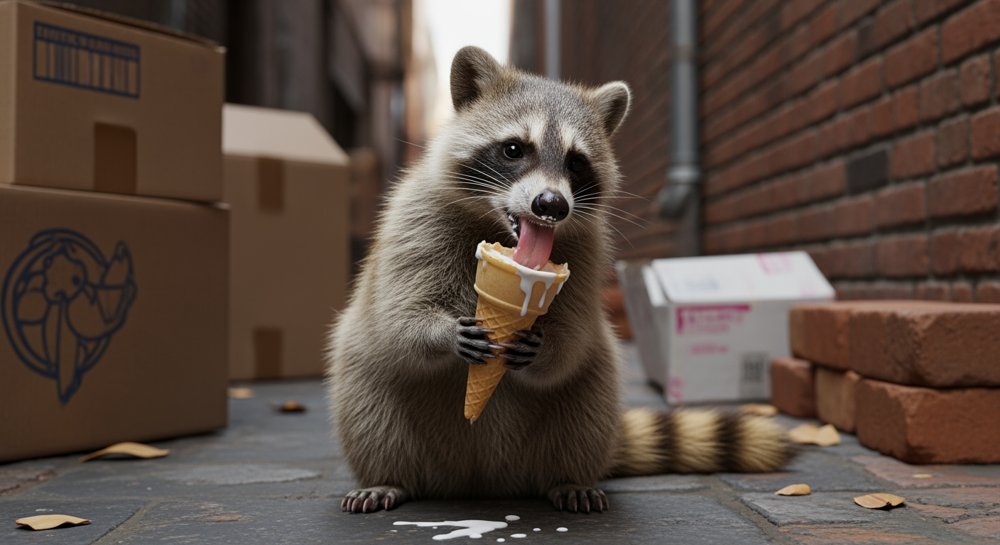

# Imagen 4 Generate


{% column width="66.66666666666666%" %}

This documentation is valid for the following list of our models:

* `google/imagen-4.0-generate-001`



{% column width="33.33333333333334%" %}
<a href="https://aimlapi.com/app/google/imagen-4-0-generate-001" class="button primary">Try in Playground</a>



## Model Overview <a href="#model-overview" id="model-overview"></a>

An advanced text-to-image model delivering a balance of speed and image quality.

## Setup your API Key <a href="#setup-your-api-key" id="setup-your-api-key"></a>

If you don’t have an API key for the AI/ML API yet, feel free to use our [Quickstart guide](https://docs.aimlapi.com/quickstart/setting-up).

## API Schema


[OpenAPI imagen-4-0-generate-001](https://raw.githubusercontent.com/aimlapi/api-docs/refs/heads/main/docs/api-references/image-models/Google/imagen-4.0-generate-001.json)


## Quick Example

Let's generate an image of the specified aspect ratio using a simple prompt.




```python
import requests
import json   # for getting a structured output with indentation

def main():
    response = requests.post(
        "https://api.aimlapi.com/v1/images/generations",
        headers={
            # Insert your AIML API Key instead of <YOUR_AIMLAPI_KEY>:
            "Authorization": "Bearer <YOUR_AIMLAPI_KEY>",
            "Content-Type": "application/json",
        },
        json={
            "prompt": "Racoon eating ice-cream",
            "model": "google/imagen-4.0-generate-001",
            "aspect_ratio": "16:9"
        }
    )

    data = response.json()
    print(json.dumps(data, indent=2, ensure_ascii=False))

if __name__ == "__main__":
    main()
```





```javascript
async function main() {
  const response = await fetch('https://api.aimlapi.com/v1/images/generations', {
    method: 'POST',
    headers: {
      // Insert your AIML API Key instead of <YOUR_AIMLAPI_KEY>:
      'Authorization': 'Bearer <YOUR_AIMLAPI_KEY>',
      'Content-Type': 'application/json',
    },
    body: JSON.stringify({
      model: 'google/imagen-4.0-generate-001',
      prompt: 'Racoon eating ice-cream',
      aspect_ratio: '16:9'
    }),
  });

  const data = await response.json();
  console.log(data);
}

main();
```




<details>

<summary>Response</summary>


```json5
{
  "data": [
    {
      "mime_type": "image/png",
      "url": "https://cdn.aimlapi.com/generations/guepard/1758236160134-5fcac25f-0c87-4145-b24b-98ccebab5c0c.png",
      "prompt": "A mischievous racoon, with beady eyes and a striped tail, is caught mid-lick, enjoying a stolen ice cream cone. Its small paws cradle the melting treat, and its face is smeared with the creamy sweetness, indicating a thorough and enthusiastic indulgence. The scene is set in a cluttered alleyway, with discarded boxes and old bricks forming a backdrop to the racoon's illicit feast."
    }
  ],
  "meta": {
    "usage": {
      "tokens_used": 84000
    }
  }
}
```


</details>

So we obtained the following 1408x768 image by running this code example:

<figure><figcaption><p>In reality, raccoons shouldn’t be given ice cream or chocolate—it’s harmful to their metabolism. <br>But in the AI world, raccoons party like there’s no tomorrow.</p></figcaption></figure>
