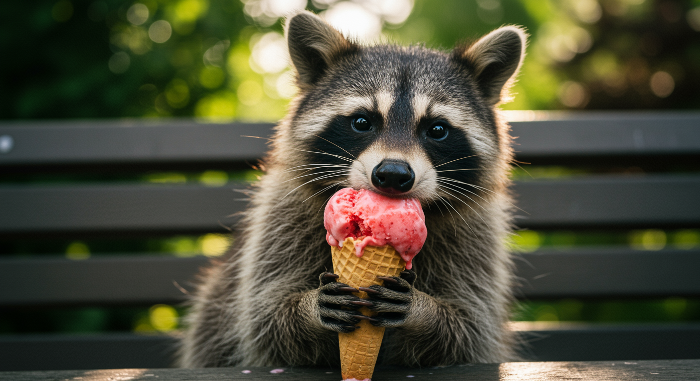

# Imagen 4 Preview


This documentation is valid for the following list of our models:

* `google/imagen4/preview`


## Model Overview <a href="#model-overview" id="model-overview"></a>

Google’s highest quality image generation model as of May 2025.

## Setup your API Key <a href="#setup-your-api-key" id="setup-your-api-key"></a>

If you don’t have an API key for the AI/ML API yet, feel free to use our [Quickstart guide](https://docs.aimlapi.com/quickstart/setting-up).

## API Schema


[Broken link](broken-reference)


## Quick Example

Let's generate an image of the specified aspect ratio using a simple prompt.


```python
import requests


def main():
    response = requests.post(
        "https://api.aimlapi.com/v1/images/generations",
        headers={
            # Insert your AIML API Key instead of <YOUR_AIMLAPI_KEY>:
            "Authorization": "Bearer <YOUR_AIMLAPI_KEY>",
            "Content-Type": "application/json",
        },
        json={
            "prompt": "Racoon eating ice-cream",
            "model": "google/imagen4/preview",
            "aspect_ratio": "16:9"
        }
    )

    response.raise_for_status()
    data = response.json()

    print("Generation:", data)


if __name__ == "__main__":
    main()

```


<details>

<summary>Response</summary>


```json5
Generation: {'images': [{'url': 'https://cdn.aimlapi.com/eagle/files/penguin/vu5A5CUdy64ZpPzlURKvu_output.png', 'content_type': 'image/png', 'file_name': 'output.png', 'file_size': 1071496}], 'seed': 1848588799}
```


</details>

So we obtained the following 1408x768 image by running this code example:

<figure><figcaption><p>In reality, raccoons shouldn’t be given ice cream or chocolate—it’s harmful to their metabolism. <br>But in the AI world, raccoons party like there’s no tomorrow.</p></figcaption></figure>
