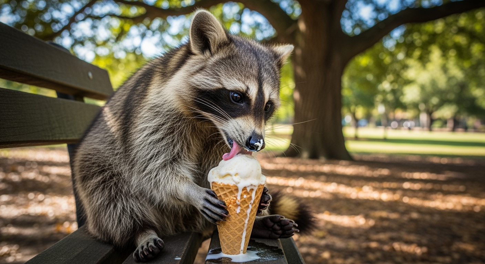

# Imagen 4 Ultra Generate 001


This documentation is valid for the following list of our models:

* `google/imagen-4.0-ultra-generate-001`


## Model Overview <a href="#model-overview" id="model-overview"></a>

A model built for photorealistic image generation and precise text rendering, suited for high-fidelity professional use.

## Setup your API Key <a href="#setup-your-api-key" id="setup-your-api-key"></a>

If you don’t have an API key for the AI/ML API yet, feel free to use our [Quickstart guide](https://docs.aimlapi.com/quickstart/setting-up).

## API Schema


[OpenAPI imagen-4-0-ultra-generate-001](https://raw.githubusercontent.com/aimlapi/api-docs/refs/heads/main/docs/api-references/image-models/Google/imagen-4.0-ultra-generate-001.json)


## Quick Example

Let's generate an image of the specified aspect ratio using a simple prompt.




```python
import requests
import json   # for getting a structured output with indentation

def main():
    response = requests.post(
        "https://api.aimlapi.com/v1/images/generations",
        headers={
            # Insert your AIML API Key instead of <YOUR_AIMLAPI_KEY>:
            "Authorization": "Bearer <YOUR_AIMLAPI_KEY>",
            "Content-Type": "application/json",
        },
        json={
            "prompt": "Racoon eating ice-cream",
            "model": "google/imagen-4.0-ultra-generate-001",
            "aspect_ratio": "16:9"
        }
    )

    data = response.json()
    print(json.dumps(data, indent=2, ensure_ascii=False))

if __name__ == "__main__":
    main()
```





```javascript
async function main() {
  const response = await fetch('https://api.aimlapi.com/v1/images/generations', {
    method: 'POST',
    headers: {
      // Insert your AIML API Key instead of <YOUR_AIMLAPI_KEY>:
      'Authorization': 'Bearer <YOUR_AIMLAPI_KEY>',
      'Content-Type': 'application/json',
    },
    body: JSON.stringify({
      model: 'google/imagen-4.0-ultra-generate-001',
      prompt: 'Racoon eating ice-cream',
      aspect_ratio: '16:9'
    }),
  });

  const data = await response.json();
  console.log(data);
}

main();
```




<details>

<summary>Response</summary>


```json5
{
  "data": [
    {
      "mime_type": "image/png",
      "url": "https://cdn.aimlapi.com/generations/guepard/1758237214798-b22381b0-cc4c-466c-92f4-c3b2531d7ebf.png",
      "prompt": "A curious raccoon sitting upright on a park bench, intently focused on licking a melting scoop of vanilla ice cream in a waffle cone. The raccoon has its small paws wrapped around the cone, and a tiny bit of ice cream is smeared on its nose and whiskers. The fur is ruffled and slightly damp from the treat. The park setting is sunny with dappled light filtering through the leaves of a large oak tree in the background. Autumn leaves are scattered on the ground near the bench. The ice cream is dripping slightly down the cone, and a small puddle is forming on the wooden bench. The image is captured at eye level with the raccoon."
    }
  ],
  "meta": {
    "usage": {
      "tokens_used": 126000
    }
  }
}
```


</details>

So we obtained the following 1408x768 image by running this code example:

<figure><figcaption><p>In reality, raccoons shouldn’t be given ice cream or chocolate—it’s harmful to their metabolism. <br>But in the AI world, raccoons party like there’s no tomorrow.</p></figcaption></figure>
