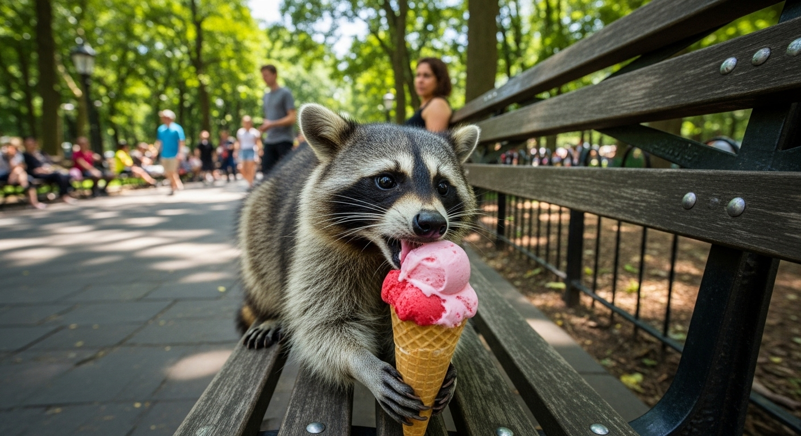

---
layout:
  width: default
  title:
    visible: true
  description:
    visible: false
  tableOfContents:
    visible: true
  outline:
    visible: true
  pagination:
    visible: true
  metadata:
    visible: true
---

# Imagen 4 Ultra Preview


{% column width="66.66666666666666%" %}

This documentation is valid for the following list of our models:

* `imagen-4.0-ultra-generate-preview-06-06`



{% column width="33.33333333333334%" %}
<a href="https://aimlapi.com/app/imagen-4-0-ultra-generate-preview-06-06" class="button primary">Try in Playground</a>



## Model Overview <a href="#model-overview" id="model-overview"></a>

Google’s highest quality image generation model as of July 2025. Supports automatic AI prompt enhancement and pre-moderation of generated content.

## Setup your API Key <a href="#setup-your-api-key" id="setup-your-api-key"></a>

If you don’t have an API key for the AI/ML API yet, feel free to use our [Quickstart guide](https://docs.aimlapi.com/quickstart/setting-up).

## API Schema


[OpenAPI imagen-4-0-ultra](https://raw.githubusercontent.com/aimlapi/api-docs/refs/heads/main/docs/api-references/image-models/Google/imagen-4.0-ultra.json)


## Quick Example

Let's generate an image of the specified aspect ratio using a simple prompt.




```python
import requests
import json   # for getting a structured output with indentation

def main():
    response = requests.post(
        "https://api.aimlapi.com/v1/images/generations",
        headers={
            # Insert your AIML API Key instead of <YOUR_AIMLAPI_KEY>:
            "Authorization": "Bearer <YOUR_AIMLAPI_KEY>",
            "Content-Type": "application/json",
        },
        json={
            "prompt": "Racoon eating ice-cream",
            "model": "imagen-4.0-ultra-generate-preview-06-06",
            "aspect_ratio": "16:9"
        }
    )

    data = response.json()
    print(json.dumps(data, indent=2, ensure_ascii=False))

if __name__ == "__main__":
    main()
```





```javascript
async function main() {
  const response = await fetch('https://api.aimlapi.com/v1/images/generations', {
    method: 'POST',
    headers: {
      // Insert your AIML API Key instead of <YOUR_AIMLAPI_KEY>:
      'Authorization': 'Bearer <YOUR_AIMLAPI_KEY>',
      'Content-Type': 'application/json',
    },
    body: JSON.stringify({
      model: 'imagen-4.0-ultra-generate-preview-06-06',
      prompt: 'Racoon eating ice-cream',
      aspect_ratio: '16:9'
    }),
  });

  const data = await response.json();
  console.log(data);
}

main();
```




<details>

<summary>Response</summary>


```json5
{
  data: [
    {
      mime_type: 'image/png',
      url: 'https://cdn.aimlapi.com/generations/guepard/1756971509123-7ed4055c-1878-47c5-a060-7202392b78a2.png',
      prompt: "A curious raccoon is sitting upright on a weathered wooden picnic table, intensely focused on eating a melting ice cream cone. The raccoon holds the cone delicately in its paws, with sticky ice cream smeared around its mouth and on its fur. The ice cream is a vibrant strawberry pink color, dripping down the cone onto the table surface. Its mask-like facial markings are prominent, and its dark eyes are wide with concentration. The setting is a lush green park during golden hour, with soft, warm sunlight filtering through the background trees, creating a gentle bokeh effect. Empty picnic benches are visible in the soft-focus background. The wooden table is slightly worn, with visible grain and a few scattered leaves. The lighting is natural and warm, highlighting the raccoon's fur and the glistening ice cream."
    }
  ]
}
```


</details>

So we obtained the following 1408x768 image by running this code example:

<figure><figcaption><p>In reality, raccoons shouldn’t be given ice cream or chocolate—it’s harmful to their metabolism. <br>But in the AI world, raccoons party like there’s no tomorrow.</p></figcaption></figure>
