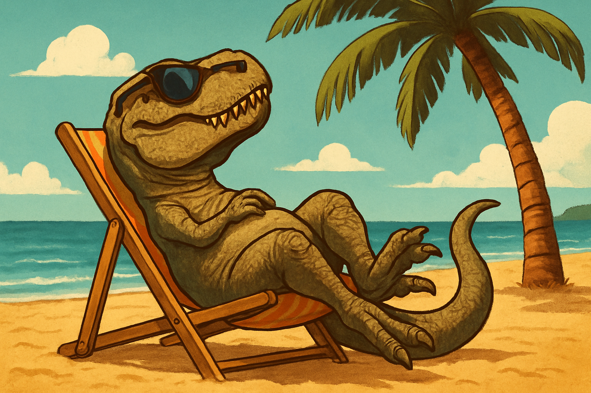
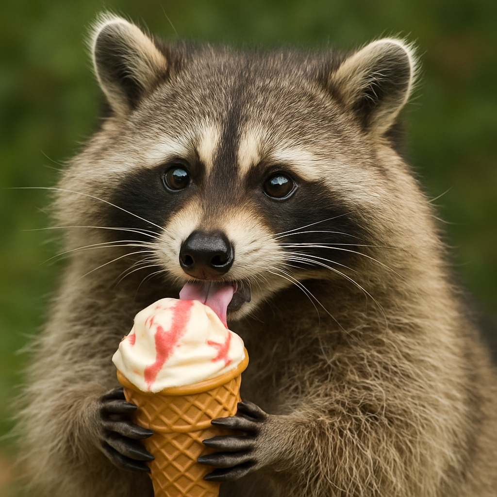
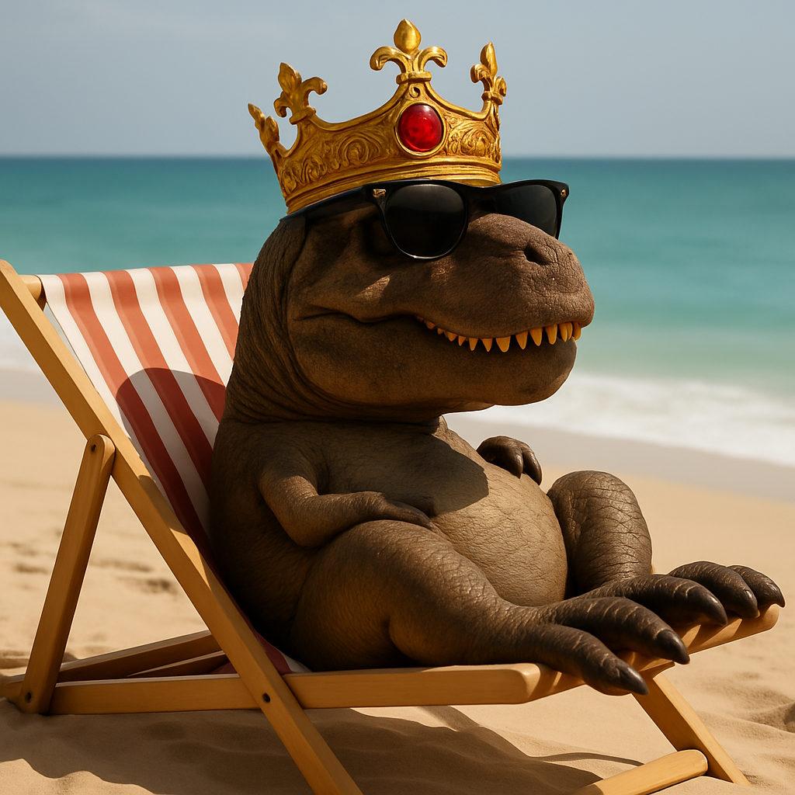

# gpt-image-1


This documentation is valid for the following list of our models:

* `openai/gpt-image-1`


## Model Overview

A powerful multimodal model capable of generating new images, combining existing ones, and applying image masks — all guided by a text prompt.

## Setup your API Key

If you don’t have an API key for the AI/ML API yet, feel free to use our [Quickstart guide](https://docs.aimlapi.com/quickstart/setting-up).

## API Schemas


Note that by default, the `quality` parameter is set to `'medium'`. The output image will still look great, but for even more detailed results, consider setting this parameter to `'high'`.


### Generate image


[OpenAPI gpt-image-1-gen](https://raw.githubusercontent.com/aimlapi/api-docs/refs/heads/main/docs/api-references/image-models/OpenAI/gpt-image-1-gen.json)


### Edit image


Unfortunately, this model only accepts local files specified by their file paths. \
It does not support image input via URLs or base64 encoding.



[OpenAPI gpt-image-1-edit](https://api.aimlapi.com/docs-public-yaml)


## Quick Examples

### Generate image

Let's generate an image of the specified size using a simple prompt.




```python
import requests
import json

def main():
    response = requests.post(
        "https://api.aimlapi.com/v1/images/generations",
        headers={
            # Insert your AIML API Key instead of <YOUR_AIMLAPI_KEY>:
            "Authorization": "Bearer <YOUR_AIMLAPI_KEY>",
            "Content-Type": "application/json",
        },
        json={
            "prompt": "Add a crown",
            "model": "openai/gpt-image-1",
            "size": "1024x1024"
        }
    )

    data = response.json()
    print(json.dumps(data, indent=2, ensure_ascii=False)

if __name__ == "__main__":
    main()
```





```javascript
async function main() {
  const response = await fetch('https://api.aimlapi.com/v1/images/generations', {
    method: 'POST',
    headers: {
      // Insert your AIML API Key instead of <YOUR_AIMLAPI_KEY>:
      'Authorization': 'Bearer <YOUR_AIMLAPI_KEY>',
      'Content-Type': 'application/json',
    },
    body: JSON.stringify({
      model: 'openai/gpt-image-1',
      prompt: 'A T-Rex relaxing on a beach, lying on a sun lounger and wearing sunglasses. Realistic photo.',
      size: '1536x1024'
    }),
  });

  const data = await response.json();
  console.log(data);
}

main();
```




<details>

<summary>Response</summary>


```json5
{
  "created": 1749730922,
  "background": "opaque",
  "data": [
    {
      "url": "https://cdn.aimlapi.com/generations/hedgehog/1749730923700-29fe35d2-4aef-4bc5-a911-6c39884d16a8.png"
    }
  ],
  "output_format": "png",
  "quality": "medium",
  "size": "1536x1024",
  "usage": {
    "input_tokens": 29,
    "input_tokens_details": {
      "image_tokens": 0,
      "text_tokens": 29
    },
    "output_tokens": 1568,
    "total_tokens": 1597
  }
}
```


</details>

We obtained the following 1536x1024 image by running this code example (\~ 26 s):

<figure><figcaption><p><code>"A T-Rex relaxing on a beach, lying on a sun lounger and wearing sunglasses. Realistic photo."</code></p></figcaption></figure>

<details>

<summary>More images</summary>

<figure><figcaption><p><code>"A T-Rex relaxing on a beach, lying on a sun lounger and wearing sunglasses."</code></p></figcaption></figure>

<figure><figcaption><p><code>"Racoon eating ice-cream"</code></p></figcaption></figure>

</details>

### Edit image: Combine images

Let's combine two images of different sizes using a simple prompt.

<details>

<summary>Our input images</summary>

| <div><figure><figcaption><p>t-rex.png</p></figcaption></figure></div> | <div><figure><figcaption><p>crown.png</p></figcaption></figure></div> |
| -------------------------------------------------------------------------------------------------------------------------- | -------------------------------------------------------------------------------------------------------------------------- |

</details>




```python
from openai import OpenAI


def main():
    client = OpenAI(
        api_key="<YOUR_AIMLAPI_KEY>",
        base_url="https://api.aimlapi.com/v1",
    )

    result = client.images.edit(
        model="openai/gpt-image-1",
        image=[
            open("t-rex.png", "rb"),
            open("crown.png", "rb"),
        ],
        prompt="Put the crown on the T-rex's head"
    )

    print("Generation:", result)


if __name__ == "__main__":
    main()
```





```javascript
import fs from 'fs';
import OpenAI, { toFile } from 'openai';


const main = async () => {
  const client = new OpenAI({
    baseURL: 'https://api.aimlapi.com/v1',
    apiKey: '<YOUR_API_KEY>',
  });

  const imageFiles = ['t-rex.png', 'crown.png'];

  const images = await Promise.all(
    imageFiles.map(
      async (file) =>
        await toFile(fs.createReadStream(file), null, {
          type: 'image/png',
        }),
    ),
  );

  const result = await client.images.edit({
    model: 'openai/gpt-image-1',
    image: images,
    prompt: "Put the crown on the T-rex's head",
  });

  console.log('Generation', result);
};

main();
```




<details>

<summary>Response</summary>


```json5
Generation: ImagesResponse(created=1750278299, data=[Image(b64_json=None, revised_prompt=None, url='https://cdn.aimlapi.com/generations/hedgehog/1750278300281-023df523-e986-431c-bb61-5b9e43301cef.png')], usage=Usage(input_tokens=574, input_tokens_details=UsageInputTokensDetails(image_tokens=517, text_tokens=57), output_tokens=1056, total_tokens=1630), background='opaque', output_format='png', quality='medium', size='1024x1024')
```


</details>

We obtained the following 1024x1024 image by running this code example (\~ 34 s):

<figure><figcaption><p>A true king of the monsters. On vacation.</p></figcaption></figure>

### Edit image: Use an image mask

In this example, we’ll provide the model with our previously generated image of a T-rex on a beach, along with a same-sized mask where the area occupied by the dinosaur is transparent (alpha = 0). In the prompt, we’ll ask the model to remove the masked object from the image and see how well it handles the task.

<details>

<summary>Image &#x26; Mask</summary>

| <div><figure><figcaption><p>Image</p></figcaption></figure></div> | <div><figure><figcaption><p>Mask</p></figcaption></figure></div> |
| ---------------------------------------------------------------------------------------------------------------------- | ------------------------------------------------------------------------------------------------------------------------------------ |

</details>




```python
from openai import OpenAI


def main():
    client = OpenAI(
        api_key="<YOUR_AIMLAPI_KEY>",
        base_url="https://api.aimlapi.com/v1",
    )

    result = client.images.edit(
        model="openai/gpt-image-1",
        image=open("t-rex.png", "rb"),
        mask=open('t-rex-alpha_mask.png', 'rb'),
        prompt="Remove this from the picture"
    )

    print("Generation:", result)


if __name__ == "__main__":
    main()
```





```python
import fs from 'fs';
import OpenAI, { toFile } from 'openai';


const main = async () => {
  const client = new OpenAI({
    baseURL: 'https://api.aimlapi.com/v1',
    apiKey: '<YOUR_AIMLAPI_KEY>',
  });

  const image = await toFile(
    fs.createReadStream('t-rex.png'),
    null,
    {
      type: 'image/png',
    },
  );
  
  const mask = await toFile(
    fs.createReadStream('t-rex-alpha_mask.png'),
    null,
    {
      type: 'image/png',
    },
  );

  const result = await client.images.edit({
    model: 'openai/gpt-image-1',
    image: image,
    mask: mask,
    prompt: 'Remove this from the picture',
  });

  console.log('Generation', result);
};

main();
```




<details>

<summary>Response</summary>


```json5
Generation: ImagesResponse(created=1750275775, data=[Image(b64_json=None, revised_prompt=None, url='https://cdn.aimlapi.com/generations/hedgehog/1750275776080-3fbcf9fc-b8ec-47f1-bb77-4a7e370a3a0c.png')], usage=Usage(input_tokens=360, input_tokens_details=UsageInputTokensDetails(image_tokens=323, text_tokens=37), output_tokens=1056, total_tokens=1416), background='opaque', output_format='png', quality='medium', size='1024x1024')
```


</details>

We obtained the following 1024x1024 image by running this code example (\~ 32 s).

<figure><figcaption><p>Our dinosaur has disappeared into thin air!</p></figcaption></figure>
