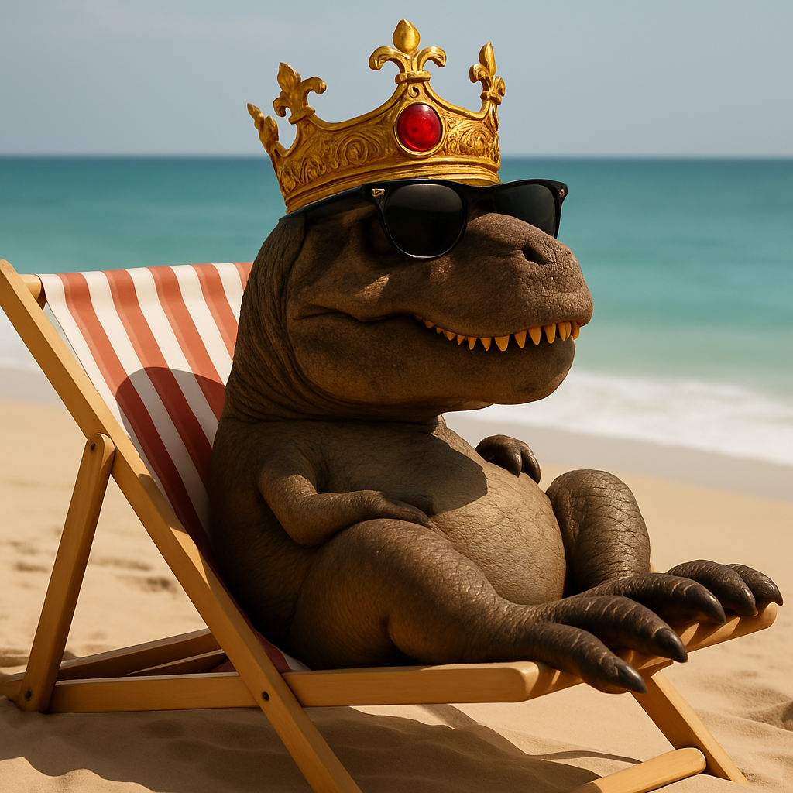

# gpt-image-2


{% column width="66.66666666666666%" %}

This documentation is valid for the following list of our models:

* `openai/gpt-image-2`



{% column width="33.33333333333334%" %}
<a href="https://aimlapi.com/app/?model=openai/gpt-image-2" class="button primary">Try in Playground</a>



## Model Overview

As of late April 2026, this is the most advanced and capable image generation model available from OpenAI. It is designed for high-quality text-to-image generation and image editing, supporting prompt-based rendering, structured edits, and efficient token usage with caching.

## How to Make a Call

<details>

<summary>Step-by-Step Instructions</summary>

:digit\_one: **Setup You Can’t Skip**

:black\_small\_square: [**Create an Account**](https://aimlapi.com/app/sign-up): Visit the AI/ML API website and create an account (if you don’t have one yet).\
:black\_small\_square: [**Generate an API Key**](https://aimlapi.com/app/keys): After logging in, navigate to your account dashboard and generate your API key. Ensure the key is enabled on the UI.

:digit\_two: **Copy the code example**

At the bottom of this page, you'll find a code example that shows how to structure the request. Choose the code snippet in your preferred programming language and copy it into your development environment.

:digit\_three: **Modify the code example**

:black\_small\_square: Replace `<YOUR_AIMLAPI_KEY>` with your actual AI/ML API key.\
:black\_small\_square: Adjust the input field used by this model (for example, prompt, input text, instructions, media source, or other model-specific input) to match your request.

:digit\_four: <sup><sub><mark style="background-color:yellow;">**(Optional)**<mark style="background-color:yellow;"><sub></sup> **Adjust other optional parameters if needed**

Only the required parameters shown in the example are needed to run the request, but you can include optional parameters to fine-tune behavior. Below, you can find the corresponding **API schema**, which lists all available parameters and usage notes.

:digit\_five: **Run your modified code**

Run your modified code inside your development environment. Response time depends on many factors, but for simple requests it rarely exceeds a few seconds.


If you need a more detailed walkthrough for setting up your development environment and making a request step-by-step, feel free to use our [**Quickstart guide.**](https://docs.aimlapi.com/quickstart/setting-up)


</details>

## API Schemas

### Generate image


[OpenAPI gpt-image-2-GENERATE](https://raw.githubusercontent.com/aimlapi/api-docs/refs/heads/main/docs/api-references/image-models/OpenAI/gpt-image-2-GENERATE.json)


### Edit image


Unfortunately, this model only accepts local files specified by their file paths.\
It does not support image input via URLs or base64 encoding.



[OpenAPI gpt-image-2-EDIT](https://raw.githubusercontent.com/aimlapi/api-docs/refs/heads/main/docs/api-references/image-models/OpenAI/gpt-image-2-EDIT.json)


## Code Examples

### Generate image

Let's generate an image of the specified size using a simple prompt.




```python
import requests

response = requests.post(
    "https://api.aimlapi.com/v1/images/generations",
    headers={
        "Content-Type":"application/json",
        "Authorization":"Bearer <YOUR_AIMLAPI_KEY>",
    },
    json={
        "model":"openai/gpt-image-2",
        "prompt": "A T-Rex relaxing on a beach, lying on a sun lounger and wearing sunglasses."
    }
)

data = response.json()
print(data)
```





```javascript
async function main() {
  const response = await fetch('https://api.aimlapi.com/v1/images/generations', {
    method: 'POST',
    headers: {
      'Authorization': 'Bearer <YOUR_AIMLAPI_KEY>',
      'Content-Type': 'application/json',
    },
    body: JSON.stringify({
      model: 'openai/gpt-image-2',
      prompt: 'A T-Rex relaxing on a beach, lying on a sun lounger and wearing sunglasses.',
    }),
  });

  const data = await response.json();
  console.log(JSON.stringify(data, null, 2));
}

main();
```




<details>

<summary>Response</summary>


```json5
{
  "data": [
    {
      "b64_json": null,
      "url": "https://cdn.aimlapi.com/generations/openai-image-generation/1776996650097-ec0cd2e8-d120-43fd-80a1-e0ad65773e6e.png"
    }
  ],
  "meta": {
    "usage": {
      "credits_used": 107341,
      "usd_spent": 0.0536705
    }
  }
}
```


</details>

We obtained the following 1536×1024 image by running this code example (\~45 s):

<figure><figcaption></figcaption></figure>

### Edit image: Combine images

Let's generate an image using two input images and a prompt that defines how they should be edited.

<details>

<summary>Our input images</summary>

|  |  |
| ----------------------------------------------------------------------------------- | ----------------------------------------------------------------------------------- |

</details>




```python
from openai import OpenAI
import json  # for getting a structured output with indentation

def main():
    client = OpenAI(
        api_key="<YOUR_AIMLAPI_KEY>",
        base_url="https://api.aimlapi.com/v1",
    )

    result = client.images.edit(
        model="openai/gpt-image-2",
        image=[
            open("t-rex.png", "rb"),
            open("crown.png", "rb"),
        ],
        prompt="Put the crown on the T-rex's head"
    )

    print("Generation:", result)
    print(json.dumps(data, indent=2, ensure_ascii=False))

if __name__ == "__main__":
    main()
```





```javascript
import fs from 'fs';
import OpenAI, { toFile } from 'openai';

const main = async () => {
  const client = new OpenAI({
    baseURL: 'https://api.aimlapi.com/v1',
    apiKey: '<YOUR_API_KEY>',
  });

  const imageFiles = ['t-rex.png', 'crown.png'];

  const images = await Promise.all(
    imageFiles.map(
      async (file) =>
        await toFile(fs.createReadStream(file), null, {
          type: 'image/png',
        }),
    ),
  );

  const result = await client.images.edit({
    model: 'openai/gpt-image-2',
    image: images,
    prompt: "Put the crown on the T-rex's head",
  });

  console.log('Generation', result);
};

main();
```




<details>

<summary>Response</summary>


```json5
```


</details>

We obtained the following 1024x1024 image by running this code example (\~ 34 s):

<figure><figcaption></figcaption></figure>
