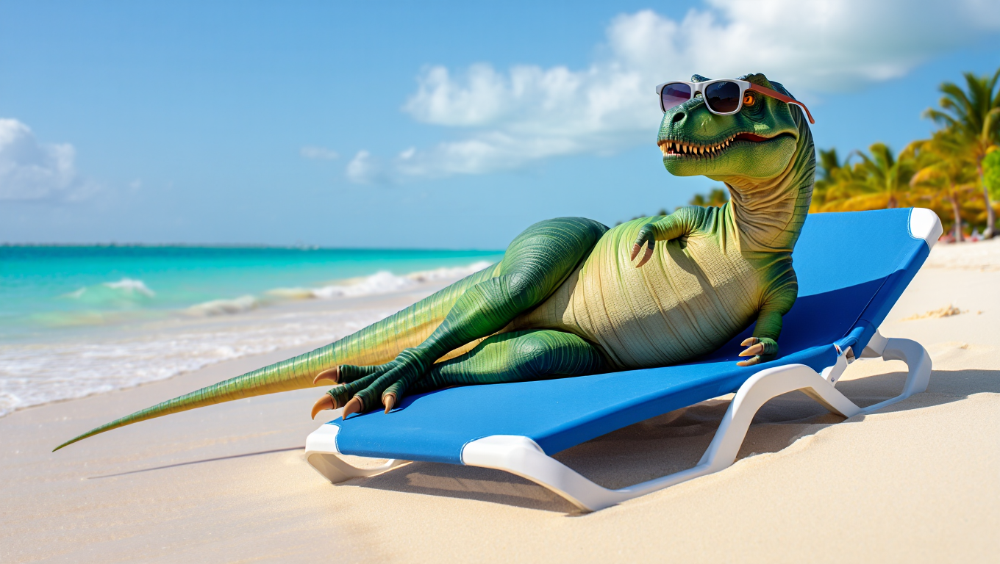

# reve/create-image


{% column width="66.66666666666666%" %}

This documentation is valid for the following list of our models:

* `reve/create-image`



{% column width="33.33333333333334%" %}
<a href="https://aimlapi.com/app/reve/create-image" class="button primary">Try in Playground</a>



## Model Overview

A model trained from the ground up for strong prompt adherence, refined aesthetics, and typography.

## Setup your API Key

If you don’t have an API key for the AI/ML API yet, feel free to use our [Quickstart guide](https://docs.aimlapi.com/quickstart/setting-up).

## API Schema


[OpenAPI reve-create-image](https://raw.githubusercontent.com/aimlapi/api-docs/refs/heads/main/docs/api-references/image-models/Reve/reve-create-image.json)


## Quick Example

Let's generate an image of the specified size using a simple prompt.




```python
import requests
import json  # for getting a structured output with indentation

def main():
    response = requests.post(
        "https://api.aimlapi.com/v1/images/generations",
        headers={
            # Insert your AIML API Key instead of <YOUR_AIMLAPI_KEY>:
            "Authorization": "Bearer <YOUR_AIMLAPI_KEY>",
            "Content-Type": "application/json"
        },
        json={
            "model": "reve/create-image",
            "prompt": "A T-Rex relaxing on a beach, lying on a sun lounger and wearing sunglasses.",
            "aspect_ratio": "16:9"
        }
    )
    
    data = response.json()
    print(json.dumps(data, indent=2, ensure_ascii=False))

if __name__ == "__main__": 
    main()   
```





```javascript
async function main() {
  const response = await fetch('https://api.aimlapi.com/v1/images/generations', {
    method: 'POST',
    headers: {
      // Insert your AIML API Key instead of <YOUR_AIMLAPI_KEY>:
      'Authorization': 'Bearer <YOUR_AIMLAPI_KEY>',
      'Content-Type': 'application/json',
    },
    body: JSON.stringify({
      model: 'reve/create-image',
      prompt: 'A T-Rex relaxing on a beach, lying on a sun lounger and wearing sunglasses.',
      aspect_ratio: '16:9'
    }),
  });

  const data = await response.json();
  console.log('Generation:', data);
}

main();
```




<details>

<summary>Response</summary>


```json
{
  "data": [
    {
      "url": "https://cdn.aimlapi.com/generations/phoenix/1759280291545-6280787e-7e4a-44c9-addf-608314a3cb58.png",
      "b64_json": null,
      "request_id": "rsid-f08b8f47354d688d6de93c400fdaf31c",
      "content_violation": false
    }
  ],
  "meta": {
    "usage": {
      "tokens_used": 126000
    }
  }
}
```


</details>

We obtained the following nice 1360x768 image by running this code example:

<div align="left"><figure><figcaption><p><code>"A T-Rex relaxing on a beach, lying on a sun lounger and wearing sunglasses."</code></p></figcaption></figure></div>
