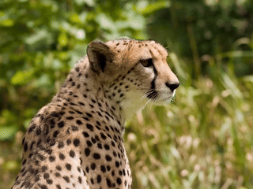

# Video Models

## Overview

With our API you can generate videos from your prompt and imagination.

## Example

<details>

<summary>Full example explanation</summary>

As an example, we will generate a video using the popular **video-01** model from the Chinese company **MiniMax**. This model, as you can verify by checking its [**API Reference**](https://docs.aimlapi.com/api-overview/video-models/minimax-video), accepts an image as input (serving as the first frame of the future video) along with a text prompt, where we can describe what should happen to this image throughout the video.

We used a publicly available [image](https://upload.wikimedia.org/wikipedia/commons/thumb/a/a9/Cheetah4.jpg/1200px-Cheetah4.jpg) from Wikimedia and described in the prompt that the cheetah turns toward the camera.

A notable feature of **video-01** model is that video generation and retrieving the final video file from the server are done through separate API calls. _(AIML API tokens are only consumed during the first step—i.e., the actual video generation.)_

You can insert the contents of each of the two code blocks into a separate Python file in your preferred development environment (or, for example, place each part in a separate cell in **Jupyter Notebook**). Replace `<YOUR_API_KEY>` in both fragments with the **AIML API Key** obtained from your [account](https://aimlapi.com/app/keys).

Next, run the first code block. If everything is set up correctly, you will see the following line in the program output (the specific numbers, of course, will vary):\
`Generation: {'generation_id': '234954179076239'}`

This means that our generation has been queued on the server.

Now, copy this numerical value (_without_ quotation marks) and insert it into the second code block, replacing `<GENERATION_ID>`. Now, we can execute the second code block to request our final video file from the server.

Processing the request on the server may take some time (usually less than a minute). If the requested file is not yet ready, the output will display the corresponding status. Try waiting a bit and rerun the second code block. _(If you're comfortable with coding, you can modify the script to perform this request inside a loop.)_

In our case, after three reruns of the second code block (waiting a total of about 20 seconds), we saw the following output:


```json
Generation: {'id': '234954179076239', 'status': 'completed', 'video': {'url': 'https://cdn.aimlapi.com/whale/inference_output%2Fvideo%2F2025-02-07%2F0c4d54db-da1b-404a-a495-600426796415%2Foutput.mp4?Expires=1738947643&OSSAccessKeyId=LTAI5tAmwsjSaaZVA6cEFAUu&Signature=mo3sfeNpVz5mNQW%2BSt2g8d2%2Fvf4%3D'}}
```


As you can see, the `'status'` is now `'completed'`, and further in the output line, we have a URL where the generated video file can be downloaded.

Here is the resulting turning cheetah ([original 960x720px](https://drive.google.com/file/d/1T06W3BGZ_HanpkN-_lvr7U9HRH7IHG9C/view?usp=sharing)):



</details>

The first code block (generation):


```python

import requests


def main():
    url = "https://api.aimlapi.com/v2/generate/video/minimax/generation"
    payload = {
        "model": "video-01",
        "prompt": "Cheetah turns toward the camera.",
        "first_frame_image": "https://upload.wikimedia.org/wikipedia/commons/thumb/a/a9/Cheetah4.jpg/1200px-Cheetah4.jpg",
    }
    # Insert your AIML API Key instead of <YOUR_API_KEY>:
    headers = {"Authorization": "Bearer <YOUR_API_KEY>", "Content-Type": "application/json"}

    response = requests.post(url, json=payload, headers=headers)
    print("Generation:", response.json())


if __name__ == "__main__":
    main()


```


The second code block (retrieving the generated video file from the server):


```python
import requests


def main():
    url = "https://api.aimlapi.com/v2/generate/video/minimax/generation"
    params = {
        # Insert the generation_id (that was returned by the generation part above) in the quotation marks instead of <GENERATION_ID>:
        "generation_id": "<GENERATION_ID>",
    }
    
    # Insert your AIML API Key instead of <YOUR_API_KEY>:
    headers = {"Authorization": "Bearer <YOUR_API_KEY>", "Content-Type": "application/json"}

    response = requests.get(url, params=params, headers=headers)
    print("Generation:", response.json())


if __name__ == "__main__":
    main()

```

<<<<<<< HEAD

=======
>>>>>>> staging
