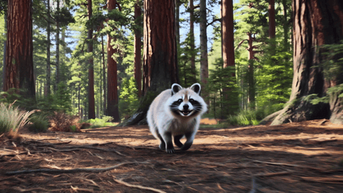

# Happy Horse 1.0


{% column width="66.66666666666666%" %}

This documentation is valid for the following list of our models:

* `alibaba/happyhorse-1-0`



{% column width="33.33333333333334%" %}
<a href="https://aimlapi.com/app/happyhorse-1-0" class="button primary">Try in Playground</a>



Advanced video generation and editing model supporting text-to-video, image-to-video, video-to-video, and references-to-video workflows. Handles multi-shot scenes and supports synchronized audio. Ideal for video generation, image animation, video editing, and media content pipelines.

## Setup your API Key

If you don’t have an API key for the AI/ML API yet, feel free to use our [Quickstart guide](https://docs.aimlapi.com/quickstart/setting-up).

## How to Make a Call

<details>

<summary>Step-by-Step Instructions</summary>

Generating a video using this model involves sequentially calling two endpoints:

* The first one is for creating and sending a video generation task to the server (returns a generation ID).
* The second one is for requesting the generated video from the server using the generation ID received from the first endpoint. Below, you can find both corresponding API schemas.

</details>

## API Schemas

### Create a video generation task and send it to the server


[OpenAPI happyhorse-1-0](https://raw.githubusercontent.com/aimlapi/api-docs/refs/heads/main/docs/api-references/video-models/Alibaba-Cloud/happyhorse-1-0.json)


### Retrieve the generated video from the server

After sending a request for video generation, this task is added to the queue. This endpoint lets you check the status of a video generation task using its `generation_id`, obtained from the endpoint described above.\
If the video generation task status is `completed`, the response will include the final result — with the generated video URL and additional metadata.


[OpenAPI universal-video-endpoint-fetch](https://raw.githubusercontent.com/aimlapi/api-docs/refs/heads/main/docs/api-references/video-models/universal-video-fetch.json)


## Code Example: Image-to-Video

The code below creates a video generation task, then automatically polls the server every **15** seconds until it finally receives the video URL.




```python
import requests
import time

# Insert your AIML API Key instead of <YOUR_AIMLAPI_KEY>:
api_key = "<YOUR_AIMLAPI_KEY>"
base_url = "https://api.aimlapi.com/v2"

# Creating and sending a video generation task to the server
def generate_video():
    url = f"{base_url}/video/generations"
    headers = {
        "Authorization": f"Bearer {api_key}", 
    }

    data = {
        "model": "alibaba/happyhorse-1-0",
        "prompt": "Mona Lisa puts on glasses with her hands.",
        "image_url": "https://raw.githubusercontent.com/aimlapi/api-docs/main/reference-files/mona_lisa_extended.jpg",
        "duration": "7",
    }
 
    response = requests.post(url, json=data, headers=headers)
    
    if response.status_code >= 400:
        print(f"Error: {response.status_code} - {response.text}")
    else:
        response_data = response.json()
        return response_data
    

# Requesting the result of the task from the server using the generation_id
def get_video(gen_id):
    url = f"{base_url}/video/generations"
    params = {
        "generation_id": gen_id,
    }
    
    headers = {
        "Authorization": f"Bearer {api_key}", 
        "Content-Type": "application/json"
        }

    response = requests.get(url, params=params, headers=headers)
    return response.json()


def main():
    # Running video generation and getting a task id
    gen_response = generate_video()
    gen_id = gen_response.get("id")
    print("Generation ID:  ", gen_id)

    # Try to retrieve the video from the server every 15 sec
    if gen_id:
        start_time = time.time()

        timeout = 1000
        while time.time() - start_time < timeout:
            response_data = get_video(gen_id)

            if response_data is None:
                print("Error: No response from API")
                break

            status = response_data.get("status")
            
            if status in ["queued", "generating"]:
                print(f"Status: {status}. Checking again in 15 seconds.")
                time.sleep(15)
            else:
                print("Processing complete:\n", response_data)
                return response_data

        print("Timeout reached. Stopping.")
        return None 


if __name__ == "__main__":
    main()
```





```javascript
const https = require("https");
const { URL } = require("url");

// Replace <YOUR_AIMLAPI_KEY> with your actual AI/ML API key
const apiKey = "<YOUR_AIMLAPI_KEY>";
const baseUrl = "https://api.aimlapi.com/v2";

// Creating and sending a video generation task to the server
function generateVideo(callback) {
  const data = JSON.stringify({
    model: "alibaba/happyhorse-1-0",
    prompt: "Mona Lisa puts on glasses with her hands.",
    image_url: "https://raw.githubusercontent.com/aimlapi/api-docs/main/reference-files/mona_lisa_extended.jpg",
    duration: "7",
  });

  const url = new URL(`${baseUrl}/video/generations`);
  const options = {
    method: "POST",
    headers: {
      "Authorization": `Bearer ${apiKey}`,
      "Content-Type": "application/json",
      "Content-Length": Buffer.byteLength(data),
    },
  };

  const req = https.request(url, options, (res) => {
    let body = "";
    res.on("data", (chunk) => body += chunk);
    res.on("end", () => {
      if (res.statusCode >= 400) {
        console.error(`Error: ${res.statusCode} - ${body}`);
        callback(null);
      } else {
        const parsed = JSON.parse(body);
        callback(parsed);
      }
    });
  });

  req.on("error", (err) => console.error("Request error:", err));
  req.write(data);
  req.end();
}

// Requesting the result of the task from the server using the generation_id
function getVideo(genId, callback) {
  const url = new URL(`${baseUrl}/video/generations`);
  url.searchParams.append("generation_id", genId);

  const options = {
    method: "GET",
    headers: {
      "Authorization": `Bearer ${apiKey}`,
      "Content-Type": "application/json",
    },
  };

  const req = https.request(url, options, (res) => {
    let body = "";
    res.on("data", (chunk) => body += chunk);
    res.on("end", () => {
      const parsed = JSON.parse(body);
      callback(parsed);
    });
  });

  req.on("error", (err) => console.error("Request error:", err));
  req.end();
}

// Initiates video generation and checks the status every 15 seconds until completion or timeout
function main() {
    generateVideo((genResponse) => {
        if (!genResponse || !genResponse.id) {
            console.error("No generation ID received.");
            return;
        }

        const genId = genResponse.id;
        console.log("Generation ID:", genId);

        const timeout = 1000 * 1000; // 1000 sec
        const interval = 15 * 1000; // 15 sec
        const startTime = Date.now();

        const checkStatus = () => {
            if (Date.now() - startTime >= timeout) {
                console.log("Timeout reached. Stopping.");
                return;
            }

            getVideo(genId, (responseData) => {
                if (!responseData) {
                    console.error("Error: No response from API");
                    return;
                }

                const status = responseData.status;
        
                if (["queued", "generating"].includes(status)) {
                    console.log(`Status: ${status}. Checking again in 15 seconds.`);
                    setTimeout(checkStatus, interval);
                } else {
                    console.log("Processing complete:\n", responseData);
                }
            });
        };
        checkStatus();
    })
}

main();
```




<details>

<summary>Response</summary>


```json5
Generation ID:   rLCxsu-1_rTBBGbBC6JFJ
Status: queued. Checking again in 15 seconds.
Status: generating. Checking again in 15 seconds.
Status: generating. Checking again in 15 seconds.
Status: generating. Checking again in 15 seconds.
Status: generating. Checking again in 15 seconds.
Status: generating. Checking again in 15 seconds.
Status: generating. Checking again in 15 seconds.
Status: generating. Checking again in 15 seconds.
Status: generating. Checking again in 15 seconds.
Status: generating. Checking again in 15 seconds.
Processing complete:
 {'id': 'rLCxsu-1_rTBBGbBC6JFJ', 'status': 'completed', 'video': {'url': 'https://cdn.aimlapi.com/generations/alligator/1777398123542-525ef81e-4568-4e38-97bd-cf2e2ee5c2aa.mp4'}}
```


</details>

**Processing time**: \~ 2 min 36 sec.

**Generated video** (1920x1080, with sound):



## Code Example #2: Video-to-Video

The code below creates a video generation task, then automatically polls the server every **15** seconds until it finally receives the video URL.




```python
import requests
import time

# Insert your AIML API Key instead of <YOUR_AIMLAPI_KEY>:
api_key = "<YOUR_AIMLAPI_KEY>"
base_url = "https://api.aimlapi.com/v2"

# Creating and sending a video generation task to the server
def generate_video():
    url = f"{base_url}/video/generations"
    headers = {
        "Authorization": f"Bearer {api_key}", 
    }

    data = {
        "model": "alibaba/happyhorse-1-0",
        "prompt": '''
            Replace the raccoon in the reference video with the dinosaur from the reference image. Match the dinosaur to the raccoon’s exact movement, position, scale, speed, and perspective throughout the entire scene. Seamlessly integrate the dinosaur into the environment with perfectly accurate shadows, lighting, ground contact, and motion blur. Preserve the original forest landscape, camera motion, framing, background, and all scene details without any changes. The result must look fully realistic and natural, as if the dinosaur was originally filmed in the video.
        ''',
        "reference_image_urls": ["https://raw.githubusercontent.com/aimlapi/api-docs/main/reference-files/t-rex.png"],
        "video_url": "https://raw.githubusercontent.com/aimlapi/api-docs/main/reference-files/racoon-in-the-forest.mp4",
        "duration": "8",
    }
 
    response = requests.post(url, json=data, headers=headers)
    
    if response.status_code >= 400:
        print(f"Error: {response.status_code} - {response.text}")
    else:
        response_data = response.json()
        return response_data
    

# Requesting the result of the task from the server using the generation_id
def get_video(gen_id):
    url = f"{base_url}/video/generations"
    params = {
        "generation_id": gen_id,
    }
    
    headers = {
        "Authorization": f"Bearer {api_key}", 
        "Content-Type": "application/json"
        }

    response = requests.get(url, params=params, headers=headers)
    return response.json()


def main():
    # Running video generation and getting a task id
    gen_response = generate_video()
    gen_id = gen_response.get("id")
    print("Generation ID:  ", gen_id)

    # Try to retrieve the video from the server every 15 sec
    if gen_id:
        start_time = time.time()

        timeout = 1000
        while time.time() - start_time < timeout:
            response_data = get_video(gen_id)

            if response_data is None:
                print("Error: No response from API")
                break

            status = response_data.get("status")
            
            if status in ["queued", "generating"]:
                print(f"Status: {status}. Checking again in 15 seconds.")
                time.sleep(15)
            else:
                print("Processing complete:\n", response_data)
                return response_data

        print("Timeout reached. Stopping.")
        return None 


if __name__ == "__main__":
    main()
```





```javascript
const https = require("https");
const { URL } = require("url");

// Replace <YOUR_AIMLAPI_KEY> with your actual AI/ML API key
const apiKey = "<YOUR_AIMLAPI_KEY>";
const baseUrl = "https://api.aimlapi.com/v2";

// Creating and sending a video generation task to the server
function generateVideo(callback) {
  const data = JSON.stringify({
    model: "alibaba/happyhorse-1-0",
    prompt: `
      Replace the raccoon in the reference video with the dinosaur from the reference image. Match the dinosaur to the raccoon’s exact movement, position, scale, speed, and perspective throughout the entire scene. Seamlessly integrate the dinosaur into the environment with perfectly accurate shadows, lighting, ground contact, and motion blur. Preserve the original forest landscape, camera motion, framing, background, and all scene details without any changes. The result must look fully realistic and natural, as if the dinosaur was originally filmed in the video.
    `,
    reference_image_url: ["https://raw.githubusercontent.com/aimlapi/api-docs/main/reference-files/t-rex.png"],
    video_url: "https://raw.githubusercontent.com/aimlapi/api-docs/main/reference-files/racoon-in-the-forest.mp4",
    duration: "8",
  });

  const url = new URL(`${baseUrl}/video/generations`);
  const options = {
    method: "POST",
    headers: {
      "Authorization": `Bearer ${apiKey}`,
      "Content-Type": "application/json",
      "Content-Length": Buffer.byteLength(data),
    },
  };

  const req = https.request(url, options, (res) => {
    let body = "";
    res.on("data", (chunk) => body += chunk);
    res.on("end", () => {
      if (res.statusCode >= 400) {
        console.error(`Error: ${res.statusCode} - ${body}`);
        callback(null);
      } else {
        const parsed = JSON.parse(body);
        callback(parsed);
      }
    });
  });

  req.on("error", (err) => console.error("Request error:", err));
  req.write(data);
  req.end();
}

// Requesting the result of the task from the server using the generation_id
function getVideo(genId, callback) {
  const url = new URL(`${baseUrl}/video/generations`);
  url.searchParams.append("generation_id", genId);

  const options = {
    method: "GET",
    headers: {
      "Authorization": `Bearer ${apiKey}`,
      "Content-Type": "application/json",
    },
  };

  const req = https.request(url, options, (res) => {
    let body = "";
    res.on("data", (chunk) => body += chunk);
    res.on("end", () => {
      const parsed = JSON.parse(body);
      callback(parsed);
    });
  });

  req.on("error", (err) => console.error("Request error:", err));
  req.end();
}

// Initiates video generation and checks the status every 15 seconds until completion or timeout
function main() {
    generateVideo((genResponse) => {
        if (!genResponse || !genResponse.id) {
            console.error("No generation ID received.");
            return;
        }

        const genId = genResponse.id;
        console.log("Generation ID:", genId);

        const timeout = 1000 * 1000; // 1000 sec
        const interval = 15 * 1000; // 15 sec
        const startTime = Date.now();

        const checkStatus = () => {
            if (Date.now() - startTime >= timeout) {
                console.log("Timeout reached. Stopping.");
                return;
            }

            getVideo(genId, (responseData) => {
                if (!responseData) {
                    console.error("Error: No response from API");
                    return;
                }

                const status = responseData.status;
        
                if (["queued", "generating"].includes(status)) {
                    console.log(`Status: ${status}. Checking again in 15 seconds.`);
                    setTimeout(checkStatus, interval);
                } else {
                    console.log("Processing complete:\n", responseData);
                }
            });
        };
        checkStatus();
    })
}

main();
```




<details>

<summary>Response</summary>


```json5
Generation ID:   uDXFoifRMu4rpMBtxSn3Q
Status: queued. Checking again in 15 seconds.
Status: generating. Checking again in 15 seconds.
Status: generating. Checking again in 15 seconds.
Status: generating. Checking again in 15 seconds.
Status: generating. Checking again in 15 seconds.
Status: generating. Checking again in 15 seconds.
Status: generating. Checking again in 15 seconds.
Status: generating. Checking again in 15 seconds.
Status: generating. Checking again in 15 seconds.
Status: generating. Checking again in 15 seconds.
Status: generating. Checking again in 15 seconds.
Processing complete:
 {'id': 'uDXFoifRMu4rpMBtxSn3Q', 'status': 'completed', 'video': {'url': 'https://cdn.aimlapi.com/generations/alligator/1777422401287-d8a3ae7a-fbe8-4a1e-93b1-3acb6c27c125.mp4'}}
```


</details>

**Processing time**: \~ 2 min 51 sec.

<details>

<summary>References</summary>

<table data-full-width="true"><thead><tr><th width="247.06683349609375" valign="top">Reference Image</th><th valign="top">Reference Video (GIF preview)</th></tr></thead><tbody><tr><td valign="top"></td><td valign="top"></td></tr></tbody></table>

</details>

**Generated video** (1920x1080, with sound):


