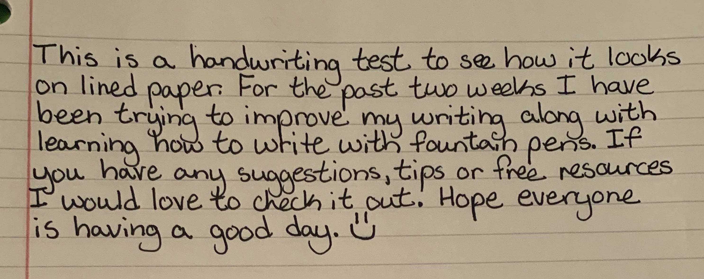
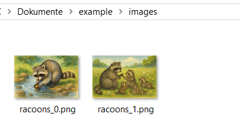

# mistral-ocr-latest


This documentation is valid for the following list of our models:

* `mistral/mistral-ocr-latest`


## Model Overview

This Optical Character Recognition API from Mistral sets a new standard in document understanding. Unlike other models, Mistral OCR comprehends each element of documents—media, text, tables, equations—with unprecedented accuracy and cognition. It takes images and PDFs as input and extracts content in an ordered interleaved text and images.


Note that this OCR does not preserve character formatting: bold, underline, italics, monospace text, etc. \
However, it preserves footnotes (superscript text).


## Setup your API Key

If you don’t have an API key for the AI/ML API yet, feel free to use our [Quickstart guide](https://docs.aimlapi.com/quickstart/setting-up).

## How to Make a Call

1. Copy the code from one of the [examples](mistral-ocr-latest.md#example-1-process-a-pdf-file) below, depending on whether you want to process an image or a PDF.
2. Replace `<YOUR_AIMLAPI_KEY>` with your AIML API key from [your personal account](https://aimlapi.com/app/keys).
3. Replace the URL of the document or image with the one you need.
4. If you need to use different parameters, refer to the API schema below for valid values and operational logic.
5. Save the modified code as a Python file and run it in an IDE[^1] or via the console.

## API Schema


[https://raw.githubusercontent.com/aimlapi/api-docs/refs/heads/main/docs/api-references/vision-models-ocr/Mistral-AI/mistral-ocr-latest.json](https://raw.githubusercontent.com/aimlapi/api-docs/refs/heads/main/docs/api-references/vision-models-ocr/Mistral-AI/mistral-ocr-latest.json)


## Example #1: Text Recognition From an Image

We’ve found a photo of a short handwritten text for OCR testing and will be passing it to the model via URL:

<figure><figcaption><p>Thanks, <a href="https://www.reddit.com/r/Handwriting/comments/ijq9nv/first_handwriting_sample_after_practice/">Reddit</a>!</p></figcaption></figure>


```python
import requests

def main():
    response = requests.post(
        "https://api.aimlapi.com/v1/ocr",
        headers={
            "Authorization": "Bearer <YOUR_AIMLAPI_KEY>",
            "Content-Type": "application/json",
        },
        json={
            "document": {
                "type": "image_url",
                "image_url": "https://i.redd.it/hx0v4fj979k51.jpg"
            },
            "model": "mistral/mistral-ocr-latest",
        },
    )

    # response.raise_for_status()
    data = response.json()
    # print(data)
    
    return data

main()
```


<details>

<summary>Response</summary>


```json5
{'pages': [{'index': 0,
   'markdown': 'This is a handwriting test to see how it looks on lined paper. For the past two weeks I have been trying to improve my writing along with learning hows to write with maintain pens. If you have any suggestions, tips or free resources I would love to check it out. Hope everyone is having a good day.',
   'images': [],
   'dimensions': {'dpi': 200, 'height': 2789, 'width': 3024}}],
 'model': 'mistral-ocr-2503-completion',
 'usage_info': {'pages_processed': 1, 'doc_size_bytes': 573156}}
```


</details>

## Example #2: Process a PDF File

Let's process a PDF file from the internet using the described model:


```python
import requests


def main():
    response = requests.post(
        "https://api.aimlapi.com/v1/ocr",
        headers={
            "Authorization": "Bearer <YOUR_AIMLAPI_KEY>",
            "Content-Type": "application/json",
        },
        json={
            "document": {
                "type": "document_url",
                "document_url": "https://css4.pub/2015/textbook/somatosensory.pdf"
            },
            "model": "mistral/mistral-ocr-latest",
        },
    )

    response.raise_for_status()
    data = response.json()

    print(data)


if __name__ == "__main__":
    main()
    
```


<details>

<summary>Response</summary>


```json5
{'pages': [{'index': 0, 'markdown': "# Anatomy of the Somatosensory System \n\nFrom Wiкibooks ${ }^{1}$\n\nOur somatosensory system consists of sensors in the skin and sensors in our muscles, tendons, and joints. The receptors in the skin, the so called cutaneous receptors, tell us about temperature (thermoreceptors), pressure and surface texture (mechano receptors), and pain (nociceptors). The receptors in muscles and joints provide information about muscle length, muscle tension, and joint angles.\n\n## Cutaneous receptors\n\nSensory information from Meissner corpuscles and rapidly adapting afferents leads to adjustment of grip force when objects are lifted. These afferents respond with a brief burst of action potentials when objects move a small distance during the early stages of lifting. In response to\n\n\nThis is a sample document to showcase page-based formatting. It contains a chapter from a Wikibook called Sensory Systems. None of the content has been changed in this article, but some content has been removed.\n\nFigure 1: Receptors in the human skin: Mechanoreceptors can be free receptors or encapsulated. Examples for free receptors are the hair receptors at the roots of hairs. Encapsulated receptors are the Pacinian corpuscles and the receptors in the glabrous (hairless) skin: Meissner corpuscles, Ruffini corpuscles and Merkel's disks.\n\n[^0]\n[^0]:    ${ }^{1}$ The following description is based on lecture notes from Laszlo Zaborszky, from Rutgers University.", 'images': [{'id': 'img-0.jpeg', 'top_left_x': 155, 'top_left_y': 1073, 'bottom_right_x': 937, 'bottom_right_y': 1694, 'image_base64': None}], 'dimensions': {'dpi': 200, 'height': 1970, 'width': 1575}}, {'index': 1, 'markdown': "Figure 2: Mammalian muscle spindle showing typical position in a muscle (left), neuronal connections in spinal cord (middle) and expanded schematic (right). The spindle is a stretch receptor with its own motor supply consisting of several intrafusal muscle fibres. The sensory endings of a primary (group Ia) afferent and a secondary (group II) afferent coil around the non-contractile central portions of the intrafusal fibres.\n\nrapidly adapting afferent activity, muscle force increases reflexively until the gripped object no longer moves. Such a rapid response to a tactile stimulus is a clear indication of the role played by somatosensory neurons in motor activity.\n\nThe slowly adapting Merkel's receptors are responsible for form and texture perception. As would be expected for receptors mediating form perception, Merkel's receptors are present at high density in the digits and around the mouth ( $50 / \\mathrm{mm}^{2}$ of skin surface), at lower density in other glabrous surfaces, and at very low density in hairy skin. This innervations density shrinks progressively with the passage of time so that by the age of 50 , the density in human digits is reduced to $10 / \\mathrm{mm}^{2}$. Unlike rapidly adapting axons, slowly adapting fibers respond not only to the initial indentation of skin, but also to sustained indentation up to several seconds in duration.\n\nActivation of the rapidly adapting Pacinian corpuscles gives a feeling of vibration, while the slowly adapting Ruffini corpuscles respond to the lataral movement or stretching of skin.\n\n## Nociceptors\n\nNociceptors have free nerve endings. Functionally, skin nociceptors are either high-threshold mechanoreceptors", 'images': [{'id': 'img-1.jpeg', 'top_left_x': 606, 'top_left_y': 228, 'bottom_right_x': 1431, 'bottom_right_y': 705, 'image_base64': None}], 'dimensions': {'dpi': 200, 'height': 1970, 'width': 1575}}, {'index': 2, 'markdown': '|  | Rapidly adapting | Slowly adapting |\n| :-- | :-- | :-- |\n| Surface receptor / <br> small receptive <br> field | Hair receptor, Meissner\'s corpuscle: De- <br> tect an insect or a very fine vibration. <br> Used for recognizing texture. | Merkel\'s receptor: Used for spa- <br> tial details, e.g. a round surface <br> edge or "an X" in brail. |\n| Deep receptor / <br> large receptive <br> field | Pacinian corpuscle: "A diffuse vibra- <br> tion" e.g. tapping with a pencil. | Ruffini\'s corpuscle: "A skin <br> stretch". Used for joint position <br> in fingers. |\n\nTable 1\nor polymodal receptors. Polymodal receptors respond not only to intense mechanical stimuli, but also to heat and to noxious chemicals. These receptors respond to minute punctures of the epithelium, with a response magnitude that depends on the degree of tissue deformation. They also respond to temperatures in the range of $40-60^{\\circ} \\mathrm{C}$, and change their response rates as a linear function of warming (in contrast with the saturating responses displayed by non-noxious thermoreceptors at high temperatures).\n\nPain signals can be separated into individual components, corresponding to different types of nerve fibers used for transmitting these signals. The rapidly transmitted signal, which often has high spatial resolution, is called first pain or cutaneous pricking pain. It is well localized and easily tolerated. The much slower, highly affective component is called second pain or burning pain; it is poorly localized and poorly tolerated. The third or deep pain, arising from viscera, musculature and joints, is also poorly localized, can be chronic and is often associated with referred pain.\n\n## Muscle Spindles\n\nScattered throughout virtually every striated muscle in the body are long, thin, stretch receptors called muscle spindles. They are quite simple in principle, consisting of a few small muscle fibers with a capsule surrounding the middle third of the fibers. These fibers are called intrafusal fibers, in contrast to the ordinary extrafusal fibers. The ends of the intrafusal fibers are attached to extrafusal fibers, so whenever the muscle is stretched, the intrafusal fibers are also\n\nNotice how figure captions and sidenotes are shown in the outside margin (on the left or right, depending on whether the page is left or right). Also, figures are floated to the top/ bottom of the page. Wide content, like the table and Figure 3, intrude into the outside margins.', 'images': [], 'dimensions': {'dpi': 200, 'height': 1970, 'width': 1575}}, {'index': 3, 'markdown': '\n\nFigure 3: Feedback loops for proprioceptive signals for the perception and control of limb movements. Arrows indicate excitatory connections; filled circles inhibitory connections.\n\nFor more examples of how to use HTML and CSS for paper-based publishing, see css4.pub.\nstretched. The central region of each intrafusal fiber has few myofilaments and is non-contractile, but it does have one or more sensory endings applied to it. When the muscle is stretched, the central part of the intrafusal fiber is stretched and each sensory ending fires impulses.\n\nMuscle spindles also receive a motor innervation. The large motor neurons that supply extrafusal muscle fibers are called alpha motor neurons, while the smaller ones supplying the contractile portions of intrafusal fibers are called gamma neurons. Gamma motor neurons can regulate the sensitivity of the muscle spindle so that this sensitivity can be maintained at any given muscle length.\n\n## Joint receptors\n\nThe joint receptors are low-threshold mechanoreceptors and have been divided into four groups. They signal different characteristics of joint function (position, movements, direction and speed of movements). The free receptors or type 4 joint receptors are nociceptors.', 'images': [{'id': 'img-2.jpeg', 'top_left_x': 155, 'top_left_y': 226, 'bottom_right_x': 1307, 'bottom_right_y': 843, 'image_base64': None}], 'dimensions': {'dpi': 200, 'height': 1970, 'width': 1575}}], 'model': 'mistral-ocr-2503-completion', 'usage_info': {'pages_processed': 4, 'doc_size_bytes': 145349}}
```


</details>

## Example #3: Process a PDF File And Parse the Response

As you can see above, the model returns markdown containing the recognized text with formatting elements preserved (headings, italics, bold text, etc.), along with the location of images within the text and the images themselves in base64 format, if you have enabled the corresponding option `include_image_base64`. However, the markdown is returned as a string with newline characters and other string attributes, so you might need to parse the output separately to get clean markdown containing only the formatted text and images. In this example, we’ve written code that make it for us.

<details>

<summary>Step-by-step example explanation</summary>

* **Send OCR request**\
  The `ocr_process()` function sends a POST request to the AIML API with the URL of a PDF document. It asks for OCR results including embedded base64 images.
* **Receive structured OCR output**\
  The API returns a JSON response containing extracted Markdown text and optional base64-encoded images for each page.
* **Create output directory**\
  The script creates an `output_images/` folder to store images extracted from the base64 data.
* **Replace image placeholders**\
  For each Markdown block, the script finds image placeholders like `` and replaces them with local links to newly saved images.
* **Detect image format**\
  The script checks the base64 image header (`data:image/png;base64`, etc.) to determine whether to save the image as `.png` or `.jpg`.
* **Decode and save images**\
  The base64 image is decoded and saved to a file in the `output_images/` folder.
* **Combine Markdown**\
  All Markdown blocks from all pages are joined into a single `.md` file (`output.md`), separated by horizontal rules.
* **Done**\
  The final Markdown file includes properly linked images and is ready for use or preview.

</details>


```python
import os
import re
import base64
import requests

def ocr_process():
    response = requests.post(
        "https://api.aimlapi.com/v1/ocr",
        headers={
            "Authorization": "Bearer <YOUR_AIMLAPI_KEY>",
            "Content-Type": "application/json",
        },
        json={
            "document": {
                "type": "document_url",
                "document_url": "https://zovi0.github.io/public_misc/test-PDF-2.pdf"
            },
            "model": "mistral/mistral-ocr-latest",
            "include_image_base64": True,
            "image_limit": 5 
        },
    )

    data = response.json()
    print(data)
    
    return data

def parse_ocr_output(ocr_output):
    output_dir = "output_images"
    os.makedirs(output_dir, exist_ok=True)

    all_markdown = []

    for page in ocr_output.get("pages", []):
        md = page["markdown"]
        images = {img["id"]: img["image_base64"] for img in page.get("images", []) if img.get("image_base64")}

        def replace_image(match):
            image_id = match.group(1)
            base64_data = images.get(image_id)
            if not base64_data:
                return match.group(0)  # Leave original markdown if no image data

            # Detect image format
            img_match = re.match(r"data:image/(png|jpeg|jpg);base64,(.*)", base64_data)
            if not img_match:
                return match.group(0)

            img_format, img_b64 = img_match.groups()
            ext = "jpg" if img_format in ["jpeg", "jpg"] else "png"
            filename = f"{image_id}.{ext}"
            filepath = os.path.join(output_dir, filename)

            with open(filepath, "wb") as f:
                f.write(base64.b64decode(img_b64))

            return f""

        # Replace image links in markdown with local image links
        md = re.sub(r"!\[.*?\]\((img-\d+\.\w+)\)", replace_image, md)
        all_markdown.append(md)

    # Combine pages with spacing
    final_md = "\n\n---\n\n".join(all_markdown)

    with open("output.md", "w", encoding="utf-8") as f:
        f.write(final_md)

    print("Markdown and images saved.")
    return final_md

if __name__ == "__main__":
    ocr_output = ocr_process()
    parse_ocr_output(ocr_output)

```


<details>

<summary>Response before parsing</summary>


```json5
{'pages': [{'index': 0, 'markdown': '\n\n# Characteristics of plant cells \n\nPlant cells have cell walls composed of cellulose, hemicelluloses, and pectin and constructed outside the cell membrane. Their composition contrasts with the cell walls of fungi, which are made of chitin, of bacteria, which are made of peptidoglycan and of archaea, which are made of pseudopeptidoglycan. In many cases lignin or suberin are secreted by the protoplast as secondary wall layers inside the primary cell wall. Cutin is secreted outside the primary cell wall and into the outer layers of the secondary cell wall of the epidermal cells of leaves, stems and other above-ground organs to form the plant cuticle. Cell walls perform many essential functions. They provide shape to form the tissue and organs of the plant, and play an important role in intercellular communication and plant-microbe interactions. ${ }^{[1]}$ The cell wall is flexible during growth and has small pores called plasmodesmata that allow the exchange of nutrients and hormones between cells. ${ }^{[2]}$', 'images': [{'id': 'img-0.jpeg', 'top_left_x': 198, 'top_left_y': 142, 'bottom_right_x': 405, 'bottom_right_y': 350, 'image_base64': 'data:image/jpeg;base64,/9j/4AAQSkZJRgABAQAAAQABAAD/2wBDAAgGBgcGBQgHBwcJCQgKDBQNDAsLDBkSEw8UHRofHh0aHBwgJC4nICIsIxwcKDcpLDAxNDQ0Hyc5PTgyPC4zNDL/2wBDAQkJCQwLDBgNDRgyIRwhMjIyMjIyMjIyMjIyMjIyMjIyMjIyMjIyMjIyMjIyMjIyMjIyMjIyMjIyMjIyMjIyMjL/wAARCADQAM8DASIAAhEBAxEB/8QAHwAAAQUBAQEBAQEAAAAAAAAAAAECAwQFBgcICQoL/8QAtRAAAgEDAwIEAwUFBAQAAAF9AQIDAAQRBRIhMUEGE1FhByJxFDKBkaEII0KxwRVS0fAkM2JyggkKFhcYGRolJicoKSo0NTY3ODk6Q0RFRkdISUpTVFVWV1hZWmNkZWZnaGlqc3R1dnd4eXqDhIWGh4iJipKTlJWWl5iZmqKjpKWmp6ipqrKztLW2t7i5usLDxMXGx8jJytLT1NXW19jZ2uHi4+Tl5ufo6erx8vP09fb3+Pn6/8QAHwEAAwEBAQEBAQEBAQAAAAAAAAECAwQFBgcICQoL/8QAtREAAgECBAQDBAcFBAQAAQJ3AAECAxEEBSExBhJBUQdhcRMiMoEIFEKRobHBCSMzUvAVYnLRChYkNOEl8RcYGRomJygpKjU2Nzg5OkNERUZHSElKU1RVVldYWVpjZGVmZ2hpanN0dXZ3eHl6goOEhYaHiImKkpOUlZaXmJmaoqOkpaanqKmqsrO0tba3uLm6wsPExcbHyMnK0tPU1dbX2Nna4uPk5ebn6Onq8vP09fb3+Pn6/9oADAMBAAIRAxEAPwD3+iiigAooooAKKKM0AFFFFABRRRQAUUUUAFFGaKACkpc1HLNHDG0ksixxr1ZjgD8TQA+lqnbapYXhItb23nI6+VKrY/I1ZDj1pXQrofRSZpRTGFFFFABRRRQAUUUUAFFFFACUtJRQAUUUhOKAFoppbBo3UWHYdRSA5pM0WFYdRmm7xnFQy3UMQzJIqD/aOP50m0hNpE/emk+prn7/AMYaXY7l84O6jO1e9cddfELUZZi9qkccXpIuazdaC6mbrQien+YAMDjPtXM+LddtbXS5rcOrzSjZhSDXC3vi7V9Sg8ozFF9YVKk/jWKYZpDltzse5OT+dc1TFRtZHNUxStZFnS9Vm0u6LxNtJUrgdGrqvBms6hdasInYyQsCZCf4a4R47gXYLxFYlGV7nNb3hnWzo+pLIRmGX5ZsdfbFY0qmphSq66nso6L6VKOlU7O8hvIElikV0buP88VaDdOK9NNNHqJprQdRSBs0tMYUUUUAFFFFABRRRQAhooooAac5rmPEXiyLQ7uOF4i25dxPpV3xDrsWh2huHVmf+EDvXlmva5LrlytzJEsbImAM9eaxrVeRGFWryI9c0/VbfUrZJ4HVw3bPIq8XVT83A9Sa8R0XxA2jX5li2yELjyyxxmtLWfE+qavCieX9nUcko3UVjHFJLUxWLSjqeryXUMalmkUKO+RXL6z43trOFlsys83b0rzZftEpJ82XHfLHmpDaLnJc5rKeMb2MZ45vSJsX3jjWLtVEciwNj/lmaxbu/vNReNrmeScqOd9WbewfbuVGbJ64qf7FcA4a2fnvtrkeJnJ2RjKtUZlR2zOck4X3qyttGO4YVs22ksw/esVz6ipl0aIPzMSPTFZz9otZImMJT6mKke0Eqp/KniMsO+Qc9K3LiSKyh+VAy9CcdKqzTKWjdNgzwyfxVndNmv1ZozWTBzICKqXUCou9BySAR6D1rqmiW7gIddv0FZV5Ym3O5csmOuKqEmpGc6cosg0HX7nRL0L5haCRxujP8ZPevY4JUmhR1IwQDwc4rxCW2VgWztbsK1vD3iubRC0UyCSEuBuLEla9LD17aM6cNX6SPX1x0p1Z+naraalE0lrMsmAN23tmrwJ9eK74tNXPQTurjqKQHIpaYwooooAKKKKAEoPSij1oAz9SsYb61aKZA+RxkdM14tqdidO1GeDfny2xmvb7tmS0lcdQhI/KvCru4kvJ5ZJT87tzXFijgxe5Ut4A2q7gR8wz0rbGOepOMYplraIbhOOTgZrVK29o8RfkscdK8uUzhVNyehDHp9w4VvlVSOnerUejqGG9yaXfO6rOkq7CxXbitKM/u+etRDmeiOtYeCjzMFjjgUIuaczE/e596U9ietNr3sHgIU4e1nuc8p+0dmAGe/FKDzwo/Gko967Z0YYmF2rGKlySsUbm1efcPOAiBztC96dFpzT3SSShVkAx8vepp54oIiZHChjwBViGYx7WX5gRkGvksZRlBuNN6nrUmpWbLZsTsOHwoFUWUMrRkZ7Vblv2aM8ADFZMt0NqSbSckjg+lcuFVeL/AHjNa3LJOxnXWnSwB5BzGOT7VlTW5lZvLwM+3Wuje5E0ESshxPx1rMvLX7M6LvGCDXaptO6PLqQcdUT+EtcfSbwW6pxcSBTj8q9cDZ6V4eIjb3MdxF8rRtvAY5rptG8dXpvhFfqsiOcLsXbt+tenh8QrWZ1YeurWZ6avANL0qGORXQEHIPTFS+x/CvQTvqd++o6iiigAooooAQ0lOPSm96AM3V7tLTTp5JCANpHP0rxaCNZpnLDI6g11XxCv7n+2RZhysAiDHH41zVlgrkcLnNeXi5NuyPLxcruxfs0L3MQHY9K1pbCGRd8jsMN68Cs/THWK4aVuiKSa2ZoEaP8AfxN5MhX5mOBz6VxKN/kGFhpdjIrWONNqkkA5HOanPtSCNYh5aqQE446Ute1gMD9uRlXq2lYDRRRXqypXkmc3tEFBIAz2oAyahkZt20VGJqRowa7glzyuIYUuFZZEyoOcmpldVA27cAeuMVBNMI41KuFJbaaxN0s/zks5dsEg9B6187Ci6knKR7FGm5R0RtNe2u7YZRk9ajEFvcRqI5UAVick1l2kNutnLCziUgtyTgipLeOFI1Q7dxXmreCjvqbKhL+U0Us9yRhJEKx8DA6U+e1E7qsiqYguCQOay3SaJdkVwypnJxWnbXCvGMyZJIxk9q5p0OT4UZzo2VrmXqNktuVRC5VhwGPSsp7cIhePIfuRxXYzxrJG4ZQeODXOTwSRFty8ZrGMnB6nnVIOm7o3/B/io27NaajcsyEfKznJ/OvRY5VeNCrBh2I714ZdrlUKRnOeorX8O+Ib+LVLOGW+cWauFZTjaBXp4fFJ6M6KOL+yz2DfzS7+ahjkSaMSKwZSMqQetDyqg3F1BHXJrvunsehzKxYooopjENIeKWmscA0MDyj4gkf8JIPTyR/WsGzX902DjJq/4pvWvfEFwxA/dv5Q+gNVwgVdnr3FeNiZNz0PGxLvPQu2Vv8AaBLGTsDLtz6muhu5PtenxWhj+4yNuz2WqFvZxi2iDE/eDVcXqQMnt0rbA4V1pc3Qr2rpwsOc5diDxnI/OmcnIHY07vtUdOpNJnCt619JG0VZHFK8tStdXf2d1VV3HHOada3JuFbKAY96dJbxzFS4PFEcMduDt71UpJRuZKLbJC20E+3Sq8sqW8Zlf04FWAAWDMQorGvZfMlkcsAqHCg14deq8RPl7HsYLDq6T6lZ7yIzebgZ+9gk1Q+2O85k2bQfubT0FNdzcTOfMUrnjCgcU0DDArgKo71d+RWR9zg8rhTipSIZrN5yX851JPQcUWsEttIWMznb0Dd6mVwy7lkB57VLu3K2SDnjmleXU9R4enKNktCzBqRnBt7lBGW+6VOc1LcQOjKQwAC7Fwe55yaygrcqBwv8VWoLmSVT5zjCnCgjtTpxUnaR4WOyunD3oG/pl6ZiYGA8xFwRnr7irU0AuEIYjYOpxzWDav8A6UqhysoYHcB1FdEW5CZUFifxxXmY2moTskfMVoK+pz97ALWUIGLZ5ArLntgCJBwV5wOldNOq36TPAgMMbFNzdc+lYbpvDIGIz6iueElFnl1YqMro1tN8c3Wm2EVqLVJAmcuz4I9K5+bUru6upZmmcs7E7VcniqSxyI7bpMjpg1q2MepWcyTW9k5YA43QbgQa7IVJyasb06s3ax7nRRRXqnqjW6+1Z2s6jDpunS3EpwFXitFh196474gXcUeiC2bJaVxt/A81nUdokVHaLPNrqc3V/JNj/WPk1pWtvJcSYTqOazbVHYliMc5rotIUh2lHTGK8WUryPGj707mmm5UUEcquKngOOo7VDgnPvVxBtQDHavosvhyUn5irauxVkIZ+tJStgydKSu21kYeQVG/zHbUlIAN2SQDXJmMnCjdGlGN5mbq8jqsMSHG49fpWddWryXJkVtyKpJH17VpanbPO0W08KdxNZssz2cNy6IZtxLKq+9eRhV7vN1PoKCtKLRj2yYCZbgVTv9UWNZLdF5bvVy1BFuPNBRwCSD/KsbUIJI7gsUOG5BxXTFt7n6HSaqQjcbpVwYrsCR8RkEde/aug2klAx571zdpbtNdxqAcAg11CkEZYZIPSqZUnHZIVmEZ2r3qGE7b1geR5RNSMRkt0pLSNZZnctlgPLwPU8iqo/Fc4sdJKgzQt3CyRuB/GFH51vugkmjZl+aPkfj1rn4QNyQhgriUNluhxXTO29WdMfQVw5jK9S6PhK8iuxS2Vl3okDEtgjktiueJC5JBVT0JrT1lR5MBEWTu5zWNMuYHGc8cD0rzm3Jnj4iWtiG1g+3alDBnHmSBa9usrcQW0cPZEC/kK8X0BC2vWOAS6yrkCvcE4Ar1cJG0dTuwcfd1JKKKQ13HaNbO7INeY/EK+SXUorIDDQDcT/vYr0uQkH2715F41mSfxFM8bq/yoMpz0rnxErRObEu0bIy7XmHJNb+lFRbsSSPmrBtBujA6MeiiteTVrHRoUhuiyu4yPlzzXjKEpPQ4sHRlWk1E2kOcYNXecY9qzbaaO5iEsTZXHToa0I23KDX1OH1ppLoZVITjUakiq/D0lTSxZOQMVFsYDJrpvc5ne+w2mP1Bp/WjtissRTVWHKVCXLK4yXbPE6KcFhgCuZuLS4S78t5NiIAojHUgf0rpHDKHCABipwTWQu9ogtyGW4dtocj5cfWvFowdOfJM9zCTU476mXf2bXJzaurEHPy9hUDF4iUmQ7iOCw4NbTRsqBbdF/d/K5HGe9QbhLAUkQFgOCT1NddtbI9/DZnOk7PYzFUJhtqg/SlL7WPzDA9Kui2a5ljDpsAHI6U77ItoSix/PjOX6H6UOCtqen/bMEtjNQmeTYmST7VoiMRwosBVZUYFie3uat+dF5AlSNYmJ2gMMc1DFYoZTdktKM/Mid6zUow3PGxeaSr+6hsi/bLiDaNyqcOF6n3FdJEqR4VSQEXoaxLWD7LfvPONkJXgd844rYWdDGJGx0BxnrXn4urHmSPHxEk2oroZGqsxuAoc7WGfoayLp1ICIeVPNXbyZXnkkzwDx9KyMPPP+7TLyMAF9a5qUbyseP8dQ9M8DaVbDSIb7yw08mfnI6YJrslPQe1YfhK1mtfDltDOmx1ByPxNbgAzXuUo2iezRjyxsSUlLSVoaHl/jLxDqEWvXmnxSbYE2YCnB5QHr+NcVPMIwZJnwDyT3rofGw/4rC+65Bj/9FrWA9uxUGWNip9VIry6jm5SR5lRzdRouWE0ckSSI2FQjnFTa7DDqeoxCSZAiQ5ywxzmq1nsiTYrAAnoauGG1uVZbuFnCnjy2wfxrOhU5J6m+U4qNCveQ7w3eQmaW3LsFB+Tdxn8e9dXHIVOT+Vc5DokLSWphnASNt3lk5xW+Tyf8K9Onj43sb5wqWJkqtFlwOJAMUrrlMYqorMvIp3nOeK9JVIyjzRZ4zk9IsYRgkUlByTRXPKpzvlSLVOEPeEOAeR9Ka6q0YjcZX+7jNK3I+lO3EKCDn6V5OZTcasV1NsO1F3tuc5cSS21y0aRsIhyp96hnmKebIUOw4aLaue3P610rrG6lZhhc7h65qvFYxRQ7FdgueATzVxx0EvM9fnstEY62t5hJrc5LAFt/bvTZ4rmObzCzMwwSuM4z1NdFDEtvHsBJOc/eqUwSTsscJWOVj8rsMhT7461k8xb2iQ6skY72zXcS+VHlVJG48YOOuKu2Nu1rZrG4APcjvVz7K9qFSeeOZ2PLRcKPYg96rz3MdsvzkA56H0rCrUlVVluQpTnLliQTSGVzEqxtGAdxYjOaoSxSJZsQx24Aya0JLJJ3SQEEYJz7VmXl29wRGBhIzt+tcjUnpLdHFVnKHNzbmZdn90g9TyfWrPhkBvEun7sZ80DB71TvGzKkYXAHOa6bwNpIuNTjuZ43Cxr5kbHpmu3CwuznwsLu56ioGMdPanDGelApa9hHsLQWjFFFAzLudA0y7vWu57KKSc4JkI54GB/KpbnSrO7txDPAjoOikdKvUhNTyolxR494o0GTS9QdoosW+NwKjge1ZNvcDftdwpHb1r2m9sY722eGVQVbocV5T4n8OHQrhPLlkeKUZDFRw2elediMPrdHm1sPZuUSK1uPs8/mKxJXk49K6GGeK5i3IzFupz1FchFdliivjHTitG1vDaMzKMjuK82ULGFGfJ7p0Z4HHSja5wR0NQW94lxCGGPpUrS+WgfdhScH2renWrUtmdboxqajwjYJxSY6561TN87s8cZ+ZT8n+0KfZXLXUZbGGRsHNbvM6z93Qj2NPYsMoIwehqJvkBjVuT3qXIJOKjdXD7goxXDWqSlq9zsw8VzJJbFVi7fLJu/3hT1dNu15lcjoO9PEyuxV4zj1FKv2c8ALj0rz/eTue5KK5LWGCaJpd2AAB0qS3upPtG+J2TaOCKgkQNJsRQPepoSY9ysoUAfe9a0pud9zDEUYRp8y3JFRQzuSWkc723dz61yniK6ea+SGKSaJAh3yp91a6eWV2tZGhYO+DwB7VzFjYXl4fM8vygsnzs/Vh6CvcwjgouUtxZY6cXKpPoa+lNL/AGEGllZ22kByckgdKzWO4852k1vTmGzsthPykHAPUfSucmYpAceua56klOfMjwczkqlbmjsVTm5u/KXdlvlXHrXs+haf/Z2k21u2C6JgsO/evOPBOlxalrDSSEg26iUAdz0r1lcKoUdq9DC09LmuFp6cw8UUUortOwWiiigAxSYopaAGbBjGOKhubSC5j2TxCRR2IBxVimuCV96LITSe5w+u+CdPSxmnskeOZRvHJIPtivOhcTL8p+XnGCOa97ZdwAYZHeue1PwhpeoMZHiZHzkFWxXHXwqlqjjr4VS1iebWtw6fvYzhxxt7Vp292t0jW8w5buOKwb6GTT9QntsOgVztyeozViOU4RgQG715U6bjozz/AN5Tep0iWUUbwtj/AFQwpzUyxrHkAYZjk4rP0+9MqOkjAHsTUGvMWVFjklyVyTGSKeHoKcrM9bBU/rLUUzXMkcZzK4RP7x45pqSxzoSrh1zjKmuRukmkS3hjeV9yFm35bkDNdDo0Bg0uPeFDOAxG3GK6sRhlTjc9HFYD6tG/MWxbIACu7n3qRbZFTAH60gmiCk7l47ZrLm1NlciPFeZ7K+p5ssZJL4jUNuGTbtAHrup0gjiVVdlIx65rCk1GeSPG5R+FVJZXYDdJx+VWqaOeePnLQ27nUooHAiUH6Cs/+0ZwSUIA9CM1nvMsa5U7jVU3cm729K1SlscrrVWmk9zQvb13i3ysDsBI4rIinmniPmnJPI4xSzs0wKk43DFNXaoQZOAMVahbUzUZKPvnpXw7so1sJbwcSMxRvcCu4P3q4X4dXqGynsx95D5h+hruuuM969jD2UEevhrKmhxpRSe1LWxuLRRRQAUUUUAFIaWkNABjimNzn2p/amMCeKLBY5Hxd4eGp2v2m2hzeLwuP4q8zkjnsrnybgbJUb5lb+Ef1r3nywTmsrVvD1hqyO0tvGZtuFk5BBrlrYdSRzVsOpank0cwkyVIJXritWwvNoKTEhR0zWXrGk3Wh34hmKhm+ZQOhGetZTXN1Hcja25T/f6V5jpcjPL9+jPQ7CbUIYAfsw3se47Vmvd3DEhpWCnsaxzdSuOdseOgTv8AnUsKXV1KsUKu7HpjmkozmzSdWpUdi00yA8vTBcRdN1a9n4H1a8hEjBIs9pOtWo/h3qfmruuIAmfmwecVtDCyFHDTZzMtyX+WJlx6ioYxLdOETc7E4C9TXrlt4N0iO3WOS0jkOOWJPJrQs9A0uwfzLazjjfpkVvHBnRDB9zydPCuuMgKWEhB6Ekf41oaX4J1K6nH2yBraLuW6n8q9Y2YPApcfnW8cMludEcJBHITeDbC30mdILcS3Gw7Hbk57CvP00DVWlS3WzPmY5AHfFe3baaIQMnA3euKqWGiyp4aMjhPA+jahpt1dPeWzQq8QUEkHnNd6KQR4PtTgDWlOHKrGlOHIrCgUvegUVoaC0UUUAFFFFABSGlooASjiloxQAlM6Z7CpMU3AoYHB+P4LFoI5J3AuQuE9SM15v16HIHSvZvEHha018bpWaOdE2JIDkL3+7xmufX4ax/ZWibU905IKyCDAUDqNu7nNcNWhKTujhrUakpXiYvgvRrPWJrr7XGXWILxnHWvQtO0TT9MG21tkTJzzyf1qt4a8MReH4XHnmeaTAZ9u0H8MnFb3lr9a6KVPlSub0qXKtVqJgDAIyaMc04AAUBa2NnpsJg04UUUMYUUuKKQCUUtFMBtOHSjFFACUZpaMUAf/2Q=='}], 'dimensions': {'dpi': 200, 'height': 2339, 'width': 1654}}], 'model': 'mistral-ocr-2503-completion', 'usage_info': {'pages_processed': 1, 'doc_size_bytes': 60230}}
```


</details>

<details>

<summary>Response after parsing</summary>


**Contents of the `output.md` file:**


```markdown


# Characteristics of plant cells 

Plant cells have cell walls composed of cellulose, hemicelluloses, and pectin and constructed outside the cell membrane. Their composition contrasts with the cell walls of fungi, which are made of chitin, of bacteria, which are made of peptidoglycan and of archaea, which are made of pseudopeptidoglycan. In many cases lignin or suberin are secreted by the protoplast as secondary wall layers inside the primary cell wall. Cutin is secreted outside the primary cell wall and into the outer layers of the secondary cell wall of the epidermal cells of leaves, stems and other above-ground organs to form the plant cuticle. Cell walls perform many essential functions. They provide shape to form the tissue and organs of the plant, and play an important role in intercellular communication and plant-microbe interactions. ${ }^{[1]}$ The cell wall is flexible during growth and has small pores called plasmodesmata that allow the exchange of nutrients and hormones between cells. ${ }^{[2]}$
```


**Content of `output_images` subfolder**

<figure><figcaption></figcaption></figure>

**How it looks in any Markdown viewer:**

<figure><figcaption></figcaption></figure>

It looks almost like the original PDF, but all the text has been recognized, and the markdown is easy to use further, for example, to embed in a web page. Enjoy!

</details>

[^1]: An integrated development environment (IDE) is a software application that helps programmers write, test, and debug software code efficiently.
