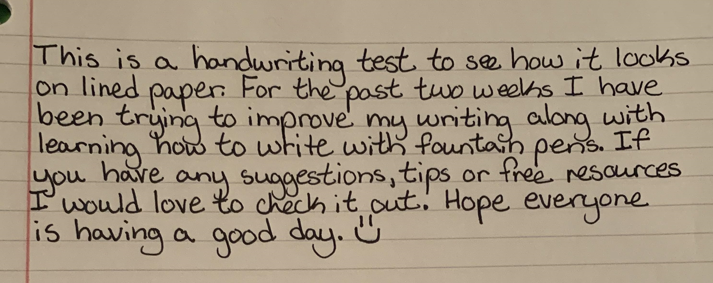

# glm-ocr


This documentation is valid for the following list of our models:

* `zhipu/glm-ocr`


## Model Overview

A lightweight, production-ready OCR model that returns recognized content in Markdown format. \
It delivers high recognition accuracy even on complex page layouts, varied fonts, and mixed text-image documents.

Maximum file size: `50` MB.\
Maximum number of pages: `100`.


Note that this OCR does not preserve character formatting: bold, underline, italics, monospace text, etc.\
However, it preserves footnotes (superscript text).


## Setup your API Key

If you don’t have an API key for the AI/ML API yet, feel free to use our [Quickstart guide](https://docs.aimlapi.com/quickstart/setting-up).

## How to Make a Call

<details>

<summary>Step-by-Step Instructions</summary>

* Copy the code from one of the [examples](glm-ocr.md#example-1-process-a-pdf-file) below, depending on whether you want to process an image or a PDF.
* Replace `<YOUR_AIMLAPI_KEY>` with your AIML API key from [your personal account](https://aimlapi.com/app/keys).
* Replace the URL of the document or image with the one you need.
* If you need to use different parameters, refer to the API schema below for valid values and operational logic.
* Save the modified code as a Python file and run it in an IDE[^1] or via the console.

</details>

## API Schema


[OpenAPI glm-ocr](https://raw.githubusercontent.com/aimlapi/api-docs/refs/heads/main/docs/api-references/vision-models/Zhipu/glm-ocr.json)


## Example #1: Text Recognition From an Image

We’ve found a photo of a short handwritten text for OCR testing and will be passing it to the model via URL:

<div align="left"><figure><figcaption><p>Thanks, <a href="https://www.reddit.com/r/Handwriting/comments/ijq9nv/first_handwriting_sample_after_practice/">Reddit</a>!</p></figcaption></figure></div>




```python
import requests
import json  # for getting a structured output with indentation 

def main():
    response = requests.post(
        "https://api.aimlapi.com/v1/ocr",
        headers={
            # Insert your AIML API Key instead of <YOUR_AIMLAPI_KEY>:
            "Authorization": "Bearer <YOUR_AIMLAPI_KEY>",
            "Content-Type": "application/json",
        },
        json={
            "model": "zhipu/glm-ocr",
            "document": {
                "type": "image_url",
                "image_url": "https://raw.githubusercontent.com/aimlapi/api-docs/main/reference-files/handwriting.jpg"
            }
        },
    )

    data = response.json()
    print(json.dumps(data, indent=2, ensure_ascii=False))

main()
```





```javascript
async function main() {
  try {
    const response = await fetch('https://api.aimlapi.com/v1/ocr', {
      method: 'POST',
      headers: {
        //  Insert your AIML API Key instead of <YOUR_AIMLAPI_KEY>:
        'Authorization': 'Bearer <YOUR_AIMLAPI_KEY>',
        'Content-Type': 'application/json',
      },
      body: JSON.stringify({
        model: 'zhipu/glm-ocr',
        document: {
            type: 'image_url',
            image_url: 'https://raw.githubusercontent.com/aimlapi/api-docs/main/reference-files/handwriting.jpg'
        }
      }),
    });

    if (!response.ok) {
      throw new Error("HTTP error!");
    }

    const data = await response.json();
    console.log(JSON.stringify(data, null, 2));

  } catch (error) {
    console.error('Error', error);
  }
}

main();
```




<details>

<summary>Response</summary>


```json5
{
  "pages": [
    {
      "index": 0,
      "markdown": "This is a handwriting test to see how it looks on lined paper. For the past two weeks I have been trying to improve my writing along with learning how to write with fountain pens. If you have any suggestions, tips or free resources I would love to check it out. Hope everyone is having a good day. \"",
      "images": [],
      "dimensions": {
        "dpi": 72,
        "height": 1180,
        "width": 2972
      }
    }
  ],
  "model": "glm-ocr",
  "usage_info": {
    "pages_processed": 1,
    "doc_size_bytes": null
  },
  "meta": {
    "usage": {
      "credits_used": 26000
    }
  }
}
```


</details>

## Example #2: Process a PDF File

Let's process a PDF file from the internet using the described model:




```python
import requests
import json  # for getting a structured output with indentation 

def main():
    response = requests.post(
        "https://api.aimlapi.com/v1/ocr",
        headers={
            # Insert your AIML API Key instead of <YOUR_AIMLAPI_KEY>:
            "Authorization": "Bearer <YOUR_AIMLAPI_KEY>",
            "Content-Type": "application/json",
        },
        json={
            "model": "zhipu/glm-ocr",
            "document": {
                "type": "document_url",
                "document_url": "https://css4.pub/2015/textbook/somatosensory.pdf"
            }
        },
    )

    data = response.json()
    print(json.dumps(data, indent=2, ensure_ascii=False))

main()
```





```javascript
async function main() {
  try {
    const response = await fetch('https://api.aimlapi.com/v1/ocr', {
      method: 'POST',
      headers: {
        //  Insert your AIML API Key instead of <YOUR_AIMLAPI_KEY>:
        'Authorization': 'Bearer <YOUR_AIMLAPI_KEY>',
        'Content-Type': 'application/json',
      },
      body: JSON.stringify({
        model: 'zhipu/glm-ocr',
        document: {
            type: 'document_url',
            document_url: 'https://css4.pub/2015/textbook/somatosensory.pdf'
        }
      }),
    });

    if (!response.ok) {
      throw new Error("HTTP error!");
    }

    const data = await response.json();
    console.log(JSON.stringify(data, null, 2));

  } catch (error) {
    console.error('Error', error);
  }
}

main();
```




<details>

<summary>Response</summary>


```json5
{
  "pages": [
    {
      "index": 0,
      "markdown": "<div align=\"center\">\n\n# Anatomy of the Somatosensory System\n\n</div>\n\nFROM WIKIBOOKS $ ^{1} $\n\nOur somatosensory system consists of sensors in the skin and sensors in our muscles, tendons, and joints. The receptors in the skin, the so called cutaneous receptors, tell us about temperature (thermoreceptors), pressure and surface texture (mechano receptors), and pain (nociceptors). The receptors in muscles and joints provide information about muscle length, muscle tension, and joint angles.\n\n## Cutaneous receptors\n\nSensory information from Meissner corpuscles and rapidly adapting afferents leads to adjustment of grip force when objects are lifted. These afferents respond with a brief burst of action potentials when objects move a small distance during the early stages of lifting. In response to\n\nThis is a sample document to showcase page-based formatting. It contains a chapter from a Wikibook called Sensory Systems. None of the content has been changed in this article, but some content has been removed.\n\n<div align=\"center\">\n\nFigure 1: Receptors in the human skin: Mechanoreceptors can be free receptors or encapsulated. Examples for free receptors are the hair receptors at the roots of hairs. Encapsulated receptors are the Pacinian corpuscles and the receptors in the glabrous (hairless) skin: Meissner corpuscles, Ruffini corpuscles and Merkel's disks.\n\n</div>",
      "images": [],
      "dimensions": {
        "dpi": 72,
        "height": 2363,
        "width": 1890
      }
    },
    {
      "index": 1,
      "markdown": "<div align=\"center\">\n\nFigure 2: Mammalian muscle spindle showing typical position in a muscle (left), neuronal connections in spinal cord (middle) and expanded schematic (right). The spindle is a stretch receptor with its own motor supply consisting of several intrafusal muscle fibres. The sensory endings of a primary (group Ia) afferent and a secondary (group II) afferent coil around the non-contractile central portions of the intrafusal fibres.\n\n</div>\n\nrapidly adapting afferent activity, muscle force increases reflexively until the gripped object no longer moves. Such a rapid response to a tactile stimulus is a clear indication of the role played by somatosensory neurons in motor activity.\n\nThe slowly adapting Merkel's receptors are responsible for form and texture perception. As would be expected for receptors mediating form perception, Merkel's receptors are present at high density in the digits and around the mouth $ ( 5 0 / \\mathrm {m m} ^ {2} $ of skin surface), at lower density in other glabrous surfaces, and at very low density in hairy skin. This innervations density shrinks progressively with the passage of time so that by the age of 50, the density in human digits is reduced to $ 1 0 / \\mathrm {m m} ^ {2} $ . Unlike rapidly adapting axons, slowly adapting fibers respond not only to the initial indentation of skin, but also to sustained indentation up to several seconds in duration.\n\nActivation of the rapidly adapting Pacinian corpuscles gives a feeling of vibration, while the slowly adapting Ruffini corpuscles respond to the lataral movement or stretching of skin.\n\n## Nociceptors\n\nNociceptors have free nerve endings. Functionally, skin nociceptors are either high-threshold mechanoreceptors",
      "images": [],
      "dimensions": {
        "dpi": 72,
        "height": 2363,
        "width": 1890
      }
    },
    {
      "index": 2,
      "markdown": "<table border=\"1\"><tr><td></td><td>Rapidly adapting</td><td>Slowly adapting</td></tr><tr><td>Surface receptor/small receptive field</td><td>Hair receptor,Meissner&#x27;s corpuscle:Detect an insect or a very fine vibration.Used for recognizing texture.</td><td>Merkel&#x27;s receptor:Used for spatial details,e.g.a round surface edge or“an X&quot;in brail.</td></tr><tr><td>Deep receptor/large receptive field</td><td>Pacinian corpuscle:“A diffuse vibration&quot;e.g.tapping with a pencil.</td><td>Ruffini&#x27;s corpuscle:“A skin stretch&quot;.Used for joint position in fingers.</td></tr></table>\n\n<div align=\"center\">\n\nTable 1\n\n</div>\n\nor polymodal receptors. Polymodal receptors respond not only to intense mechanical stimuli, but also to heat and to noxious chemicals. These receptors respond to minute punctures of the epithelium, with a response magnitude that depends on the degree of tissue deformation. They also respond to temperatures in the range of $ 4 0-6 0^{\\circ} \\mathrm{C} $ , and change their response rates as a linear function of warming (in contrast with the saturating responses displayed by non-noxious thermoreceptors at high temperatures).\n\nPain signals can be separated into individual components, corresponding to different types of nerve fibers used for transmitting these signals. The rapidly transmitted signal, which often has high spatial resolution, is called first pain or cutaneous pricking pain. It is well localized and easily tolerated. The much slower, highly affective component is called second pain or burning pain; it is poorly localized and poorly tolerated. The third or deep pain, arising from viscera, musculature and joints, is also poorly localized, can be chronic and is often associated with referred pain.\n\n## Muscle Spindles\n\nScattered throughout virtually every striated muscle in the body are long, thin, stretch receptors called muscle spindles. They are quite simple in principle, consisting of a few small muscle fibers with a capsule surrounding the middle third of the fibers. These fibers are called intrafusal fibers, in contrast to the ordinary extrafusal fibers. The ends of the intrafusal fibers are attached to extrafusal fibers, so whenever the muscle is stretched, the intrafusal fibers are also\n\nNotice how figure captions and sidenotes are shown in the outside margin (on the left or right, depending on whether the page is left or right). Also, figures are floated to the top/bottom of the page. Wide content, like the table and Figure 3, intrude into the outside margins.",
      "images": [],
      "dimensions": {
        "dpi": 72,
        "height": 2363,
        "width": 1890
      }
    },
    {
      "index": 3,
      "markdown": "<div align=\"center\">\n\nFigure 3: Feedback loops for proprioceptive signals for the perception and control of limb movements. Arrows indicate excitatory connections; filled circles inhibitory connections.\n\n</div>\n\nFor more examples of how to use HTML and CSS for paper-based publishing, see css4.pub.\n\nstretched. The central region of each intrafusal fiber has few myofilaments and is non-contractile, but it does have one or more sensory endings applied to it. When the muscle is stretched, the central part of the intrafusal fiber is stretched and each sensory ending fires impulses.\n\nMuscle spindles also receive a motor innervation. The large motor neurons that supply extrafusal muscle fibers are called alpha motor neurons, while the smaller ones supplying the contractile portions of intrafusal fibers are called gamma neurons. Gamma motor neurons can regulate the sensitivity of the muscle spindle so that this sensitivity can be maintained at any given muscle length.\n\n## Joint receptors\n\nThe joint receptors are low-threshold mechanoreceptors and have been divided into four groups. They signal different characteristics of joint function (position, movements, direction and speed of movements). The free receptors or type 4 joint receptors are nociceptors.",
      "images": [],
      "dimensions": {
        "dpi": 72,
        "height": 2363,
        "width": 1890
      }
    }
  ],
  "model": "glm-ocr",
  "usage_info": {
    "pages_processed": 4,
    "doc_size_bytes": null
  },
  "meta": {
    "usage": {
      "credits_used": 104000
    }
  }
}
```


</details>

[^1]: An integrated development environment (IDE) is a software application that helps programmers write, test, and debug software code efficiently.
