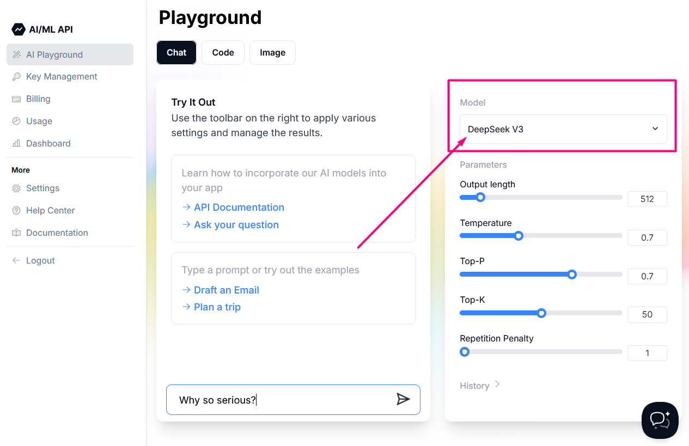

# How to use the Free Tier?

## About

The Free Tier allows users to use the service with certain limits at no cost. This helps them test the product and see if it works for their goals before making any payments.

## Which models are included

### **In AI Playground**

Some models can be tested in the [AI Playground](https://aimlapi.com/app/) available on our official website. There, you will find a list of models ready to be launched.&#x20;

<div data-full-width="false"><figure><figcaption></figcaption></figure></div>


The following rules apply:

* Regular models come with 50 free requests per day.
* You can execute only one request at a time.
* [Pro models](pro-models.md) have a limit of 10,000 AI/ML API tokens per day.

### **Via API**

Using our API on the Free Tier, you can access:

* [Chat completion text models](../api-references/model-database.md#text-models-llm),
* [Embedding models](../api-references/model-database.md#embedding-models),
* [Image models](../api-references/model-database.md#image-models).

The following Free Tier rules apply:

* You are allowed 10 free requests per hour.
* When using Chat Completion text models, the maximum output is limited to 512 tokens. Image attachments in messages are not supported.
* You can generate up to 10 images per hour.&#x20;
* Using the following image models, you can only 1 image generated at a time:

<details>

<summary>Model list</summary>

* [flux/schnell ](../api-references/image-models/Black-Forest-Labs/flux-schnell.md)
* [flux-pro](../api-references/image-models/Black-Forest-Labs/flux-pro.md)&#x20;
* [flux-pro/v1.1 ](../api-references/image-models/Black-Forest-Labs/flux-pro.md)
* [flux-pro/v1.1-ultra](../api-references/image-models/Black-Forest-Labs/flux-pro-v1.1-ultra.md)
* [flux/dev](../api-references/image-models/Black-Forest-Labs/flux-dev.md)
* [flux/dev/image-to-image](../api-references/image-models/Black-Forest-Labs/flux-dev-image-to-image.md)
* [flux-realism](../api-references/image-models/Black-Forest-Labs/flux-realism.md)
* [stable-diffusion-v3-medium ](../api-references/image-models/Stability-AI/stable-diffusion-v3-medium.md)
* [stable-diffusion-v35-large](../api-references/image-models/Stability-AI/stable-diffusion-v35-large.md)
* [recraft-v3](../api-references/image-models/RecraftAI/recraft-v3.md)

</details>

* For the following models generated images are limited to a resolution of 512x512 pixels:

<details>

<summary>Model list</summary>

* [dall-e-2](../api-references/image-models/OpenAI/dall-e-2.md)
* [dall-e-3](../api-references/image-models/OpenAI/dall-e-3.md)
* [stabilityai/stable-diffusion-xl-base-1.0](../api-references/image-models/Stability-AI/stable-diffusion-xl-base-1.0.md)

</details>

* If image generation requires more than 512 AI/ML API tokens, the request will not be processed.

#### Error Message

When you attempt to call the API after reaching the limit, you will receive an appropriate error. \
For example, if the `/v1/chat/completions` endpoint was called:


```json
{
    "message": "Free-tier limit: You've reached your free limit for the hour. Get AI/ML Subscription to use API, visit https://aimlapi.com/app/billing/ !"
    "path": "/v1/chat/completions"
    "requestId": "798b860e-98c2-4e8e-8c50-550bcfc2eccc"
    "statusCode": "429"
    "timestamp": "2025-03-11T07:13:27.813Z"
}
```

