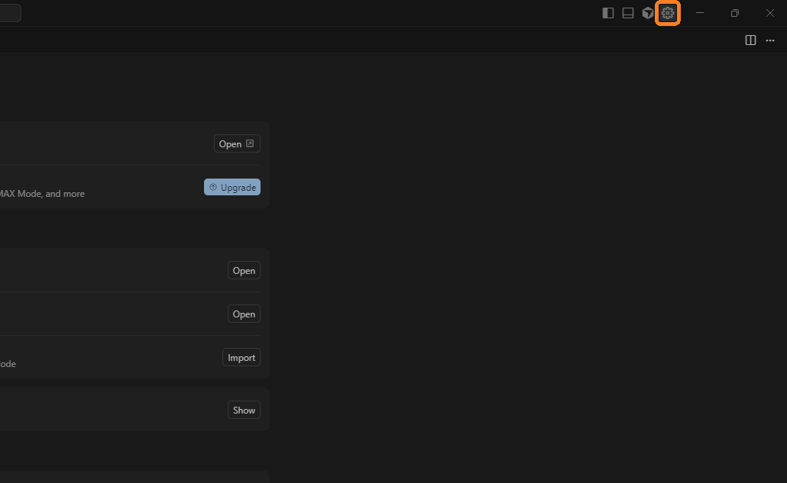
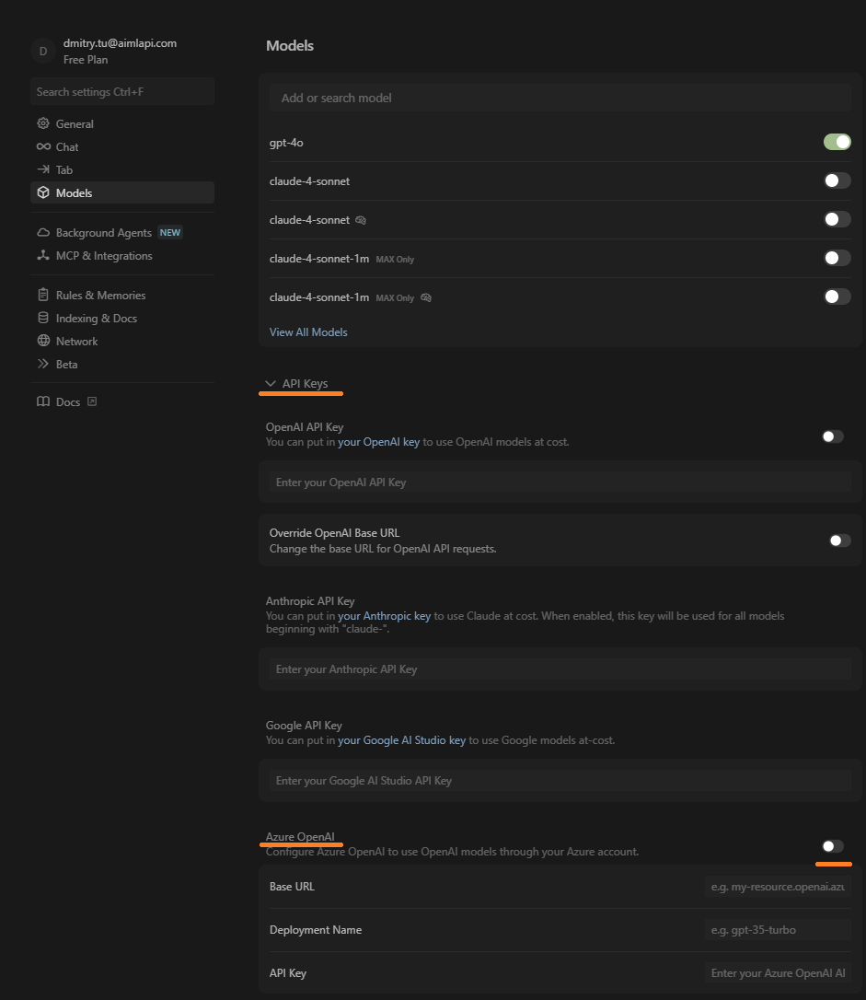
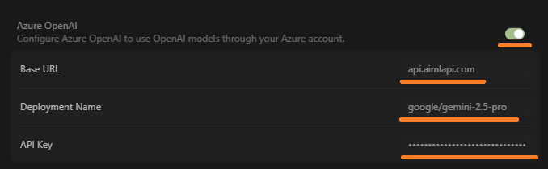
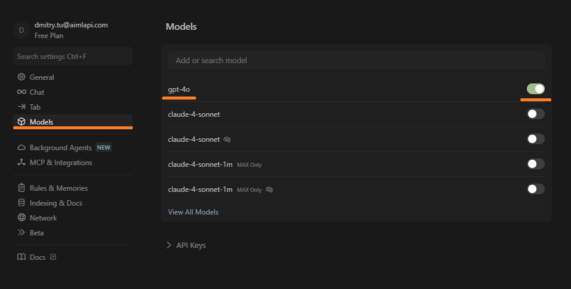
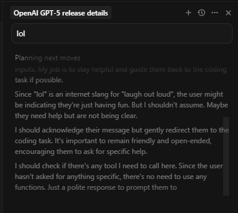
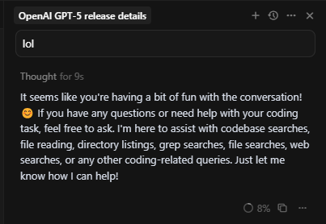

# Cursor


Only versions 1.x are currently supported for integration.\
You can select one of them on [Cursor’s official download page](https://cursor.com/download).


## About

[Cursor](https://cursor.com/) is an advanced AI-powered IDE that combines intelligent code completion, inline explanations, and automatic code editing directly inside the editor.

This guide explains how to connect **AI/ML API** to **Cursor** using the **Azure OpenAI-compatible** flow.\
You’ll get a clean setup with **one endpoint**, support for **slashes in deployment names**.

## 🚀 Quick Setup

<table><thead><tr><th width="248">Field</th><th>Value</th></tr></thead><tbody><tr><td><strong>Base URL</strong></td><td><code>https://api.aimlapi.com</code></td></tr><tr><td><strong>API Key</strong></td><td>Your AI/ML API key (create at <a href="https://aimlapi.com/app/keys">aimlapi.com/app/keys</a>)</td></tr><tr><td><strong>Deployment</strong></td><td><code>google/gemini-2.5-pro</code> <em>(slashes allowed)</em></td></tr><tr><td><strong>Alias (Model ID)</strong></td><td><code>gpt-4o</code> <em>(Bypasses the restriction and makes Cursor work with any mode</em>l<em>)</em></td></tr></tbody></table>


Do **not** add `/v2/azure` or `/openai` to the Base URL.


***

## ✅ Prerequisites

* AI/ML API key
* Cursor IDE (latest)
* Internet access to `api.aimlapi.com`

***

## Installation & Configuration

### 1) Configure Cursor (Azure path)

Open **Cursor → Settings → Models → Azure** and fill in:

**Base URL**

```
https://api.aimlapi.com
```

**Deployment Name**

```
google/gemini-2.5-pro
```

**API Key** Paste your AI/ML API key exactly (avoid spaces).

Click **Verify** to confirm.

<div align="left" data-with-frame="true"><figure><figcaption></figcaption></figure></div>

<div align="left" data-full-width="false" data-with-frame="true"><figure><figcaption></figcaption></figure></div>

<div align="left" data-with-frame="true"><figure><figcaption></figcaption></figure></div>

***

### 2) Keep the model picker clean

In Cursor’s **Chat model selector**, only enable:

```
gpt-4o
```

This alias (Model ID) will send traffic to your deployment (`google/gemini-2.5-pro`).

<div data-with-frame="true"><figure><figcaption></figcaption></figure></div>

***

### 3) How Cursor calls AI/ML API

Example request generated by Cursor:


```http
POST https://api.aimlapi.com/openai/deployments/google/gemini-2.5-pro/chat/completions?api-version=2024-12-01-preview
Api-Key: <YOUR_AIMLAPI_KEY>
Content-Type: application/json

{
  "messages": [
    { "role": "system", "content": "You are a helpful coding assistant." },
    { "role": "user",   "content": "Write a Python function that reverses a string." }
  ]
}
```


Notes:

* `Deployment Name` is inserted into `/deployments/<NAME>/...`.
* `api-version` is handled by Cursor automatically.
* Base URL stays **exactly** `https://api.aimlapi.com`.

<div align="left" data-with-frame="true"><figure><figcaption></figcaption></figure></div>

<div align="left" data-with-frame="true"><figure><figcaption></figcaption></figure></div>

<div align="left" data-with-frame="true"><figure><figcaption></figcaption></figure></div>

***

### 4) Optional smoke test


```bash
curl -sS -X POST \
  "https://api.aimlapi.com/openai/deployments/google/gemini-2.5-pro/chat/completions?api-version=2024-12-01-preview" \
  -H "Api-Key: YOUR_AIMLAPI_KEY" \
  -H "Content-Type: application/json" \
  -d '{
    "messages": [
      {"role":"system","content":"You are a helpful coding assistant."},
      {"role":"user","content":"Give me a one-line Python function to merge two dicts."}
    ]
  }'
```


You should receive a JSON response with `choices[0].message.content`.

***

### 5) Common pitfalls

* **Deployment not found** → Check Base URL & Deployment Name.
* **Invalid API key** → Re-copy the key, ensure it’s in the Azure section.
* **Wrong model list** → Toggle Azure off/on, click Verify, restart Cursor.
* **Slashes in names** → Allowed in Deployment, but keep alias short (e.g. `gpt-4o`).

***

### 6) Tips for teams

* Standardize the **alias (Model ID)** (`gpt-4o`) so everyone sees the same thing in Cursor.
* Document your **Base URL + Deployment** in team wiki to avoid drift.
* You can swap deployments later without changing the alias in UI.

***

### ✅ Summary (copy/paste)

* **Base URL:** `https://api.aimlapi.com`
* **API Key:** your AI/ML API key
* **Deployment:** `google/gemini-2.5-pro` _(slashes allowed)_
* **Alias (Model ID):** `gpt-4o`

With this setup, Cursor talks to **AI/ML API** using the **Azure flow**, while you keep the UI clean and consistent
