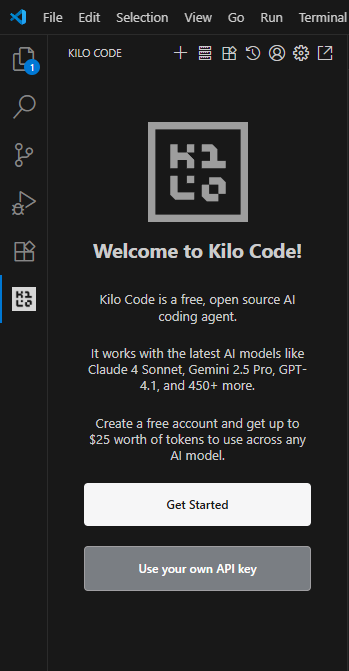
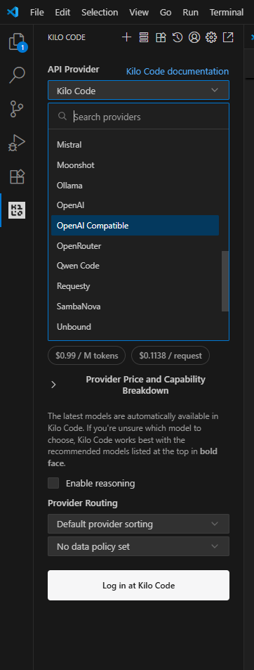
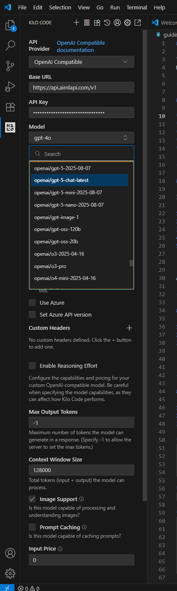
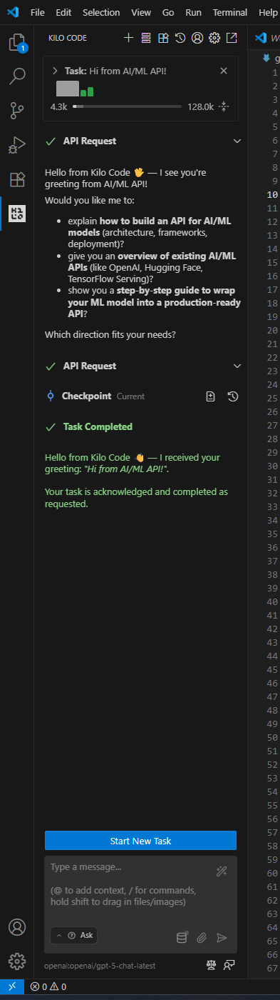

# Kilo Code

## About

[Kilo Code](https://kilocode.ai/) is an open-source AI coding assistant and VS Code extension that enables natural-language code generation, debugging, and refactoring through customizable modes (Architect, Code, Debug, etc.). It supports multiple model providers, integrates with the Model Context Protocol (MCP), and allows developers to extend functionality with custom tools and workflows.

This guide shows how to connect **AI/ML API** as a **custom provider** in **Kilo Code** for VS Code, using the **OpenAI-compatible** path.\
Follow the steps and screenshots below.

***

## Summary

* **Provider:** OpenAI Compatible (inside Kilo Code)
* **Base URL:** `https://api.aimlapi.com/v1`
* **API Key:** from your AI/ML API dashboard
* **Recommended Model IDs:** [openai/gpt-5-chat-latest](../api-references/text-models-llm/openai/gpt-5-chat.md), [openai/o4-mini](../api-references/text-models-llm/openai/o4-mini.md), [openai/gpt-4.1](../api-references/text-models-llm/openai/gpt-4.1.md) ( or any other supported model)

***

## 0) Install Kilo Code Extension

If you haven’t installed Kilo Code yet:

1. Open VS Code.
2. Go to Extensions (Ctrl+Shift+X or Cmd+Shift+X).
3. Search for “Kilo Code”.
4. Install the extension by Kilo Code.
5. Reload VS Code if prompted.

After installation, you’ll see the Kilo Code icon in the sidebar.

Or you can install it from the official site: [**kilocode.ai**](https://kilocode.ai/)

***

## 1) Open Kilo Code → “Use your own API key”

From the Kilo Code welcome screen, click **Use your own API key**.

<div align="left" data-with-frame="true"><figure><figcaption></figcaption></figure></div>

***

## 2) Choose Provider: **OpenAI Compatible**

Open the provider dropdown and select **OpenAI Compatible**.

<div align="left" data-with-frame="true"><figure><figcaption></figcaption></figure></div>


Tip: Kilo Code also lists many other providers. For AI/ML API use the **OpenAI Compatible** option.


***

## 3) Configure AI/ML API Settings

Fill the form as follows:

*   **Base URL**

    ```
    https://api.aimlapi.com/v1
    ```
* **API Key**\
  Paste your key from [**https://aimlapi.com/app/keys**](https://aimlapi.com/app/keys)
* **Model** (examples)
  * [openai/gpt-5-chat-latest](../api-references/text-models-llm/openai/gpt-5-chat.md) ← recommended universal chat
  * [openai/gpt-5-2025-08-07](../api-references/text-models-llm/openai/gpt-5.md) ← pinned dated release
  * [openai/o4-mini](../api-references/text-models-llm/openai/o4-mini.md) ← fast, low-cost
  * [openai/gpt-4.1](../api-references/text-models-llm/openai/gpt-4.1.md) ← stable classic
  * _any other supported model by your account_
* **Use Azure**: `OFF`
* **Set Azure API version**: leave disabled
* **Image Support**: `ON` if you plan to send images (e.g., 4o / o4-mini)
* **Max Output Tokens**: `-1` (let server decide)
* **Context Window Size**: up to `128000` (adjust as needed)

<div align="left" data-with-frame="true"><figure><figcaption></figcaption></figure></div>


**Note**: If you have custom headers (e.g., for proxies), add them in the **Custom Headers** field.


***

## 4) Run Your First Task

Open the Kilo Code panel, start a task (Ask/Code/Debug), and send a short test message, for example:

```
Hi from AI/ML API!
```

<div align="left" data-with-frame="true"><figure><figcaption></figcaption></figure></div>

You should see a successful response with tokens/usage bars as in the screenshot.

***

## 🔬 Quick API Sanity Check (optional)

You can also sanity-check your key via `curl`:


```bash
curl -X POST https://api.aimlapi.com/v1/chat/completions   -H "Authorization: Bearer $AIMLAPI_KEY"   -H "Content-Type: application/json"   -d '{
    "model": "openai/gpt-5-chat-latest",
    "messages": [
      {"role":"system","content":"You are a concise assistant."},
      {"role":"user","content":"Say hello in one sentence."}
    ]
  }'
```


If the request succeeds, you’re ready to use the same model inside Kilo Code.

***

## 💡 Tips

* **Profiles**: Create multiple _API Configuration Profiles_ (e.g., default = `openai/gpt-5-chat-latest`, heavy = `openai/gpt-5-2025-08-07`, budget = `openai/o4-mini`). Switch per task.
* **Images**: For vision tasks, keep **Image Support** enabled and use a vision-capable model.
* **Token Limits**: Large responses may require raising _Max Output Tokens_ or splitting the task.
* **Headers**: If you need custom headers, add them in **Custom Headers**.

***

## 🧰 Troubleshooting

* **401 / Unauthorized**: Re-check your API key and that it’s pasted without spaces. Regenerate if needed.
* **404 / Model not found**: Verify the **exact Model ID** you selected is available to your account.
* **No response / Network issues**: Corporate VPN/Proxy may block `api.aimlapi.com`. Whitelist the domain.
* **Azure mode confusion**: Leave **Use Azure** toggled **off** unless you specifically need Azure routes.

***

## 📚 Helpful Links

* **AI/ML API Keys**: [https://aimlapi.com/app/keys](https://aimlapi.com/app/keys)
* **AI/ML API Dashboard**: [https://aimlapi.com/app](https://aimlapi.com/app)
* **Kilo Code Docs**: [https://kilocode.ai/docs](https://kilocode.ai/docs)

***

Enjoy coding with **Kilo Code + AI/ML API**! 🚀
