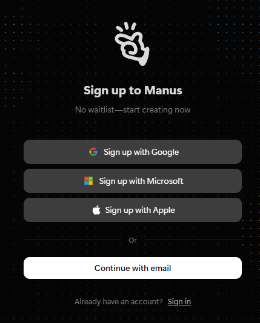
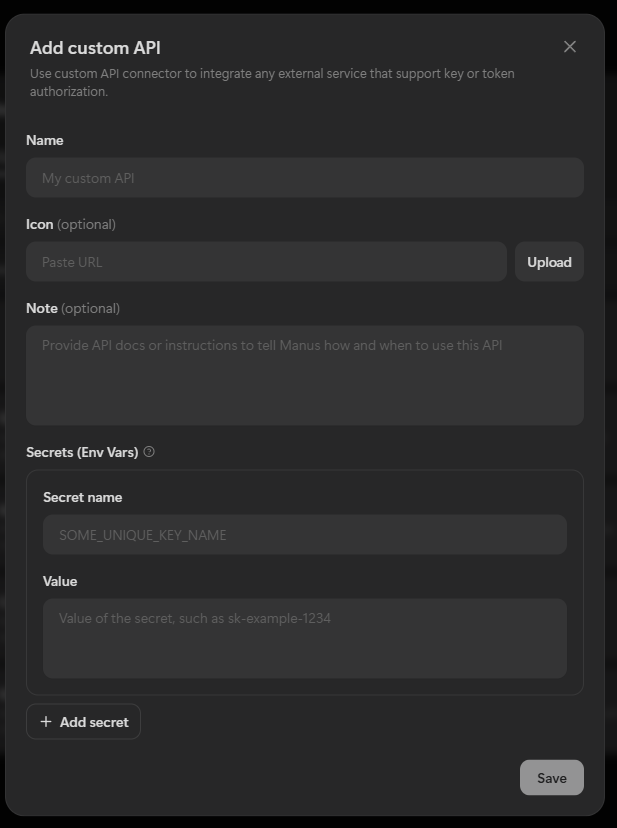
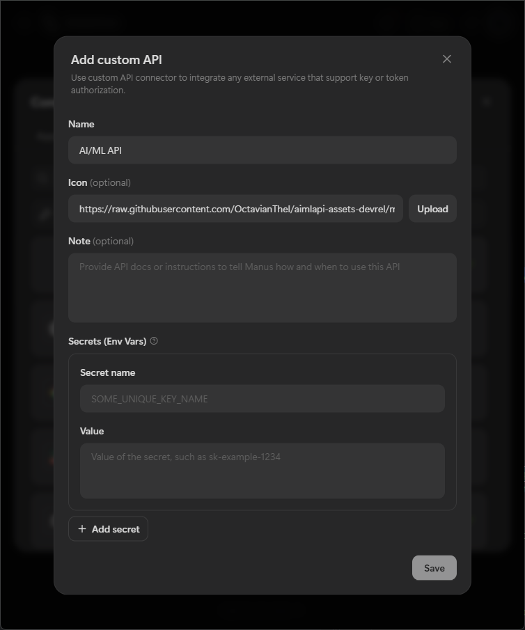
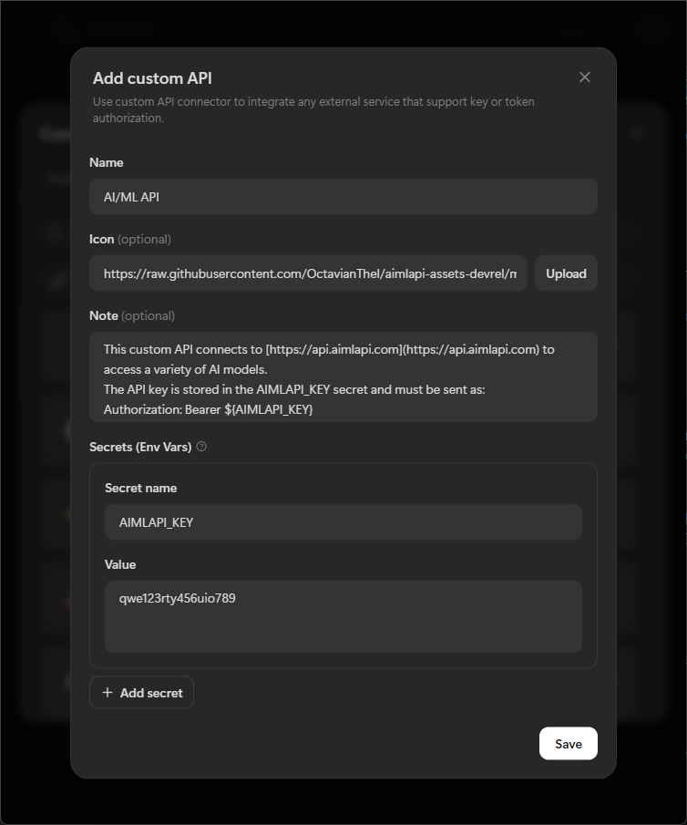
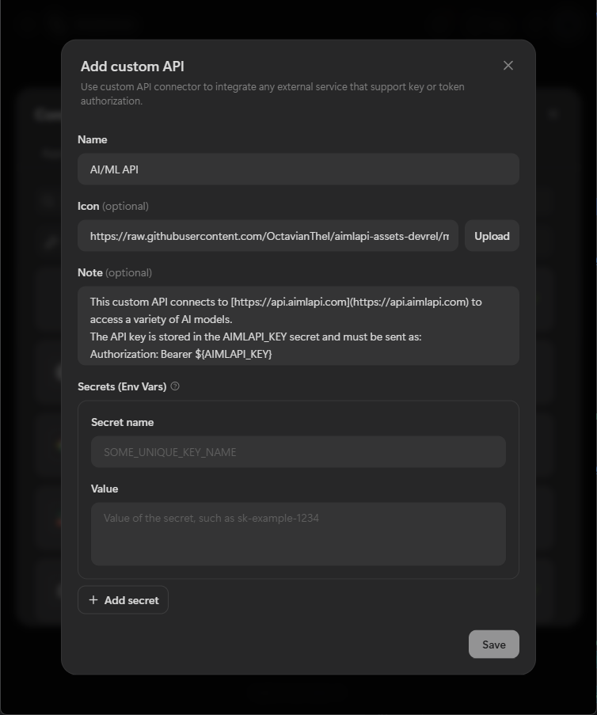
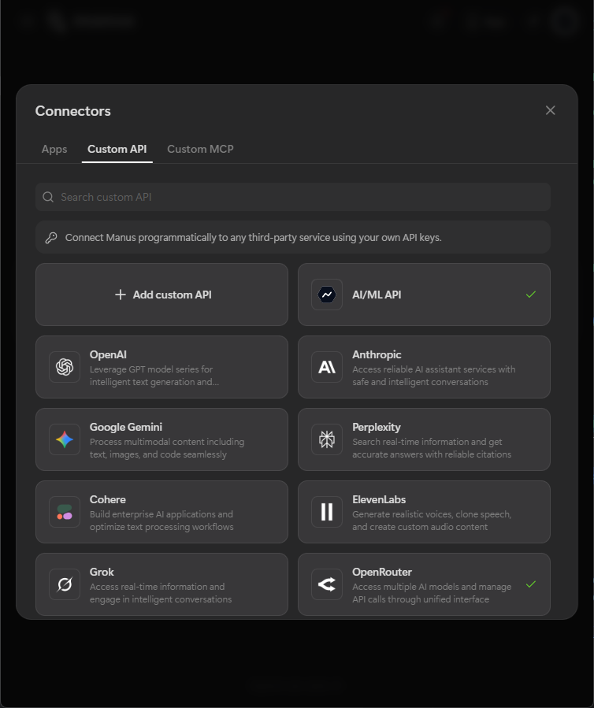
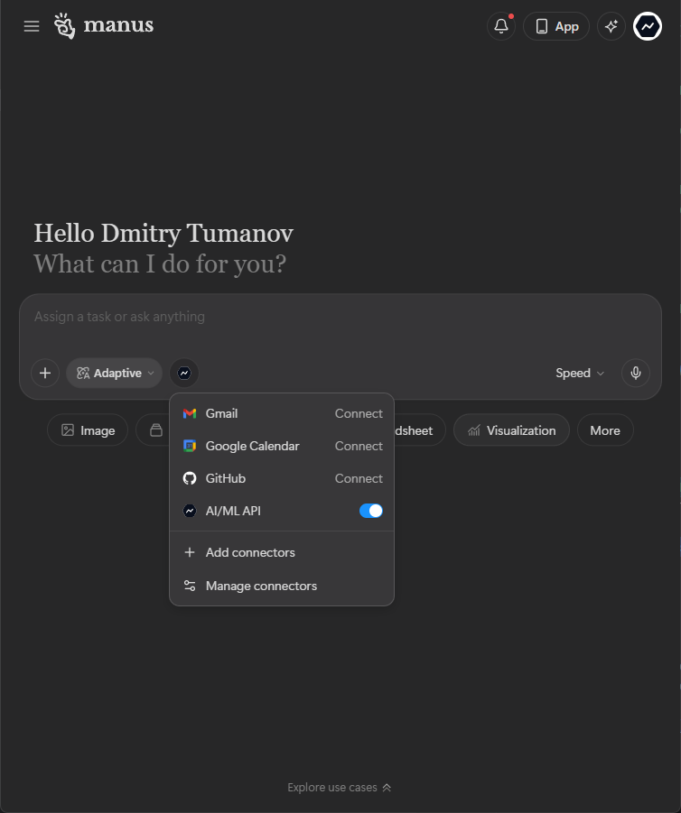
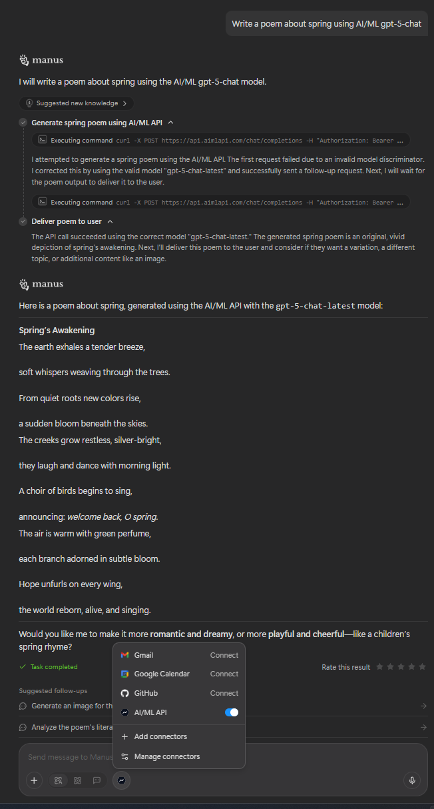

# Manus

[Manus](https://manus.im/docs/introduction/welcome) is a workflow and AI-agent orchestration platform that lets users integrate custom APIs, define automation logic, and run LLM-powered tools inside a unified interface. Manus supports custom model backends (such as AI/ML API), prompt templates, request routing, secure secret storage, and visual debugging.

## Installation / Setup

### 1. Prerequisites

* **AI/ML API account** – sign up and create an API key at:
  * Dashboard: [https://aimlapi.com/app/?utm\_source=manus\&utm\_medium=github\&utm\_campaign=integration](https://aimlapi.com/app/?utm_source=manus\&utm_medium=github\&utm_campaign=integration)
  * API Keys: [https://aimlapi.com/app/keys/?utm\_source=manus\&utm\_medium=github\&utm\_campaign=integration](https://aimlapi.com/app/keys/?utm_source=manus\&utm_medium=github\&utm_campaign=integration)
* **Manus account** – with access to **Settings → Integrations → Add custom API**.

<div align="left" data-with-frame="true"><figure><figcaption></figcaption></figure></div>

***

### 2. Open the _Add custom API_ Form

In Manus, go to:

> **Settings → Integrations → Add custom API**

This opens the configuration form.

<div align="left" data-with-frame="true"><figure><figcaption></figcaption></figure></div>

***

### 3. Fill Out the Configuration

#### A) Name

Enter:

```c
AI/ML API
```

<div align="left" data-with-frame="true"><figure><figcaption></figcaption></figure></div>

***

#### B) Icon (optional)

Paste this URL into the icon field:


```css
https://raw.githubusercontent.com/OctavianTheI/aimlapi-assets-devrel/main/aimlapi%20square%20Logo%20Icon.svg
```


<div align="left" data-with-frame="true"><figure><figcaption></figcaption></figure></div>

***

#### C) Base URL & Auth Header

* **Base URL:**

```html
https://api.aimlapi.com
```

* **Authorization header (Manus will use the secret defined below):**

```python
Authorization: Bearer ${AIMLAPI_KEY}
```

<div align="left" data-with-frame="true"><figure><figcaption></figcaption></figure></div>

***

#### D) Secrets

Create a secret to store your AI/ML API key:

* **Secret name:** `AIMLAPI_KEY`
* **Value:** your personal AI/ML API key from the AI/ML API dashboard.

<div align="left" data-with-frame="true"><figure><figcaption></figcaption></figure></div>

***

#### E) Note (Request Templates)

Paste the following template into the **Note** field — Manus will use it as a reference for how to call AI/ML API endpoints:


```json
This custom API connects to https://api.aimlapi.com to access a variety of AI models.
The API key is stored in the AIMLAPI_KEY secret and must be sent as:
Authorization: Bearer ${AIMLAPI_KEY}

Base URL: https://api.aimlapi.com

## 1. Chat / Text & Code

POST /chat/completions
{ "model": "MODEL_NAME_HERE", "messages": [{"role":"user","content":"..."}] }

## 2. Text → Image

POST /images/generations
{ "model": "MODEL_NAME_HERE", "prompt": "Describe the image" }

## 3. Audio → Text (STT)

POST /audio/transcriptions
[file upload: "file"]
{ "model": "openai/whisper-1" }

## 4. Text → Speech (TTS)

POST /audio/speech
{ "model": "MODEL_NAME_HERE", "input": "Text to speak", "voice": "alloy" }

## 5. Image → Text (Vision)

POST /chat/completions
{ "model": "MODEL_NAME_HERE", "messages":[{"role":"user","content":[
{"type":"text","text":"Question"}, {"type":"image_url","image_url":{"url":"https://..."}}]}] }

## 6. Embeddings

POST /embeddings
{ "model": "MODEL_NAME_HERE", "input": "The text to embed" }
```


<div align="left" data-with-frame="true"><figure><figcaption></figcaption></figure></div>

***

### 4. Finalise the Integration

Click **Add**. Manus will save the integration and show a confirmation message.

<div align="left" data-with-frame="true"><figure><figcaption></figcaption></figure></div>

<div align="left" data-with-frame="true"><figure><figcaption></figcaption></figure></div>

***

## Usage Examples

Once the custom API is added, you can select **AI/ML API** as a backend in Manus and use prompts such as:

*   **Chat / Text & Code**

    > “Write a poem about spring.”
*   **Text → Image**

    > “Draw a lonely lighthouse on a stormy coast using `openai/dall-e-3`.”
*   **Embeddings**

    > “Generate embeddings for this paragraph with `BAAI/bge-large-en-v1.5`.”

<div align="left" data-with-frame="true"><figure><figcaption></figcaption></figure></div>

***

## Tips

* You can use either `https://api.aimlapi.com` or `https://api.aimlapi.com/v1` as the base URL.
*   All requests must include:

    ```python
    Authorization: Bearer ${AIMLAPI_KEY}
    ```
* AI/ML API supports a wide range of providers and models (chat, code, images, audio, vision, embeddings) with enterprise-grade rate limits and uptime.

***

## Helpful Links

* Dashboard: [https://aimlapi.com/app/](https://aimlapi.com/app/?utm_source=manus\&utm_medium=github\&utm_campaign=integration)
* API Keys: [https://aimlapi.com/app/keys/](https://aimlapi.com/app/keys/?utm_source=manus\&utm_medium=github\&utm_campaign=integration)
* Models browser: [https://aimlapi.com/models/](https://aimlapi.com/models/?utm_source=manus\&utm_medium=github\&utm_campaign=integration)
* Docs: [https://docs.aimlapi.com/](https://docs.aimlapi.com/?utm_source=manus\&utm_medium=github\&utm_campaign=integration)

Enjoy building with Manus + AI/ML API 🚀
