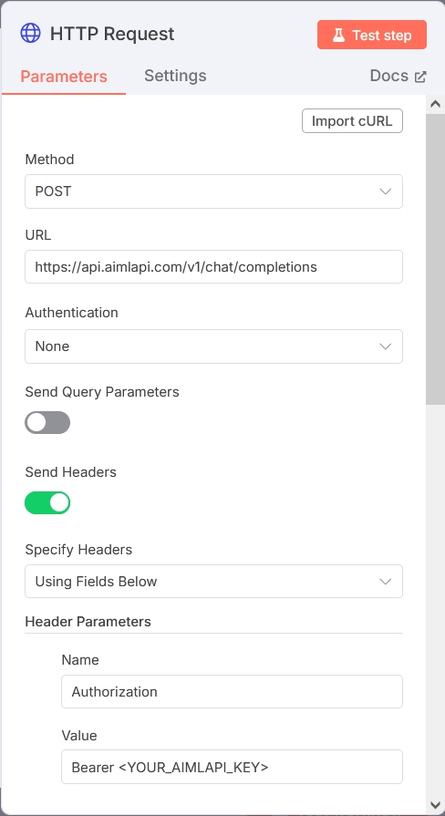

# n8n

## About

[**n8n**](https://n8n.io/) is an open-source workflow automation tool that lets you connect various services and automate tasks without writing full integrations manually.

**Key features**:

* **No-code / low-code interface:** Build workflows visually using a drag-and-drop editor.
* **Extensive integrations:** Comes with 350+ prebuilt nodes for popular services like Slack, GitHub, Google Sheets, OpenAI, and many others.
* **Flexible logic:** You can inject custom JavaScript at any point in the flow for more control.
* **Self-hosting:** Run it locally or on your own server—no need to send data to external clouds.
* **Extensibility:** Easily create custom nodes or connect to any API.

n8n is popular with developers, product teams, and analysts who want to automate repetitive tasks, streamline processes, or create event-driven workflows—without building everything from scratch.

## How to Use AIML API in n8n Workflows

A user of the n8n can create a working AI pipeline (a _workflow_) by simply adding visual components, connecting their inputs and outputs in the required order, and setting various available parameters in each component.&#x20;

You can call AI/ML API models in two ways: using the **OpenAI** nodes or using the **HTTP Request** node.

### OpenAI nodes

#### Add a node

1. You can find the OpenAI modules using the search bar on the right.

<figure><figcaption></figcaption></figure>

<figure><figcaption></figcaption></figure>

2. Then select the **OpenAI** or **OpenAI Chat Model** module and open its settings: right-click the module and select **Open**.
3. In the module settings, click the field under **Credential to connect with** and choose **Create new credential**.

<figure><figcaption></figcaption></figure>

4. Fill in the fields:

* **API Key** — enter your API key.
* **Base URL** — specify one of the available API endpoints.

5. Click **Save**. The credentials will be saved and tested. If everything is correct, you'll see the message: **Connection tested successfully**.

#### Select a model

After successful setup, go back and specify the desired model. There are two options:

1. Select the model from the dropdown list:

<figure><figcaption></figcaption></figure>


Possible issues:

* Sometimes the model list may appear empty.
* To fix this, try exiting the module settings and reopening them.
* Note that this method does not always work.


2. Select model by ID
   * In the model field, switch the selection from from list to by id
   * Enter the desired model ID manually

<figure><figcaption></figcaption></figure>

#### **Functionality Test**

* Click the Test step button to verify the operation.
* If needed, you can enter the prompt text and change the role (roles are described in the dropdown menu).

If everything is correct, you will receive a response from the API in the output.

<figure><figcaption></figcaption></figure>

All set, the integration is working!

### HTTP Request node

<figure><figcaption></figcaption></figure>

After that, connect it to your input and output elements:

