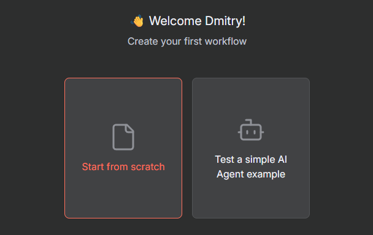

# n8n

## About

[**n8n**](https://n8n.io/) is an open-source workflow automation tool that lets you connect various services and automate tasks without writing full integrations manually.

**Key features**:

* **No-code / low-code interface:** Build workflows visually using a drag-and-drop editor.
* **Extensive integrations:** Comes with 350+ prebuilt nodes for popular services like Slack, GitHub, Google Sheets, OpenAI, and many others.
* **Flexible logic:** You can inject custom JavaScript at any point in the flow for more control.
* **Self-hosting:** Run it locally or on your own server—no need to send data to external clouds.
* **Extensibility:** Easily create custom nodes or connect to any API.

n8n is popular with developers, product teams, and analysts who want to automate repetitive tasks, streamline processes, or create event-driven workflows—without building everything from scratch.

***

## Installation

### What installation type should I use?

| Feature                      | Option 1: Community Node | Option 2: npm Install |
| ---------------------------- | ------------------------ | --------------------- |
| Setup Complexity             | 🟢 Very Easy             | 🟡 Medium             |
| Requires Restart             | ❌ Usually not            | ✅ Yes                 |
| Model Catalog Access         | ✅ Full (chat only)       | ✅ Full (chat only)    |
| Supports Cloud & Self-Hosted | ✅ Yes                    | ✅ Self-hosted only    |
| Recommended For              | Most users               | DevOps & power users  |

***

### ✅ Option 1: Use AI/ML API with Community Node Plugin (Recommended)

This is the easiest and most reliable way to use AI/ML API in n8n. It requires no coding and gives you access to a dedicated **AIMLAPI** node directly in the n8n workflow editor.

You will go from account creation to receiving your first AI response in just a few steps.

***

**Step 1: Sign up for AI/ML API**

* Visit [https://aimlapi.com/app](https://aimlapi.com/app).
* Register an account with Google or email.
* After logging in, navigate to [your dashboard](https://aimlapi.com/app/keys).
* Create and copy your **API key**.

***

**Step 2: Set up your n8n account**

*   Go to [https://n8n.io/](https://n8n.io/) and click **Sign Up**.

    <div align="left"><figure><figcaption></figcaption></figure></div>


*   Fill out the registration form.

    <div align="left"><figure><figcaption></figcaption></figure></div>


*   Wait while your workspace is created.

    <div align="left"><figure><figcaption></figcaption></figure></div>


*   You will be redirected to your personal n8n workspace.

    <div align="left"><figure><figcaption></figcaption></figure></div>


*   Click **Start from scratch** to open the editor.

    <div align="left"><figure><figcaption></figcaption></figure></div>

    \
    \

* Click **Add first step** to begin building your workflow.\
  \

*   Select the node **When chat message completed** as a trigger.\
    \


    <div align="left"><figure><figcaption></figcaption></figure></div>

***

**Step 3: Add and install the AI/ML API Node**

*   Click the **+** button on the right side of the trigger node.\
    Search for **AI/ML API**.

    <div align="left"><figure><figcaption></figcaption></figure></div>

    \
    \

* Click on **AI/ML API**, then click **Install node** → **Add to workflow**.\
  \

*   The node will appear in your workspace.

    <div align="left"><figure><figcaption></figcaption></figure></div>

***

**Step 4: Connect your API Key**

*   Click **Create new credentials** in the AI/ML API node.

    <div align="left"><figure><figcaption></figcaption></figure></div>


    <div align="left"><figure><figcaption></figcaption></figure></div>


*   Paste your **API key**.

    <div align="left"><figure><figcaption></figcaption></figure></div>


*   Click **Save**.

    <div align="left"><figure><figcaption></figcaption></figure></div>

***

**Step 5: Configure the model and the input**

*   Select the model (e.g. `GPT 4o`) in the **Model Name or ID** field.

    <div align="left"><figure><figcaption></figcaption></figure></div>


*   Click **Execute previous node** to simulate user input and activate the chat input panel.

    <div align="left"><figure><figcaption></figcaption></figure></div>


    <div align="left"><figure><figcaption></figcaption></figure></div>


*   Type a test message in the input field (e.g. “Tell me a fun fact”) and click **Send**.

    <div align="left"><figure><figcaption></figcaption></figure></div>

***

**Step 6: Pass the input to AI/ML API**

*   Go back to the **AI/ML API node**, select the **Prompt** field.\
    Click the **Expression** button.

    <div align="left"><figure><figcaption></figcaption></figure></div>


    <div align="left"><figure><figcaption></figcaption></figure></div>


*   In the expression editor, expand **chatInput** on the left.\
    Drag and drop it into the **Prompt** field.

    <div align="left"><figure><figcaption></figcaption></figure></div>


    <div align="left"><figure><figcaption></figcaption></figure></div>

#### **Step 7: Run the flow**

*   Exit the node editor and click **Execute Node** (or the full workflow ▶️ button).

    <div align="left"><figure><figcaption></figcaption></figure></div>


* You will see the AI/ML API response in the **Output** tab.\
  

***

🎉 **You’re all set!**\
You’ve successfully built a working chat interaction using AI/ML API and n8n.

<div align="left"><figure><figcaption></figcaption></figure></div>

***

### 🛠 Option 2: Use AI/ML API via npm Package (Manual, Self-Hosted)

If you're running **n8n in a custom/self-hosted setup** and prefer to manage dependencies manually, you can install the AI/ML API plugin using `npm`.

> ✅ **Note:** This option gives you **exactly the same features and interface** as Option 1.\
> The only difference is how the plugin is installed. Once it's added, the node usage, credentials, prompts, and output are identical.

***

#### 📝 Installation via npm

1. Navigate to your self-hosted n8n directory
2. Run:

```bash
npm install n8n-nodes-aimlapi
```

If you’re using Docker:

* Mount the plugin as a volume into `/home/node/.n8n/custom`, or
* Extend your `Dockerfile` and include the plugin in `package.json`.

📦 [Plugin on npm](https://www.npmjs.com/package/n8n-nodes-aimlapi)

3. Restart your n8n instance to register the new node.

***

#### 🧩 Continue with Setup from [Option 1](n8n.md#option-1-use-ai-ml-api-with-community-node-plugin-recommended)

Once the plugin is installed and n8n restarted, continue from the following steps:

* **Step 3**: Add and install the AI/ML API Node
* **Step 4**: Connect your API Key
* **Step 5**: Configure the model and the input
* **Step 6**: Pass the input to AI/ML API
* **Step 7**: Run the flow

Everything works the same as in Option 1 — including system/user messages, prompt injection, and output formatting.

***

## How to Use the AI/ML API in n8n

After completing the installation and setup steps described above, you can start using the configured model node in your workflows — for example, to build chatbots. For guidance on building different types of workflows, refer to [the official n8n documentation](https://docs.n8n.io/).

You can also test the model's responses in the **Chat** window located at the bottom left of the editor.


Please note that this chat is intended for debugging purposes only. It does not represent the actual experience your end users will have. The formatting here is optimized for development and may include special tags or symbols. Your users will see clean, properly formatted responses as expected.


<div align="left"><figure><figcaption></figcaption></figure></div>

***

## 💬 Example Settings

#### [GPT 4o](../api-references/text-models-llm/OpenAI/gpt-4o.md)

<table><thead><tr><th width="305">Field</th><th>Value</th></tr></thead><tbody><tr><td>Model</td><td><code>openai/gpt-4o</code></td></tr><tr><td>User Message</td><td><code>"Give me ideas for YouTube channels"</code></td></tr><tr><td>Temperature</td><td><code>0.7</code></td></tr></tbody></table>

#### [Gemini 2.0 Flash](../api-references/text-models-llm/google/gemini-2.0-flash.md)

<table><thead><tr><th width="305">Field</th><th>Value</th></tr></thead><tbody><tr><td>Model</td><td><code>google/gemini-2.0-flash</code></td></tr><tr><td>User Message</td><td><code>"Write a summary of the latest Apple event"</code></td></tr></tbody></table>

***

## 📎 Links

* 🔑 [Get your API key](https://aimlapi.com/app/keys?utm_source=n8n\&utm_medium=github\&utm_campaign=integration)
* 🧪 [Model playground](https://aimlapi.com/app?utm_source=n8n\&utm_medium=github\&utm_campaign=integration)
* 💬 [Join the community](https://aimlapi.com/community?utm_source=n8n\&utm_medium=github\&utm_campaign=integration)

Let us know what you build — we’d love to feature your workflows!
