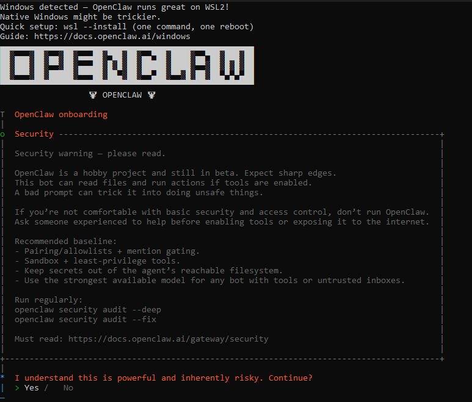

# ⭐ OpenClaw

## About

[OpenClaw](https://github.com/openclaw/openclaw) is a personal AI assistant that runs on your own devices. It connects to messaging channels (WhatsApp, Telegram, Slack, Discord, Google Chat, Signal, iMessage, Microsoft Teams, Matrix, Zalo, and more) and provides AI assistance with complete data privacy.

Developers use OpenClaw to build multi-channel AI assistants with streaming responses, browser automation, vision capabilities, and voice integration. OpenClaw provides a Gateway service that runs locally on localhost:18789 by default, a CLI for management, and support for 12+ messaging platforms.

All agent data is stored locally in your SQLite database located at `~/.openclaw/openclaw.db`. The Gateway runs on `localhost:18789` by default, keeping your AI assistant completely under your control.


**Data Privacy**: All data is stored locally in your SQLite database! \
No data is sent externally unless you explicitly configure external integrations.


## Installation

Get started with OpenClaw in seconds:

```sh
npm install -g openclaw@latest
openclaw onboard --install-daemon
```

The wizard installs the Gateway as a system service (`launchd` on macOS, `systemd` on Linux), so it stays running in the background.

## How to Use AIML API with OpenClaw

Configure OpenClaw to use AIML API as the default model provider. You have two options: environment variable or configuration file.

### Configuration File

Add to `~/.openclaw/openclaw.json`:


```python
{
  "providers": {
    "openai": {
      "apiKey": "<YOUR_AIMLAPI_KEY>",
      "baseUrl": "https://api.aimlapi.com/v1"
    }
  }
}
```


### Start the Gateway

```
openclaw gateway --port 18789 --verbose
```

### **Use with OpenClaw Agent**

```
openclaw agent \
  --message "Tell me about yourself" \
  --model gpt-4o
```

<details>

<summary>Response:</summary>


```
I'm an AI language model created by OpenAI, designed to assist with a wide range of inquiries by generating human-like text based on the input I receive. I can help with answering questions, providing explanations, and even engaging in creative writing. My knowledge is based on a diverse dataset that covers a wide variety of topics up until October 2023. However, I don't have personal experiences, emotions, or consciousness. My primary goal is to be as helpful and informative as possible! If you have any specific questions or need assistance, feel free to ask.
```


</details>

## **Our Supported models**

* All OpenAI-compatible models ([gpt-4o](../api-references/text-models-llm/OpenAI/gpt-4o.md), [gpt-4o-mini](../api-references/text-models-llm/OpenAI/gpt-4o-mini.md), [gpt-4-turbo](../api-references/text-models-llm/OpenAI/gpt-4-turbo.md), [gpt-3.5-turbo](../api-references/text-models-llm/OpenAI/gpt-3.5-turbo.md), [o3-mini](../api-references/text-models-llm/OpenAI/o3-mini.md), [o1](../api-references/text-models-llm/OpenAI/o1.md), etc),
* [Google models](../api-references/text-models-llm/Google/),
* [Anthropic models](../api-references/text-models-llm/Anthropic/) is only partially supported and only via `api.aimlapi.com/v2` base URL,
* and some other models (the list is constantly being updated).

## **Supported features**

OpenClaw provides comprehensive capabilities for building production-ready multi-channel assistants:

* **Multi-channel routing** — Connect to 12+ messaging platforms including WhatsApp, Telegram, Slack, Discord, and more
* **Real-time streaming responses** — Responses stream back to users as they're generated for improved user experience
* **Vision and image processing** — Analyze images from web pages or user uploads using vision-capable models
* **Browser automation and control** — OpenClaw-managed Chrome instance for automated web interactions and page analysis
* **Voice capabilities** — Voice wake detection and talk mode for hands-free interaction on macOS, iOS, and Android
* **Session management and conversation history** — Maintain context and conversation history across user interactions
* **Function calling and tool integration** — Integrate custom tools, skills, and external services into your agents
* **Error handling and auto-retry** — Robust error management with exponential backoff retry mechanisms

## Code Examples

<details>

<summary><strong>Prerequisites</strong></summary>

1\. Install OpenClaw

```bash
npm install -g openclaw@latest
openclaw onboard --install-daemon
```

2\. Export your [AIMLAPI\_KEY](https://aimlapi.com/app/keys)

```bash
export AIMLAPI_API_KEY=***
```

3\. Start the Gateway

```bash
openclaw gateway --port 18789
```

</details>

For configuring functions, simply follow the built-in OpenClaw instructions.

<div align="left"><figure><figcaption></figcaption></figure></div>

<div align="left"><figure><figcaption></figcaption></figure></div>

### Stream mode

Configure streaming responses for real-time chat using Telegram.

**What happens**:

1. User sends message to Telegram bot.
2. Gateway receives message and routes to OpenClaw Agent.
3. OpenClaw calls AIML API with gpt-4o-mini model.
4. Response streams word-by-word from AIML API.
5. User sees real-time streaming chat experience in Telegram.

**Result**: Users see responses appear word-by-word as they're generated in real-time, providing better user experience.

### Multi-Channel Setup (Slack + Discord)

Route messages from multiple platforms to the same agent.

**What happens**:

1. User messages OpenClaw bot on Slack or Discord.
2. Gateway receives message and identifies platform source.
3. OpenClaw routes message to Agent with platform context.
4. Agent calls AIML API with gpt-4o model.
5. Response returns to same channel where message originated.

**Result**: Single agent serves both Slack and Discord users simultaneously, maintaining consistent behavior across platforms.

### Vision with Browser

Analyze web pages using vision models.

**What happens**:

1. User requests web page analysis through messaging channel.
2. OpenClaw opens Chrome browser instance (CDP controlled).
3. Takes screenshot of specified page.
4. Sends screenshot to AIML API vision model (gpt-4o).
5. Model analyzes and returns detailed description.
6. Results sent back to user through messaging channel.

**Result**: Agent provides detailed description of web page content, layout, and visual elements.

***

## More

For further information about OpenClaw and AIML API integration, check out:

* [Official OpenClaw Documentation](https://docs.openclaw.ai)
* [GitHub Repository - OpenClaw](https://github.com/openclaw/openclaw)
* [Examples & Cookbook](https://github.com/openclaw/openclaw/tree/main/cookbook)
* [AIML API Documentation](https://docs.aimlapi.com)
* [OpenClaw Discord Community](https://discord.gg/clawd)
