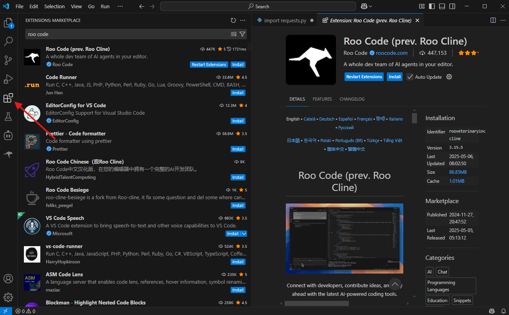
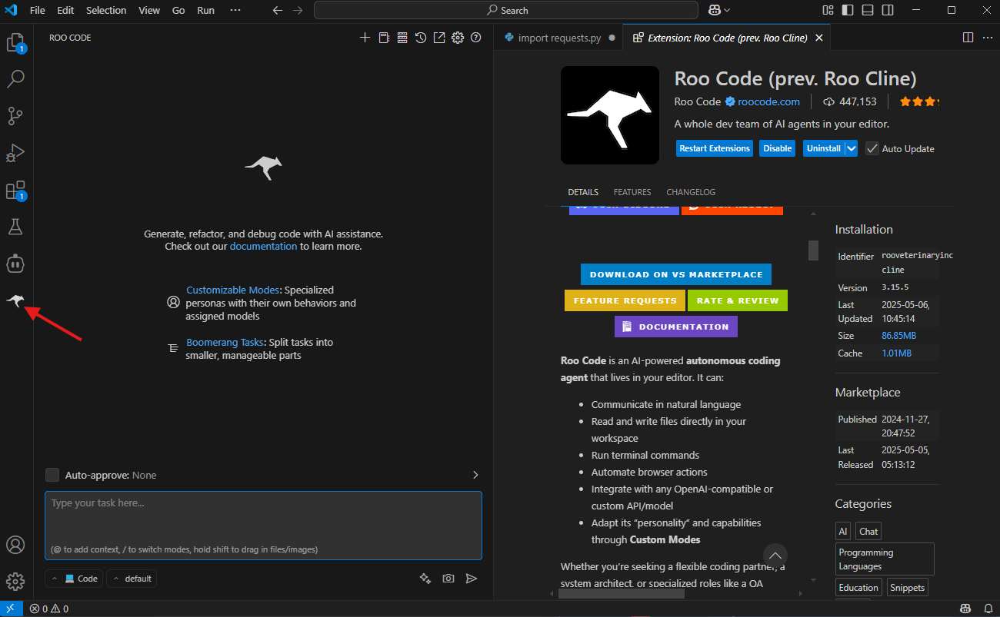
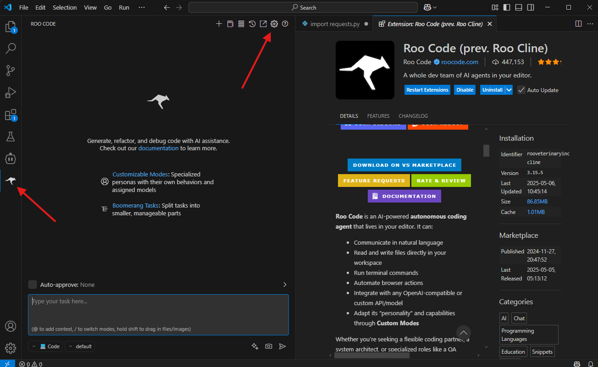
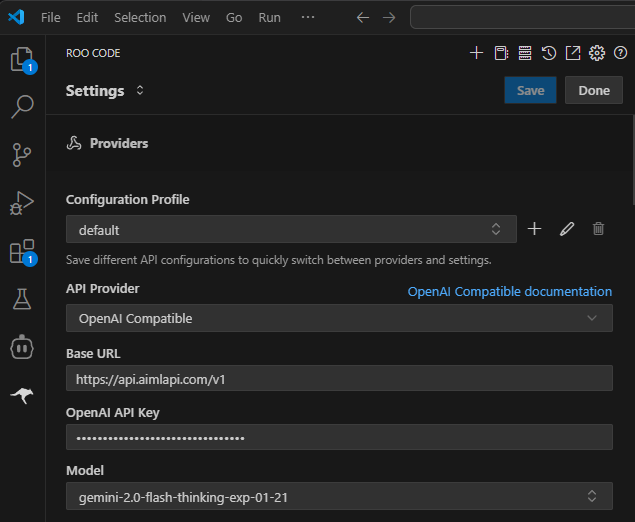
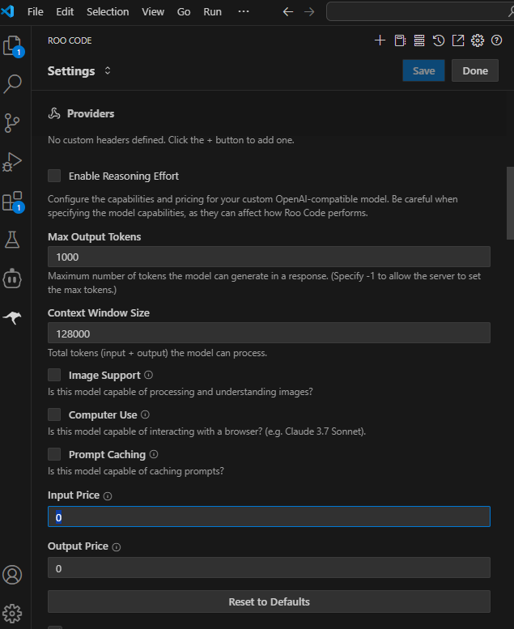

# Roo Code

## About

Roo Code is an autonomous AI programming agent that works right inside your editor, such as VS Code. It helps you code faster and smarter — whether you're starting a new project, maintaining existing code, or exploring new technologies.

You can find the Roo Code repository and community on [GitHub](https://github.com/RooCodeInc/Roo-Code).

## Installing Roo Code in VS Code

1. Open the **Extensions** tab in the VS Code sidebar.

<figure><figcaption></figcaption></figure>

2. In the search bar, type **Roo Code**.
3. Find the extension and click **Install**.

<figure><figcaption></figcaption></figure>

4. After installation, a separate **Roo Code** tab will appear in the sidebar.

<figure><figcaption></figcaption></figure>

## **Configuring Roo Code**

1. Go to the **Roo Code** tab in the sidebar.
2. Click the gear icon in the top-right corner.

<figure><figcaption></figcaption></figure>

In the settings:

* Set **API Provider** to **OpenAI Compatible**.
* In **Base URL**, enter one of our available endpoints.
* In **API Key**, enter your [AI/ML API key](https://aimlapi.com/app/keys).
* In **Model ID**, specify the model name. You can find some model selection tips in our [description of code generation as a capability](../capabilities/code-generation.md).
* Click **Save** and **Done**.

<figure><figcaption></figcaption></figure>

All done — start coding with Roo Code!&#x20;


Roo Code offers a wide range of configurable parameters, and most of them come with a description of their purpose right below.



## **Supported Models**

These models have been tested by our team for compatibility with Roo Code integration.

Supported Model List

* [gpt-3.5-turbo](../api-references/text-models-llm/OpenAI/gpt-3.5-turbo.md)&#x20;
* [gpt-3.5-turbo-0125](../api-references/text-models-llm/OpenAI/gpt-3.5-turbo.md)
* [gpt-3.5-turbo-1106](../api-references/text-models-llm/OpenAI/gpt-3.5-turbo.md)
* [gpt-4o](../api-references/text-models-llm/OpenAI/gpt-4o.md)
* [gpt-4o-2024-05-13](../api-references/text-models-llm/OpenAI/gpt-4o.md)
* [gpt-4o-2024-08-06](../api-references/text-models-llm/OpenAI/gpt-4o.md)
* [gpt-4o-mini](../api-references/text-models-llm/OpenAI/gpt-4o-mini.md)
* [gpt-4o-mini-2024-07-18](../api-references/text-models-llm/OpenAI/gpt-4o-mini.md)
* [chatgpt-4o-latest](../api-references/text-models-llm/OpenAI/gpt-4o.md)
* [gpt-4o-2024-05-13](../api-references/text-models-llm/OpenAI/gpt-4o.md)
* [gpt-4o-2024-08-06](../api-references/text-models-llm/OpenAI/gpt-4o.md)
* [gpt-4-turbo](../api-references/text-models-llm/OpenAI/gpt-4-turbo.md)
* [gpt-4-turbo-2024-04-09](../api-references/text-models-llm/OpenAI/gpt-4-turbo.md)
* [gpt-4-0125-preview](../api-references/text-models-llm/OpenAI/gpt-4-preview.md)
* [gpt-4-1106-preview](../api-references/text-models-llm/OpenAI/gpt-4-preview.md)
* [o3-mini](../api-references/text-models-llm/OpenAI/o3-mini.md)

- [openai/gpt-4.1-2025-04-14](../api-references/text-models-llm/openai/gpt-4.1.md)
- [openai/gpt-4.1-mini-2025-04-14](../api-references/text-models-llm/openai/gpt-4.1-mini.md)
- [openai/gpt-4.1-nano-2025-04-14](../api-references/text-models-llm/openai/gpt-4.1-nano.md)
- [openai/o4-mini-2025-04-16](../api-references/text-models-llm/openai/o4-mini.md)

* [deepseek/deepseek-chat](../api-references/text-models-llm/DeepSeek/deepseek-chat.md)
* [deepseek/deepseek-r1](../api-references/text-models-llm/DeepSeek/deepseek-r1.md)

* [meta-llama/Llama-3.2-90B-Vision-Instruct-Turbo](../api-references/text-models-llm/Meta/Llama-3.2-90B-Vision-Instruct-Turbo.md)
* [meta-llama/Llama-Vision-Free](../api-references/text-models-llm/Meta/Llama-Vision-Free.md)

- [meta-llama/Llama-3.3-70B-Instruct-Turbo](../api-references/text-models-llm/Meta/Llama-3.3-70B-Instruct-Turbo.md)
- [meta-llama/Llama-3.2-3B-Instruct-Turbo](../api-references/text-models-llm/Meta/Llama-3.2-3B-Instruct-Turbo.md)
- [meta-llama/Llama-3.2-11B-Vision-Instruct-Turbo](../api-references/text-models-llm/Meta/Llama-3.2-11B-Vision-Instruct-Turbo.md)
- [meta-llama/Meta-Llama-3.1-405B-Instruct-Turbo](../api-references/text-models-llm/Meta/Meta-Llama-3.1-405B-Instruct-Turbo.md)
- [meta-llama/Meta-Llama-3.1-8B-Instruct-Turbo](../api-references/text-models-llm/Meta/Meta-Llama-3.1-8B-Instruct-Turbo.md)
- [meta-llama/Meta-Llama-3.1-70B-Instruct-Turbo](../api-references/text-models-llm/Meta/Meta-Llama-3.1-70B-Instruct-Turbo.md)
- [meta-llama/llama-4-maverick](../api-references/text-models-llm/meta/llama-4-maverick.md)

* [Qwen/Qwen2-72B-Instruct](../api-references/text-models-llm/Alibaba-Cloud/Qwen2-72B-Instruct.md)
* [Qwen/Qwen2.5-7B-Instruct-Turbo](../api-references/text-models-llm/Alibaba-Cloud/Qwen2.5-7B-Instruct-Turbo.md)
* [Qwen/Qwen2.5-Coder-32B-Instruct](../api-references/text-models-llm/Alibaba-Cloud/Qwen2.5-Coder-32B-Instruct.md)
* [qwen-max](../api-references/text-models-llm/Alibaba-Cloud/qwen-max.md)
* [qwen-max-2025-01-25](../api-references/text-models-llm/Alibaba-Cloud/qwen-max.md)
* [qwen-plus](../api-references/text-models-llm/Alibaba-Cloud/qwen-plus.md)
* [qwen-turbo](../api-references/text-models-llm/Alibaba-Cloud/qwen-turbo.md)
* [Qwen/Qwen2.5-72B-Instruct-Turbo](../api-references/text-models-llm/Alibaba-Cloud/Qwen2.5-72B-Instruct-Turbo.md)
* [Qwen/QwQ-32B](../api-references/text-models-llm/alibaba-cloud/qwen-qwq-32b.md)

* [mistralai/Mixtral-8x7B-Instruct-v0.1](../api-references/text-models-llm/Mistral-AI/Mixtral-8x7B-Instruct-v0.1.md)
* [mistralai/Mistral-7B-Instruct-v0.1](../api-references/text-models-llm/Mistral-AI/Mistral-7B-Instruct.md)
* [mistralai/Mistral-7B-Instruct-v0.2](../api-references/text-models-llm/Mistral-AI/Mistral-7B-Instruct.md)
* [mistralai/Mistral-7B-Instruct-v0.3](../api-references/text-models-llm/Mistral-AI/Mistral-7B-Instruct.md)
* [mistralai/mistral-tiny](../api-references/text-models-llm/Mistral-AI/mistral-tiny.md)
* [mistralai/mistral-nemo](../api-references/text-models-llm/Mistral-AI/mistral-nemo.md)

- [mistralai/codestral-2501](../api-references/text-models-llm/Mistral-AI/codestral-2501.md)

* [google/gemini-2.0-flash-exp](../api-references/text-models-llm/Google/gemini-2.0-flash-exp.md)
* [gemini-2.0-flash-exp](../api-references/text-models-llm/Google/gemini-2.0-flash-exp.md)
* [google/gemini-2.0-flash](../api-references/text-models-llm/google/gemini-2.0-flash.md)

* [x-ai/grok-3-beta](../api-references/text-models-llm/xai/grok-3-beta.md)
* [x-ai/grok-3-mini-beta](../api-references/text-models-llm/xai/grok-3-mini-beta.md)

* [anthracite-org/magnum-v4-72b](../api-references/text-models-llm/Anthracite/magnum-v4.md)
* [cohere/command-r-plus](../api-references/text-models-llm/Cohere/command-r-plus.md)
* [nvidia/Llama-3.1-Nemotron-70B-Instruct-HF](../api-references/text-models-llm/NVIDIA/Llama-3.1-Nemotron-70B-Instruct-HF.md)
* [NousResearch/Nous-Hermes-2-Mixtral-8x7B-DPO](../api-references/text-models-llm/NousResearch/Nous-Hermes-2-Mixtral-8x7B-DPO.md)

* [MiniMax-Text-01](../api-references/text-models-llm/MiniMax/text-01.md)

## Troubleshooting

Possible Issues:

* **403 status code (no body)** — This is the most common error. Possible causes:
  * You might need to use a different endpoint. Be sure to refer to the documentation for the specific model you've selected from our catalog!
  * The user may have run out of tokens or doesn’t have enough. Check your balance in your account dashboard.
* **400 status code (no body)** — This error occurs when using models that are not compatible with the integration. See the previous section [Supported Models](roo-code.md#supported-models) :point\_up:
