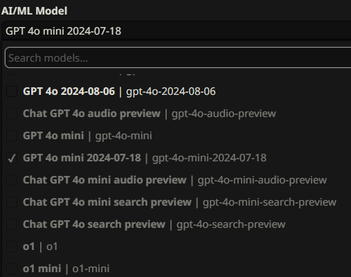

# SillyTavern

## About

[SillyTavern](https://github.com/SillyTavern/SillyTavern) is a locally installed user interface that allows you to interact with text generation LLMs, image generation engines, and TTS voice models. Integration with the AI/ML API currently applies only to LLMs.

***

## Installing SillyTavern (Fresh Setup)


Adapted from the official SillyTavern [README / Installation](https://github.com/SillyTavern/SillyTavern?tab=readme-ov-file#-installation)


### Windows (Recommended: SillyTavern Launcher)


<mark style="color:$primary;">**Warning:**</mark>

* <mark style="color:$primary;">Do</mark> <mark style="color:$primary;"></mark><mark style="color:$primary;">**not**</mark> <mark style="color:$primary;"></mark><mark style="color:$primary;">install into any Windows‑controlled folder (Program Files, System32, etc.).</mark>
* <mark style="color:$primary;">Do</mark> <mark style="color:$primary;"></mark><mark style="color:$primary;">**not**</mark> <mark style="color:$primary;"></mark><mark style="color:$primary;">run</mark> <mark style="color:$primary;"></mark><mark style="color:$primary;">`Start.bat`</mark> <mark style="color:$primary;"></mark><mark style="color:$primary;">with administrator permissions.</mark>
* <mark style="color:$primary;">Windows 7 is</mark> <mark style="color:$primary;"></mark><mark style="color:$primary;">**not**</mark> <mark style="color:$primary;"></mark><mark style="color:$primary;">supported (requires Node.js 18.16+).</mark>


1. Make sure **Node.js** (latest LTS) and **Git** are installed.
2.  Open **Run** (`Win + R`) and execute:

    ```bash
    cmd /c winget install -e --id Git.Git
    ```
3. In **File Explorer**, navigate to a non‑system folder (e.g. `C:\SillyTavern`), click the address bar, type `cmd` and press Enter.
4.  Clone the release branch and launch SillyTavern:

    
    ```bash
    git clone https://github.com/SillyTavern/SillyTavern -b release
    cd SillyTavern
    start Start.bat
    ```
    
5. After the installer finishes, a browser window will open with the SillyTavern interface.

***

### Linux / macOS

1. Install **Git** and **Node.js** (via your distro’s package manager or Homebrew).
2.  In a terminal, run:

    ```bash
    # Clone the release branch
    git clone https://github.com/SillyTavern/SillyTavern -b release
    cd SillyTavern
    ```
3.  Make the startup script executable and run it:

    ```bash
    chmod +x start.sh
    ./start.sh
    ```
4. Open your browser to the URL shown in the console (default: `http://localhost:8000`).


For Docker, Termux, GitHub Desktop, and other installation methods, see the full [Installation section](https://github.com/SillyTavern/SillyTavern?tab=readme-ov-file#-installation) in the upstream README.


***

## Connecting AI/ML API in SillyTavern

### Step 1. Launch SillyTavern → Set Persona

* On first launch you'll see "Welcome to SillyTavern"
* Enter `AI/ML API` as the **Persona Name** for example
* Click **Save**

> This step is required to unlock the chat UI.

<div align="left"><figure><figcaption></figcaption></figure></div>

### Step 2. Go to Connection Settings

* Open ⚙ **Settings** tab → **Connection Profile** (Second tab)
* Configure:
  * `API`: Chat Completion
  * `Chat Completion Source`: AI/ML API

<div align="left"><figure><figcaption></figcaption></figure></div>

### Step 3. Enter API Key

1. Copy your API key from [https://aimlapi.com/app/keys](https://aimlapi.com/app/keys?utm_source=sillytavern\&utm_medium=github\&utm_campaign=integration)
2. Paste into the **AI/ML API Key** field.
3. Click 🔑 icon to save — it should show a timestamp.

<div align="left"><figure><figcaption></figcaption></figure></div>

### Step 4. Choose a model

Click the dropdown next to **AI/ML Model** and pick any model such as:

* `gpt-4o-mini-2024-07-18`
* `claude-3-5-sonnet`
* `gemini-1.5-flash`

<div align="left"><figure><figcaption></figcaption></figure></div>

### Step 5. Test Connection

Click **Connect** and then the **Test Message**.

* You should see `API connection successful`.
* 🟢 Status: `Valid`.

<div align="left"><figure><figcaption></figcaption></figure></div>

### 💬 Step 6. Send a Message

Use the input box below to send a test message:

<figure><figcaption></figcaption></figure>

If all is set up, you’ll see the assistant reply like this:

<figure><figcaption></figcaption></figure>

***

### 🎉 Step 7. Done – You’re All Set!

You’re now connected to AI/ML API and can start chatting with any of 200+ models.


Tip: Try Claude 3.5, GPT-4o, Gemini 1.5 or explore more in [Model Playground](https://aimlapi.com/app?utm_source=sillytavern\&utm_medium=github\&utm_campaign=integration)


***

## ✅ Config checklist

| Field   | Value                       |
| ------- | --------------------------- |
| API     | Chat Completion             |
| Source  | AI/ML API                   |
| API Key | `********` (saved)          |
| Model   | `gpt-4o-mini-2024-07-18`    |
| Status  | ✅ API connection successful |

***

## 🔗 Internal Links

* [AI/ML API Model Catalog](https://aimlapi.com/models?utm_source=sillytavern\&utm_medium=github\&utm_campaign=integration)
* [Your API Keys Page](https://aimlapi.com/app/keys?utm_source=sillytavern\&utm_medium=github\&utm_campaign=integration)
* [Community & Feedback](https://aimlapi.com/community?utm_source=sillytavern\&utm_medium=github\&utm_campaign=integration)
