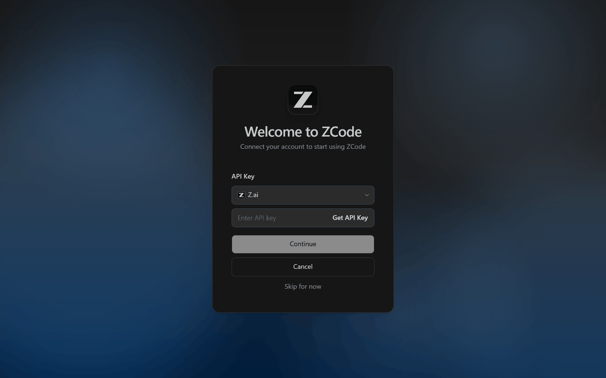
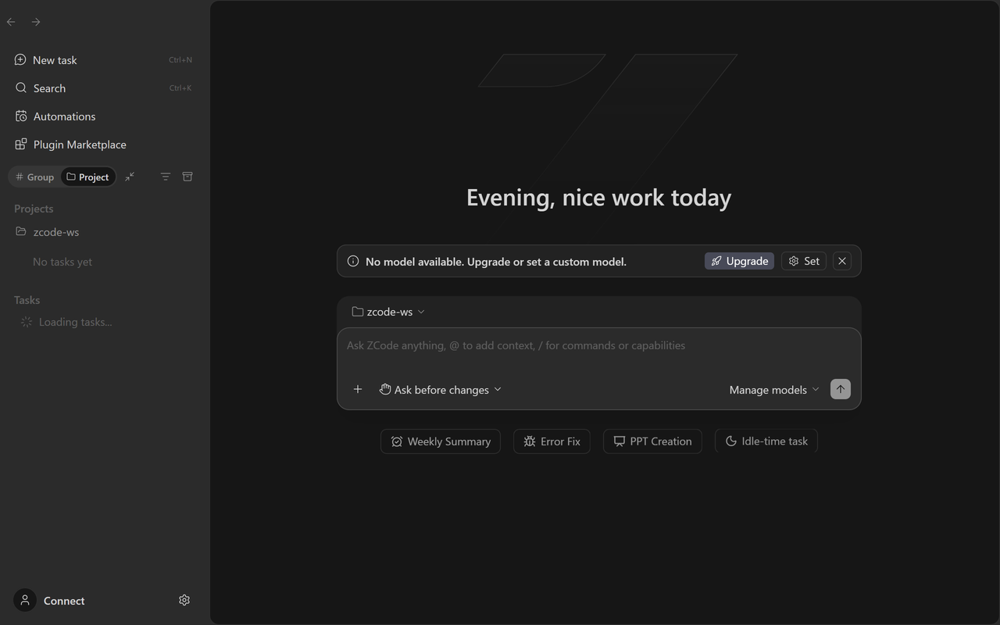
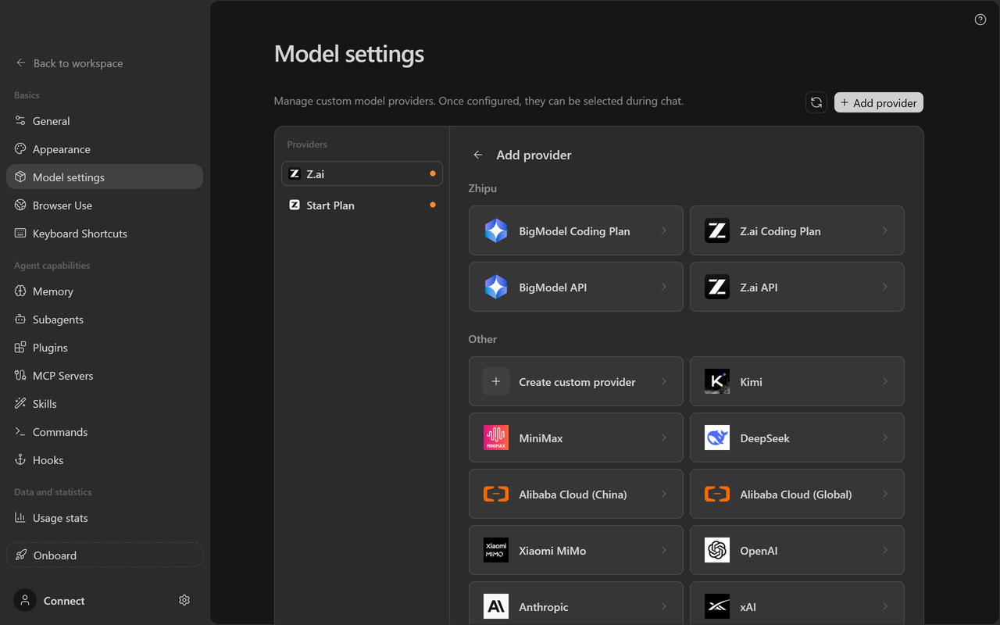
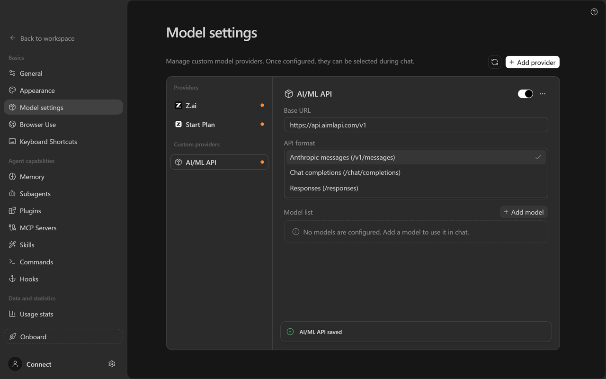
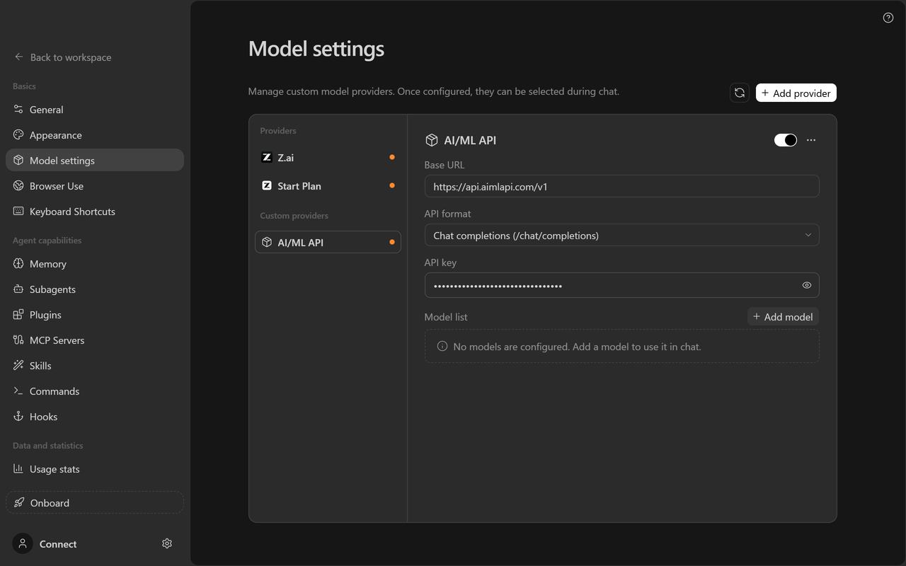
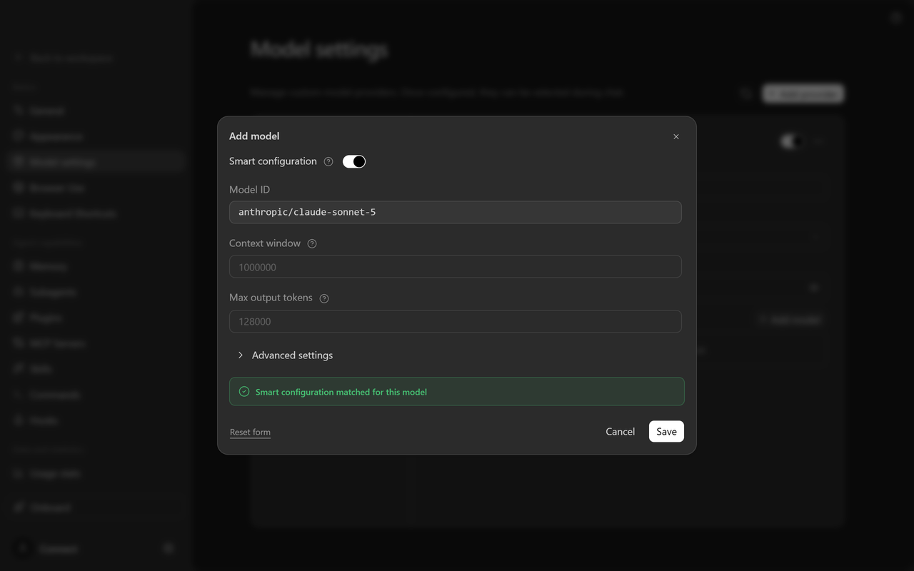
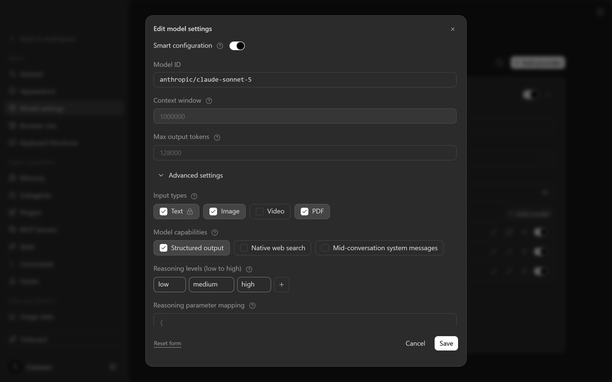
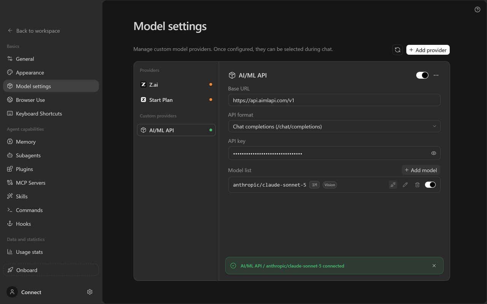
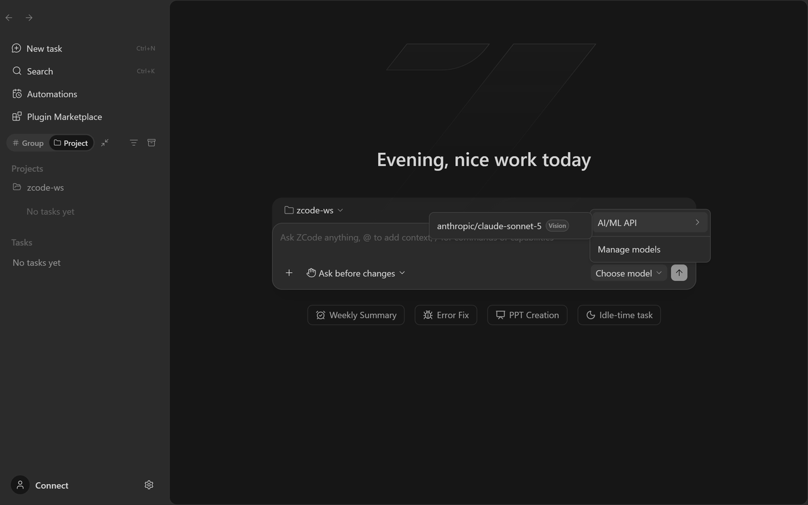
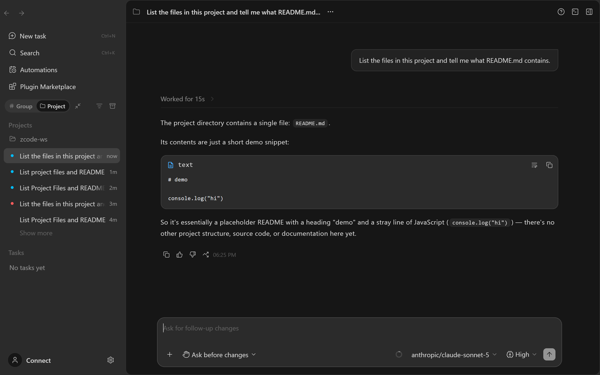

# ZCode

## About

[ZCode](https://github.com/zai-org/ZCode) is an open-source AI coding workspace from Z.ai with three interfaces on one agent runtime: a desktop app (Windows, macOS, Linux), a browser UI, and a `zcode` terminal TUI. It ships with presets for Z.ai, BigModel and a handful of other vendors, and lets you add any OpenAI-compatible or Anthropic-compatible endpoint as a **custom provider**.

AI/ML API is not one of the built-in presets, so you add it once as a custom provider. After that, every model you register under it shows up in the model switcher — in the desktop app, in web mode, and in the terminal, because all three read the same provider configuration.

Everything on this page was verified against ZCode 3.14 with real requests through AI/ML API, including the full agent loop with tool calls.

## Quick start



## Install ZCode

Download the desktop app for your platform from [zcode.z.ai](https://zcode.z.ai/) and open it. On the welcome screen choose **Use API key**, then **Skip for now** — a Z.ai account is not required. Skip the short questionnaire that follows.



## Create a custom provider

Click **Set** on the *No model available* banner (or open **Settings → Model settings**), then **Add provider → Create custom provider**.



## Point it at AI/ML API

Rename the provider to `AI/ML API`. Set **API format** to **Chat completions**, **Base URL** to `https://api.aimlapi.com/v1`, and paste your **API key**.



## Add a model, cap the reasoning level, test

**Add model** with an ID such as `anthropic/claude-sonnet-5`. In its settings, remove the `xhigh` and `max` reasoning levels. Press **Test model** — when it reports *connected*, pick the model in chat and start coding.



## When to use AI/ML API with ZCode

AI/ML API works well with ZCode when you want:

* one key for Claude, GPT, Gemini, GLM and many more behind a single endpoint
* to switch between vendors from ZCode's model switcher without re-configuring anything
* the same models in the desktop app and in the terminal, configured once

## Prerequisites

Before you start, make sure you have:

* ZCode installed from [zcode.z.ai](https://zcode.z.ai/) (or built from the [repository](https://github.com/zai-org/ZCode))
* an AI/ML API key from [aimlapi.com/app/keys](https://aimlapi.com/app/keys)
* a model ID from [aimlapi.com/models](https://aimlapi.com/models) — chat models with tool calling work best in a coding agent

The base URL is:

```
https://api.aimlapi.com/v1
```

Need a key first? Use [API Key Management](../api-references/service-endpoints/api-key-management.md).

## Set up AI/ML API in ZCode

### Step 1 — Get past the welcome screen

ZCode opens on a login screen offering **Connect to Z.ai** and **Connect to BigModel**. Neither is needed:

1. Click **Use API key**.
2. Click **Skip for now** at the bottom of the form.
3. A three-step questionnaire follows (*What do you do?*, *Choose your UI mode*, *Personalize*). **Skip** each step, or close it with the **×**.

<div align="left" data-with-frame="true"><figure><figcaption></figcaption></figure></div>

You land in the workspace with a *No model available. Upgrade or set a custom model.* banner. Its **Set** button opens the provider settings directly; the same page is at **Settings → Model settings**.

<div align="left" data-with-frame="true"><figure><figcaption></figcaption></figure></div>

### Step 2 — Create the provider

1. On **Model settings**, click **Add provider**. A picker opens with two groups, **Zhipu** and **Other**.
2. Under **Other**, click **Create custom provider** — the card with the **+** icon. ZCode creates a provider named *New provider* and opens its card.

<div align="left" data-with-frame="true"><figure><figcaption></figcaption></figure></div>

### Step 3 — Configure the connection

Fill in the card. Connection fields save on their own a moment after you leave them; the name is confirmed with **Enter**.

| Field          | Value                                                              |
| -------------- | ------------------------------------------------------------------ |
| **Name**       | `AI/ML API` — via **⋯ → Rename** in the card's top-right corner    |
| **API format** | **Chat completions (/chat/completions)**                           |
| **Base URL**   | `https://api.aimlapi.com/v1`                                       |
| **API key**    | your key from [aimlapi.com/app/keys](https://aimlapi.com/app/keys) |


**Change the API format.** A new custom provider opens with **Anthropic messages** selected. On AI/ML API that format reaches Claude models only — any other model answers `400 … is not available on /v1/messages`. **Chat completions** works with every chat model, so switch to it unless you are deliberately building a Claude-only provider (see [Using the Anthropic format](#using-the-anthropic-format-for-claude-models)).


<div align="left" data-with-frame="true"><figure><figcaption></figcaption></figure></div>

When the card looks like this, the connection is done. The dot next to the provider stays orange until it has at least one model.

<div align="left" data-with-frame="true"><figure><figcaption></figcaption></figure></div>

### Step 4 — Add a model

1. In the **Model list**, click **Add model**.
2. Enter the **Model ID** exactly as AI/ML API lists it, vendor prefix included — `anthropic/claude-sonnet-5`, not `claude-sonnet-5`.
3. **Smart configuration** recognises well-known model names and fills **Context window** and **Max output tokens** for you. If the two fields stay empty or show a generic `200000`, type the values from the model's page in [All Model IDs](../api-references/model-database.md) — ZCode uses the context window to decide when to compact a long session.
4. Click **Save**.

<div align="left" data-with-frame="true"><figure><figcaption></figcaption></figure></div>

### Step 5 — Cap the reasoning level


**Do this before the first message.** For Claude and GPT models ZCode offers reasoning levels up to **Extra high** and **Max**, and every new task starts on the highest one. AI/ML API accepts up to **High** for these models; **Extra high** and **Max** fail with *Provider rejected the model request* — even though **Test model** passes, because the test does not send a reasoning level.


Fix it once per model so the default becomes **High**:

1. On the model row, click the pencil (**Edit model settings**).
2. Expand **Advanced settings** and find **Reasoning levels (low to high)**.
3. Hover `max` and `xhigh` and delete them, leaving `low`, `medium`, `high`.
4. **Save**.

<div align="left" data-with-frame="true"><figure><figcaption></figcaption></figure></div>

Alternatively, pick **High** (or lower) in the reasoning selector next to the model name in the composer — but that choice is per task, so you would repeat it every time.

GLM models are the exception: `zhipu/glm-5.3` runs fine on its **Max** level, so nothing to trim there.

### Step 6 — Test

Click the plug icon (**Test model**) on the model row. ZCode sends a real request and reports *AI/ML API / \<model\> connected*. The provider's dot turns green.

<div align="left" data-with-frame="true"><figure><figcaption></figcaption></figure></div>

Repeat steps 4–6 for each model you want in the switcher. Models can be reordered by dragging.

### Step 7 — Use it

Back in the workspace, open the model switcher in the composer, hover **AI/ML API** and pick a model. The reasoning selector next to it should read **High**.

<div align="left" data-with-frame="true"><figure><figcaption></figcaption></figure></div>

Ask for something that needs a tool, so you know the agent loop works end to end and not just the connection test:

<div align="left" data-with-frame="true"><figure><figcaption></figcaption></figure></div>

### Using it in the terminal

The `zcode` TUI and the web mode (`zcode --web`) share the desktop app's configuration — all three read `~/.zcode/v2/provider_config.json` (under `ZCODE_DATA_BASE_DIR` if you set one). A provider added in the desktop app is available in the terminal straight away:

```bash
cd your-project
zcode
```

Type `/model` to open the model picker and choose your AI/ML API model.


Z.ai publishes the desktop app; the `zcode` command-line distribution and web mode are built from source with `pnpm build:zcode` — see the [repository README](https://github.com/zai-org/ZCode#readme). The settings screens on this page are the same ones in web mode.


## Which API format to choose

ZCode can talk to a provider in three formats. On AI/ML API they are not equivalent:

| API format in ZCode    | What ZCode requests           | Works with on AI/ML API                           |
| ---------------------- | ----------------------------- | ------------------------------------------------- |
| **Chat completions**   | `<base URL>/chat/completions` | **Every chat model** — the recommended choice     |
| **Anthropic messages** | `<base URL>/messages`         | `anthropic/*` models only                         |
| **Responses**          | `<base URL>/responses`        | a few legacy OpenAI models only — not recommended |

With **Chat completions** ZCode streams responses, requests token usage on every call and passes all of its tool definitions through — the full coding-agent loop, verified on AI/ML API with Claude, GPT and GLM models.

### Using the Anthropic format for Claude models

If you only want Claude models, you can register a second provider in the native Anthropic format instead — useful when you rely on Anthropic-specific request fields. Set **API format** to **Anthropic messages** and **Base URL** to the same `https://api.aimlapi.com/v1`; ZCode appends `/messages`, which lands on AI/ML API's Anthropic-compatible endpoint. Add only `anthropic/*` model IDs under this provider — any other model returns `400`.

## Model selection

Model IDs on AI/ML API carry a vendor prefix (`openai/gpt-5.4-mini`, not `gpt-5.4-mini`). ZCode does not fetch the catalog, so type the ID exactly.

### Good starting models

All three were run through ZCode's agent loop on AI/ML API while writing this page:

* `anthropic/claude-sonnet-5` — strong on multi-file coding work; 1M context, filled in by Smart configuration; trim the reasoning levels to `high`
* `openai/gpt-5.4-mini` — fast and inexpensive for everyday edits; 400K context; trim the reasoning levels to `high`
* `zhipu/glm-5.3` — GLM through AI/ML API, so your GLM and non-GLM models share one key; 1M context; works on its default **Max** level

For the full catalog, use [All Model IDs](../api-references/model-database.md), or query it live:

```bash
curl 'https://api.aimlapi.com/v1/models?capabilities=tools&include=capabilities'
```

## Verify

* The provider's dot is green and **Test model** reports *connected*.
* The composer shows **AI/ML API / \<model\>** with the reasoning selector on **High** or lower.
* A prompt that needs a tool — *"list the files in this project"* — completes with *Worked for Ns* and a real answer, not *Provider rejected the model request*.
* Usage appears at [aimlapi.com/app](https://aimlapi.com/app) for the key you configured.

## Config checklist

Make sure these values are set:

* **API format:** Chat completions
* **Base URL:** `https://api.aimlapi.com/v1` — no `/chat/completions` at the end
* **API key:** your AI/ML API key
* **Model ID:** exact AI/ML API chat model ID, with vendor prefix
* **Reasoning levels:** `xhigh` and `max` removed for Claude and GPT models
* **Context window:** the model's real value, if Smart configuration did not fill it

## Troubleshooting

<details>

<summary>Test model passes, but every chat ends with "Provider rejected the model request"</summary>

The task is running on the **Extra high** or **Max** reasoning level, which AI/ML API rejects for Claude and GPT models. The connection test never sends a reasoning level, so it cannot catch this.

Either switch the reasoning selector in the composer to **High**, or — permanently — open **Edit model settings → Advanced settings → Reasoning levels** and delete `xhigh` and `max` (see [Step 5](#step-5-cap-the-reasoning-level)).

</details>

<details>

<summary>400 — "Model … is not available on /v1/messages"</summary>

The provider is in **Anthropic messages** format and the model is not a Claude model. Change **API format** to **Chat completions** on the provider card, or keep Anthropic messages and use only `anthropic/*` model IDs.

</details>

<details>

<summary>Test model fails with "Provider authentication failed"</summary>

Check that:

* the key on the provider card is complete — no leading/trailing spaces
* the key is active at [aimlapi.com/app/keys](https://aimlapi.com/app/keys)
* your balance is sufficient at [aimlapi.com/app](https://aimlapi.com/app)

</details>

<details>

<summary>Test model fails with "Model not found" or 404</summary>

Two common causes:

* **The model ID is not exact.** Copy it from [All Model IDs](../api-references/model-database.md), prefix included.
* **The base URL already ends with an endpoint path.** ZCode appends `/chat/completions` itself, so a base URL of `https://api.aimlapi.com/v1/chat/completions` produces `…/chat/completions/chat/completions`. Use `https://api.aimlapi.com/v1` only. A trailing slash is fine — ZCode strips it.

</details>

<details>

<summary>The provider's dot is orange / its models are missing from the switcher</summary>

Orange means *not ready*: the provider has no API key, no models, or is switched off. Set the key, add at least one model, and check the toggle in the card's top-right corner is on.

</details>

<details>

<summary>Sessions get compacted too early or too late</summary>

The model's **Context window** does not match reality. Open **Edit model settings** on the model row and set it to the value from the model's page.

</details>

<details>

<summary>I set it up in the desktop app but the terminal doesn't see it</summary>

Both read `~/.zcode/v2/provider_config.json`. If you start the terminal with a different `ZCODE_DATA_BASE_DIR` than the desktop app uses, they look at different files — run the TUI with the same value, or unset it.

</details>

## Links

* [All Model IDs](../api-references/model-database.md)
* [API Key Management](../api-references/service-endpoints/api-key-management.md)
* [AI/ML API keys](https://aimlapi.com/app/keys)
* [AI/ML API model catalog](https://aimlapi.com/models)
* [ZCode repository](https://github.com/zai-org/ZCode)
* [ZCode website](https://zcode.z.ai/)
