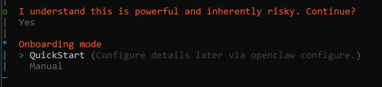
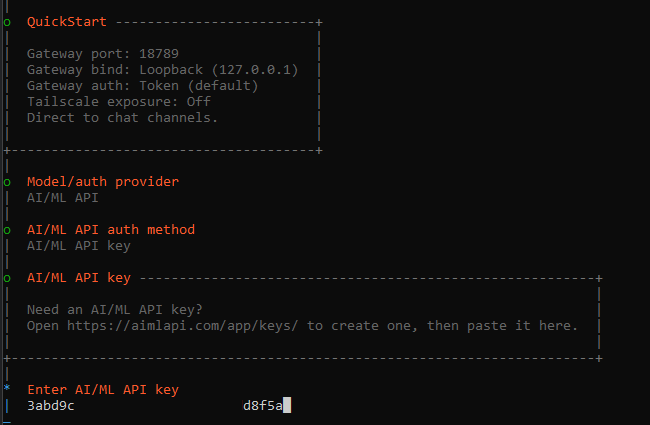
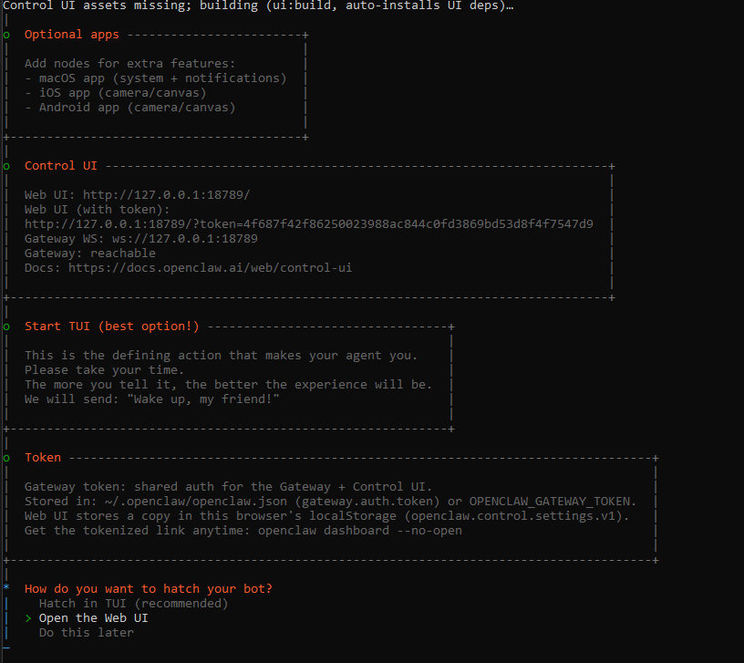
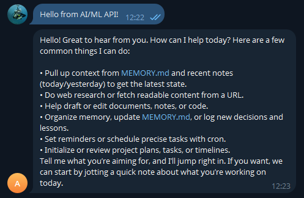

# 🦞 OpenClaw AI/ML

## About

OpenClaw is an AI platform for building AI agents and assistants. It runs on your own devices and connects to popular messaging platforms (such as WhatsApp, Telegram, Slack, Discord, and others) while preserving full data privacy (all agent data is stored locally in a SQLite database).

Developers use OpenClaw to build multi-channel AI assistants with streaming responses, browser automation, vision, and voice features. It includes a local Gateway service, a CLI for management, and support for 12+ messaging platforms.


**Data privacy:** OpenClaw stores data locally by default.\
Nothing is sent externally unless you configure it.


### What you get

* Multi-channel assistants and routing across 12+ messaging platforms
* Streaming responses for faster, more interactive chats
* Vision inputs for image understanding and UI analysis
* Browser automation via an OpenClaw-managed Chrome instance
* Voice integrations (platform dependent)
* Session memory and conversation history
* Tooling via skills, function calling, and external integrations
* Retries and error handling for more robust agents
* A local Gateway (binds to `localhost:18789` by default) and a CLI
* A local SQLite database containing all agent data (default path: `~/.openclaw/openclaw.db`)

***

## Prerequisites

* An AIMLAPI key obtained from your [account dashboard](https://aimlapi.com/app/keys)
* Node.js and npm
* `pnpm`  if you build from source

***

## Installation

### Option 1: Install via npm (recommended)

```sh
npm install -g openclaw-aimlapi@latest
openclaw onboard --install-daemon
```


`openclaw-aimlapi@latest` includes two AI/ML API skills:

* `aimlapi-media-gen` for images and video
* `aimlapi-llm-reasoning` for chat and reasoning


The onboarding wizard installs the Gateway as a system service. It uses `launchd` on macOS and `systemd` on Linux.

### Option 2: Build from source


```sh
git clone -b feature/add-aimlapi-models-provider --single-branch \
  https://github.com/aimlapi/openclaw-aimlapi.git
cd openclaw

pnpm install
pnpm ui:build  # installs UI deps on first run
pnpm build

pnpm openclaw onboard --install-daemon
```


<details>

<summary>UI walkthrough (screenshots)</summary>

<div align="left" data-with-frame="true"><figure><figcaption><p>Install via npm</p></figcaption></figure></div>

<div align="left" data-full-width="false" data-with-frame="true"><figure><figcaption><p>Or build from GitHub with pnpm</p></figcaption></figure></div>

<div align="left" data-with-frame="true"><figure><figcaption><p>Confirm installation</p></figcaption></figure></div>

<div align="left" data-with-frame="true"><figure><figcaption><p>Select "Quickstart"</p></figcaption></figure></div>

<div align="left" data-with-frame="true"><figure><figcaption><p>Select provider: AI/ML API</p></figcaption></figure></div>

<div align="left" data-with-frame="true"><figure><figcaption><p>Select auth method: API Key</p></figcaption></figure></div>

<div align="left" data-with-frame="true"><figure><figcaption><p>Paste your AI/ML API key</p></figcaption></figure></div>

<div align="left" data-with-frame="true"><figure><figcaption><p>Select a model<br>Always include the <code>aimlapi/</code> prefix<br>Suggested: <code>aimlapi/google/gemini-3-flash-preview</code></p></figcaption></figure></div>

<div align="left" data-with-frame="true"><figure><figcaption><p>Select a channel<br>Telegram is usually the easiest</p></figcaption></figure></div>

<div align="left" data-with-frame="true"><figure><figcaption><p>Paste your Telegram bot token</p></figcaption></figure></div>

<div align="left" data-with-frame="true"><figure><figcaption><p>Optional: configure extra skills<br>Media skills are configured by default</p></figcaption></figure></div>

<div align="left" data-with-frame="true"><figure><figcaption><p>Finish onboarding and open the Web UI</p></figcaption></figure></div>

<div align="left"><figure><figcaption><p>Gateway is running</p></figcaption></figure></div>

</details>

***

## Configure AI/ML API in OpenClaw

Use the Web UI from onboarding. The default URL is usually [http://127.0.0.1:59062/](http://127.0.0.1:59062/).



### Select provider

Pick AI/ML API in the providers list.



### Add your API key

Use **API Key** auth. Paste the key from [aimlapi.com/app/keys](https://aimlapi.com/app/keys/).



### Choose a model

Use a model ID that starts with `aimlapi/`. Example:

`aimlapi/google/gemini-3-flash-preview`



### Choose a channel

Telegram is a good first connector. Then add more channels as needed.



***

## Use OpenClaw

### Use via a chat connector (Telegram example)

1\. Message your bot. You will receive a pairing code.

<div align="left" data-with-frame="true"><figure><figcaption><p>Get the pairing code</p></figcaption></figure></div>

2\. Approve the pairing:

```bash
pnpm openclaw pairing approve telegram <PAIRING_CODE>
```


Expected output looks like this:


```bash
🦞 OpenClaw 2026.2.6-3 (fe86a9c) — Shell yeah—I'm here to pinch the toil and leave you the glory.
Approved telegram sender 835750362.
```



3\. Message your bot again. You should get a response.

<div align="left" data-with-frame="true"><figure><figcaption><p>Agent is responding</p></figcaption></figure></div>

### Use via CLI

```bash
openclaw agent \
  --message "Tell me about yourself" \
  --model gpt-4o
```

<details>

<summary>Example response</summary>


```
I'm an AI language model created by OpenAI, designed to assist with a wide range of inquiries by generating human-like text based on the input I receive. I can help with answering questions, providing explanations, and even engaging in creative writing. My knowledge is based on a diverse dataset that covers a wide variety of topics up until October 2023. However, I don't have personal experiences, emotions, or consciousness. My primary goal is to be as helpful and informative as possible! If you have any specific questions or need assistance, feel free to ask.
```


</details>

### Use Cases

<details>

<summary>Example: Route Slack + Discord to the same agent</summary>

1. User messages the bot on Slack or Discord.
2. Gateway receives the message with platform context.
3. OpenClaw routes the message to the agent.
4. The agent calls AI/ML API using your chosen model.
5. The response goes back to the same channel.

</details>

<details>

<summary>Example: Analyze a web page with vision</summary>

1. User requests a web page analysis.
2. OpenClaw opens a Chrome instance (CDP-controlled).
3. OpenClaw captures a screenshot of the page.
4. The agent sends the screenshot to a vision model.
5. The model returns a description and key details.
6. OpenClaw sends the result back to the user.

</details>

***

## Supported models

* OpenAI models ([gpt-4o](../api-references/text-models-llm/OpenAI/gpt-4o.md), [gpt-4o-mini](../api-references/text-models-llm/OpenAI/gpt-4o-mini.md), [gpt-4-turbo](../api-references/text-models-llm/OpenAI/gpt-4-turbo.md), [o3-mini](../api-references/text-models-llm/OpenAI/o3-mini.md), [o1](../api-references/text-models-llm/OpenAI/o1.md), and others)
* [Google models](../api-references/text-models-llm/Google/)
* [Anthropic models](../api-references/text-models-llm/Anthropic/)
* Many others, including [Qwen](../api-references/text-models-llm/Alibaba-Cloud/) and [DeepSeek](../api-references/text-models-llm/DeepSeek/)

***

## More

* [OpenClaw documentation](https://docs.openclaw.ai)
* [OpenClaw GitHub](https://github.com/openclaw/openclaw)
* [OpenClaw cookbook](https://github.com/openclaw/openclaw/tree/main/cookbook)
* [OpenClaw Discord](https://discord.gg/clawd)
