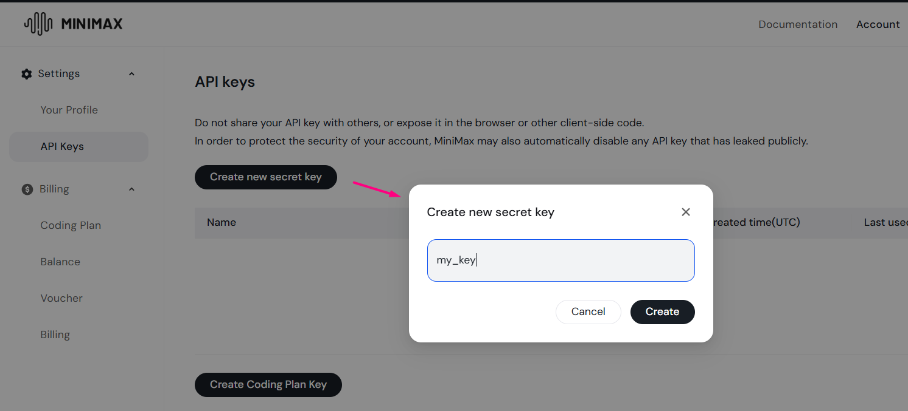

# Quickstart


If you are a manager and simply want to test a model to evaluate its performance, for instance in content generation, the quickest approach is **to use** [**our Playground**](https://aimlapi.com/app/). \
It offers an intuitive, user-friendly interface—no coding required.

Programmatic API calls are best suited for developers who want to integrate a model into their own apps.


***

Here, you'll learn how to start using our API in your code. \
The following steps must be completed regardless of which of our models you plan to call:

* [generating an AIML API Key](./#generating-an-aiml-api-key),
* [choosing and preparing your development environment](./#choosing-and-preparing-the-development-environment),
* [making an API call](./#making-an-api-call).

Let's walk through an example of connecting to [the free-tier Gemma 3](../../api-references/text-models-llm/google/gemma-3.md) model via REST API. \
After completing the steps, you will be able to generate text with this model at no cost.

## G**enerating an AIML API Key**

<details>

<summary><mark style="color:blue;">What is an API Key?</mark></summary>

You can find your AIML API key on the [account page](https://aimlapi.com/app/keys).

An AIML API key is a credential that grants you access to our API from your code.\
It is a sensitive string that is shown **only at creation time** and should be kept confidential. \
Do not share this key with anyone, as it could be misused without your knowledge.\
If you lose it, generate a new key from your dashboard.

⚠️ <mark style="color:orange;">Note that API keys from third-party organizations cannot be used with our API: you need an AIML API Key.</mark>

</details>

To use the AIML API, you need to create an account and generate an AIML API key. \
Follow these steps:

1. [**Create an Account**](https://aimlapi.com/app/sign-up): Visit the AI/ML API website and create an account.
2. [**Generate an API Key**](https://aimlapi.com/app/keys): After logging in, navigate to your account dashboard and generate your API key. Ensure that key is enabled on UI.

<figure><figcaption></figcaption></figure>

***

## Choosing the Development Environment

Each language has recommended environments for running code samples.

<table data-header-hidden><thead><tr><th width="196.9332275390625" valign="top"></th><th></th></tr></thead><tbody><tr><td valign="top"><strong>cURL</strong></td><td><ul><li><a href="https://reqbin.com/curl">REQBIN</a> is a web-based REST client that lets you quickly run cURL requests directly in your browser, without installing any tools.</li><li><a href="https://git-scm.com/install/windows">Git Bash</a> (Windows) or the built-in Terminal (macOS/Linux) allow you to run cURL examples and other command-line tools locally.  </li></ul></td></tr><tr><td valign="top"><strong>Python</strong></td><td><ul><li><a href="https://jupyter.org/try-jupyter/notebooks/?path=Untitled.ipynb">Jupyter Notebook</a> is a popular online environment for running Python code and is the fastest option if you do not want to install anything locally.</li><li><a href="https://code.visualstudio.com/download">Visual Studio Code</a> (VS Code) is a lightweight and widely used code editor that supports both Python and Node.js. It is suitable for running and debugging local examples and for working on real projects.</li></ul></td></tr><tr><td valign="top"><strong>JavaScript</strong></td><td><ul><li><a href="https://code.visualstudio.com/download">Visual Studio Code</a> (VS Code)</li></ul></td></tr></tbody></table>


In the examples below for JavaScript and Python, we use the [**REST API SDK**](../supported-sdks.md#rest-api). This approach works with all of our APIs, but it is not the only way to integrate. You can use [**other supported SDKs**](../supported-sdks.md), or make direct requests using **cURL** without any SDK.


## Making an API Call

Based on your environment, you will call our API differently. Below are three common ways to call our API using two popular languages: **cURL** (a command-line format for making HTTP requests rather than a programming language), **Python**, and **JavaScript** (NodeJS).

If you want to get started really quickly, choose one of the four expandable sections below. \
Each one contains instructions for calling our model using different tools and environments. \
The first two options are especially simple and suitable even for beginners.

For completeness, we also walk through the same example step by step for each language [later in this guide](./#code-explanation).



```bash
curl -L \
  --request POST \
  --url 'https://api.aimlapi.com/v1/chat/completions' \
  --header 'Authorization: Bearer <YOUR_AIMLAPI_KEY>' \
  --header 'Content-Type: application/json' \
  --data '{
    "model": "google/gemma-3-4b-it",
    "messages": [
      {
        "role": "user",
        "content": "Tell me about San Francisco"
      }
    ],
    "temperature": 0.7,
    "max_tokens": 512
  }'
```




```javascript
userPrompt = 'Tell me about San Francisco' // insert your request here

async function main() {
  const response = await fetch('https://api.aimlapi.com/v1/chat/completions', {
    method: 'POST',
    headers: {
      // Insert your AIML API Key instead of <YOUR_AIMLAPI_KEY>
      'Authorization': 'Bearer <YOUR_AIMLAPI_KEY>',
      'Content-Type': 'application/json',
    },
    body: JSON.stringify({
      model: 'google/gemma-3-4b-it',
      messages:[
          {
              role:'user',
              content: userPrompt
          }
      ],
      temperature: 0.7,
      max_tokens: 512,
    }),
  });

  const data = await response.json();
  const answer = data.choices[0].message.content;
  
  console.log('User:', userPrompt);
  console.log('AI:', answer);
}

main();
```





```python
import requests 

user_prompt = "Tell me about San Francisco"  # insert your request here

response = requests.post(
    "https://api.aimlapi.com/v1/chat/completions",
    headers={
        # Insert your AIML API Key instead of <YOUR_AIMLAPI_KEY>:
        "Authorization":"Bearer <YOUR_AIMLAPI_KEY>",
        "Content-Type":"application/json"
    },
    json={
        "model":"google/gemma-3-4b-it",
        "messages":[  
            {
                "role":"user",
                "content": user_prompt
            }
        ],
        "temperature": 0.7,
        "max_tokens": 512,
    }
)

data = response.json()
answer = data["choices"][0]["message"]["content"]

print("User:", user_prompt)
print("AI:", answer)
```




<details>

<summary><span data-gb-custom-inline data-tag="emoji" data-code="2b50">⭐</span>  How to run a <mark style="color:$primary;"><strong>cURL</strong></mark> example in a web-based REST client (REQBIN)</summary>

<mark style="color:$info;">Calling the API via cURL through a web service like this is the simplest and fastest method, requiring no additional libraries. However, there is a downside: cURL is not a programming language, which means it has very limited capabilities for adding logic—only API calls, no loops or conditions. You can’t even extract just the specific field with the model’s text response—cURL returns the model’s full output, as you’ll see below.</mark>

***

1\. Copy the cURL example above and paste it into a text editor, such as Notepad or Notepad++.

2\. Replace the placeholder `<YOUR_AIMLAPI_KEY>` with your actual AIMLAPI Key.

3\. If needed, modify the prompt (the `content` field).

4\. Copy the modified example, go to the [REQBIN](https://reqbin.com/curl) website, paste it into the designated field and click **Run**:

<figure><figcaption></figcaption></figure>

5\. After the model processes your request, the model’s full output will be shown directly below the input field.


Pro tip: try experimenting with the three different ways of displaying the model’s output. \
Some are more readable than others.


<figure><figcaption></figcaption></figure>

</details>

<details>

<summary><span data-gb-custom-inline data-tag="emoji" data-code="2b50">⭐</span>  How to run a <mark style="color:$primary;"><strong>Python</strong></mark> example in an online Jupyter Notebook</summary>

<mark style="color:$info;">The second fastest option, and a much more convenient choice, while offering more flexibility for customizing how the output is displayed in code.</mark>

***

**1**. When you open [Jupyter Notebook](https://jupyter.org/try-jupyter/notebooks/?path=Untitled.ipynb) for the first time, select **“Python 3.13 (XPython)”** in the pop-up window to indicate the programming language kernel you will be working with:

<div align="left"><figure><figcaption></figcaption></figure></div>


In some browsers, the kernel selection may look different:


<figure><figcaption></figcaption></figure>

2\. Enter the following command in the first cell to install the `requests` library:

```bash
%pip install requests
```

Click the **Run** button in the toolbar above the cell to execute it:

<figure><figcaption></figcaption></figure>

3\. Paste our example into the second cell, replace the placeholder with your AIMLAPI Key, then click the **Run** button in the toolbar:

<figure><figcaption></figcaption></figure>

4\. After the model processes your request, the result will be shown directly below the cell:

<figure><figcaption></figcaption></figure>

</details>

<details>

<summary>How to run a <mark style="color:$primary;"><strong>Python</strong></mark> example locally from the command line (without an IDE)</summary>

Let's start from very beginning. We assume you already installed Python (with `venv`), if not, here a [guide for the beginners](../../faq/can-i-use-api-in-python.md).

Create a new folder for test project, name it as `aimlapi-welcome` and change to it.

```bash
mkdir ./aimlapi-welcome
cd ./aimlapi-welcome
```

(Optional) If you use IDE then we recommend to open created folder as workspace. On example, in Visual Studio Code you can do it with:

```
code .
```

Run a terminal inside created folder and create virtual envorinment with a command:

```shell
python3 -m venv ./.venv
```

Activate created virtual environment:

```shell
# Linux / Mac
source ./.venv/bin/activate
# Windows
./.venv/bin/Activate.bat
```

Install requirement dependencies. In our case (REST API SDK) we need only `request` library:

```shell
pip install requests
```

Create new file and name it as `travel.py`:

```shell
touch travel.py
```

Paste following content inside this `travel.py` and replace `<YOUR_AIMLAPI_KEY>` with your API key you got on [first step](./#generating-an-api-key):

```python
import requests 

user_prompt = "Tell me about San Francisco"

response = requests.post(
    "https://api.aimlapi.com/v1/chat/completions",
    headers={
        # Insert your AIML API Key instead of <YOUR_AIMLAPI_KEY>:
        "Authorization":"Bearer <YOUR_AIMLAPI_KEY>",
        "Content-Type":"application/json"
    },
    json={
        "model":"google/gemma-3-4b-it",
        "messages":[
            {
                "role":"user",
                "content": user_prompt
            }
        ],
        "temperature": 0.7,
        "max_tokens": 512,
    }
)

data = response.json()
answer = data["choices"][0]["message"]["content"]

print("User:", user_prompt)
print("AI:", answer)
```

Run the application:

```shell
python3 ./travel.py
```

If you done all correct, you will see following output:


```json5
User: Tell me about San Francisco
AI:  San Francisco, located in northern California, USA, is a vibrant and culturally rich city known for its iconic landmarks, beautiful vistas, and diverse neighborhoods. It's a popular tourist destination famous for its iconic Golden Gate Bridge, which spans the entrance to the San Francisco Bay, and the iconic Alcatraz Island, home to the infamous federal prison.

The city's famous hills offer stunning views of the bay and the cityscape. Lombard Street, the "crookedest street in the world," is a must-see attraction, with its zigzagging pavement and colorful gardens. Ferry Building Marketplace is a great place to explore local food and artisanal products, and the Pier 39 area is home to sea lions, shops, and restaurants.

San Francisco's diverse neighborhoods each have their unique character. The historic Chinatown is the oldest in North America, while the colorful streets of the Mission District are known for their murals and Latin American culture. The Castro District is famous for its LGBTQ+ community and vibrant nightlife.
```


</details>

<details>

<summary>How to run a <mark style="color:$primary;"><strong>JavaScript</strong></mark> example locally from the command line (without an IDE)</summary>

We assume you already have Node.js installed. If not, here is a [guide for beginners](../../faq/can-i-use-api-in-nodejs.md).

Create a new folder for the example project:

```bash
mkdir ./aimlapi-welcome
cd ./aimlapi-welcome
```

Create a project file:

```bash
npm init -y
```

Create a file with the source code:

```bash
touch ./index.js
```

And paste the following content to the file and save it:

```javascript
async function main() {
  const response = await fetch('https://api.aimlapi.com/v1/chat/completions', {
    method: 'POST',
    headers: {
      // Insert your AIML API Key instead of <YOUR_AIMLAPI_KEY>
      'Authorization': 'Bearer <YOUR_AIMLAPI_KEY>',
      'Content-Type': 'application/json',
    },
    body: JSON.stringify({
      model: 'google/gemma-3-4b-it',
      messages:[
          {
              role:'user',
              content: 'Tell me about San Francisco'  // Insert your prompt here
          }
      ],
      temperature: 0.7,
      max_tokens: 256,
    }),
  });

  const data = await response.json();
  console.log(JSON.stringify(data, null, 2));
}

main();
```

Run the file:

```bash
./index.js
```

You will see a response that looks like this:


```json5
User: Tell me about San Francisco
AI: San Francisco, located in the northern part of California, USA, is a vibrant and culturally rich city known for its iconic landmarks, beautiful scenery, and diverse neighborhoods.

The city is famous for its iconic Golden Gate Bridge, an engineering marvel and one of the most recognized structures in the world. Spanning the Golden Gate Strait, this red-orange suspension bridge connects San Francisco to Marin County and offers breathtaking views of the San Francisco Bay and the Pacific Ocean.
```


</details>


***

## Code Step-by-Step Explanation

Below is a step-by-step explanation of the same API call in three variants: cURL, JavaScript, and Python. All three examples send an identical request to the `google/gemma-3-4b-it` chat model.

<details>

<summary>cURL</summary>

***

**1. Command start**

```bash
curl -L \
```

Runs the cURL HTTP client. The `-L` flag tells cURL to follow redirects (if any).

***

**2. HTTP method**

```bash
--request POST \
```

Specifies that the request uses the **POST** method.

***

**3. Endpoint**

```bash
--url 'https://api.aimlapi.com/v1/chat/completions' \
```

The full endpoint URL used to call chat models.

***

**4. Authorization header**

```bash
--header 'Authorization: Bearer <YOUR_AIMLAPI_KEY>' \
```

Sends your AIMLAPI key in the `Authorization` header.

***

**5. Content type**

```bash
--header 'Content-Type: application/json' \
```

Indicates that the request body is JSON.

***

**6. Request body**

```bash
--data '{
  "model": "google/gemma-3-4b-it",
  "messages": [
    {
      "role": "user",
      "content": "Tell me about San Francisco"
    }
  ],
  "temperature": 0.7,
  "max_tokens": 512
}'
```

This is the payload sent to the API:

* `model` – the model identifier.
* `messages` – the chat history.
  * `role: "user"` – the user message.
  * `content` – the user prompt.
* `temperature` – controls output randomness.
* `max_tokens` – the maximum number of tokens in the response.


These are the input parameters used to tell the endpoint—which in this case generates text answers—what exactly we want it to produce.

With the parameters shown above, we are effectively asking the API to use the `google/gemma-3-4b-it` model and generate a reasonably vivid and engaging description of San Francisco, limited to roughly 300–350 words— with the `temperature` and `max_tokens` parameters controlling the creativity and approximate length of the output, respectively.


***

**7. Response**

In the cURL example, you receive the **entire JSON response**.\
No fields are extracted — cURL simply prints the raw output.


</details>

<details>

<summary>JavaScript (Node.js)</summary>

***

**1. Define the user prompt**

```js
userPrompt = 'Tell me about San Francisco'
```

Stores the text of the user request.

***

**2. Call the API**

```js
const response = await fetch(
  'https://api.aimlapi.com/v1/chat/completions',
  { ... }
);
```

Sends an HTTP request to the endpoint.

***

**3. HTTP method**

```js
method: 'POST',
```

Specifies that the request uses the **POST** method.

***

**4. Headers**

```js
headers: {
  'Authorization': 'Bearer <YOUR_AIMLAPI_KEY>',
  'Content-Type': 'application/json',
},
```

* Sends your AIMLAPI key in the `Authorization` header.
* Indicates that the request body is JSON.

***

**5. Request body**

```js
body: JSON.stringify({
  model: 'google/gemma-3-4b-it',
  messages: [
    {
      role: 'user',
      content: userPrompt
    }
  ],
  temperature: 0.7,
  max_tokens: 512,
}),
```

This is the payload sent to the API:

* `model` – the model identifier.
* `messages` – the chat history.
  * `role: "user"` – the user message.
  * `content` – the user prompt.
* `temperature` – controls output randomness.
* `max_tokens` – the maximum number of tokens in the response.


These are the input parameters used to tell the endpoint—which in this case generates text answers—what exactly we want it to produce.

With the parameters shown above, we are effectively asking the API to use the `google/gemma-3-4b-it` model and generate a reasonably vivid and engaging description of San Francisco, limited to roughly 300–350 words— with the `temperature` and `max_tokens` parameters controlling the creativity and approximate length of the output, respectively.


***

**6. Parse the response**

```js
const data = await response.json();
```

Converts the API response into a JavaScript object.

***

**7. Extract the model’s text output**

```js
const answer = data.choices[0].message.content;
```

Reads the text of the first generated message.

***

**8. Print the result**

```js
console.log('User:', userPrompt);
console.log('AI:', answer);
```

Output formatting: from the model’s full response, only the generated text is extracted, and it is presented together with the original prompt in a dialogue-style format.

***

</details>

<details>

<summary>Python</summary>

***

**1. Import the HTTP library**

```python
import requests
```

The `requests` library is used to send HTTP requests.

***

**2. Define the user prompt**

```python
user_prompt = "Tell me about San Francisco"
```

Stores the text of the user query.

***

**3. Call the API**

```python
response = requests.post(
    "https://api.aimlapi.com/v1/chat/completions",
    ...
)
```

Sends a POST request to the endpoint.

***

**4. Headers**

```python
headers={
    "Authorization": "Bearer <YOUR_AIMLAPI_KEY>",
    "Content-Type": "application/json"
},
```

* Sends your AIMLAPI key in the `Authorization` header.
* Indicates that the request body is JSON.

***

**5. Request body**

```python
json={
    "model": "google/gemma-3-4b-it",
    "messages": [
        {
            "role": "user",
            "content": user_prompt
        }
    ],
    "temperature": 0.7,
    "max_tokens": 512,
}
```

This is the payload sent to the API:

* `model` – the model identifier.
* `messages` – the chat history.
  * `role: "user"` – the user message.
  * `content` – the user prompt.
* `temperature` – controls output randomness.
* `max_tokens` – the maximum number of tokens in the response.


These are the input parameters used to tell the endpoint—which in this case generates text answers—what exactly we want it to produce.

With the parameters shown above, we are effectively asking the API to use the `google/gemma-3-4b-it` model and generate a reasonably vivid and engaging description of San Francisco, limited to roughly 300–350 words— with the `temperature` and `max_tokens` parameters controlling the creativity and approximate length of the output, respectively.


***

**6. Parse the response**

```python
data = response.json()
```

Converts the JSON response into a Python dictionary.

***

**7. Extract the model’s text output**

```python
answer = data["choices"][0]["message"]["content"]
```

Reads the text of the first generated message.

***

**8. Print the result**

```python
print("User:", user_prompt)
print("AI:", answer)
```

Output formatting: from the model’s full response, only the generated text is extracted, and it is presented together with the original prompt in a dialogue-style format.


</details>

***

## Future Steps

* [Move to production-ready models: see the guide for connecting GPT-4o](u9q0.md)
* [Browse and compare AI models, including GPT, Claude, and many others, using the Playground](https://aimlapi.com/app/)
* [Know more about supported SDKs](../supported-sdks.md)
* [Learn more about special text model capabilities](/broken/pages/qQxIeD1HucvN1Duoxrk0)
* [Join the community: get help and share your projects in our Discord](https://discord.com/invite/hvaUsJpVJf)
