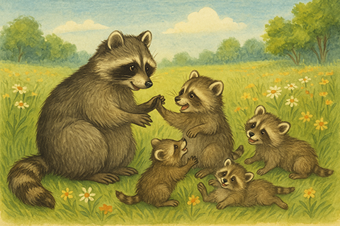

# Animate Images: A Children’s Encyclopedia


**Legal Notice**\
Please remember that reference images may be subject to copyright. Make sure to respect the law and avoid sharing the animated versions online if doing so could infringe intellectual property rights.\
Just use them to bring a bit of joy to kids at home :tada:


## Idea and Step-by-Step Plan

Today, we’re going to bring a page from a children’s encyclopedia to life — with pictures!

Here’s the plan:

1. Take an article from some free encyclopedia for children. (Of course, you can use a children's story, short illustrated tales, or any other suitable content.) To keep it simple, we’ll focus only on text and illustrations.
2. Based on each illustration, a smart multimodal[^1] chat model [**gpt-4o**](../api-references/text-models-llm/OpenAI/gpt-4o.md) comes up with a short video idea — a little scene that matches the content. Model generates a video model prompt.
3. With this prompt, generate a 5-second video using video model and download the generated video from the server.
4. Convert it to a GIF using any free online tool.
5. Replace the original static image with the animated GIF.

Repeat this process for every illustration on the page.

## A Page We’re Bringing to Life

<details>

<summary>Article Example</summary>

***

_**What Are Raccoons?**_

_Raccoons are small, furry animals with fluffy striped tails and black “masks” around their eyes. They live in forests, near rivers and lakes—and sometimes even close to people in towns and cities. Raccoons are very clever, curious, and quick with their paws._

<figure><figcaption></figcaption></figure>

_One of the raccoon's most famous habits is "washing" its food. But raccoons aren’t really cleaning their meals. They just love to roll and rub things between their paws, especially near water. Scientists believe this helps them understand what they’re holding._

_Raccoons eat almost anything: berries, fruits, nuts, insects, fish, and even bird eggs. They're nocturnal, which means they go out at night to look for food and sleep during the day in cozy tree hollows._

<figure><figcaption></figcaption></figure>

_Raccoons are very social. Young raccoons love to play—tumbling in the grass, hiding behind trees, and exploring everything around them. And sometimes, if they feel safe, raccoons might even come closer to where people are—especially if there's a snack nearby!_

_Even though they can be a little mischievous, raccoons play an important role in nature. They help spread seeds and keep insect populations in check._

_So next time you see a raccoon, remember: it’s not just a fluffy animal—it’s a real forest explorer!_

***

</details>

## Full Walkthrough

1. Let’s take the raccoon article from the previous section. To upload the illustrations into the chat model, we’ll save them to disk first. Later, you can use the resulting folder of images to build an HTML page with animated visuals.

<figure><figcaption></figcaption></figure>

2. Let’s have the multimodal [**gpt-4o**](../api-references/text-models-llm/OpenAI/gpt-4o.md) model analyze the image and suggest a prompt for the video:

<details>

<summary>Python code</summary>


```python
from openai import OpenAI
import base64
import mimetypes
from pathlib import Path

base_url = "https://api.aimlapi.com/"
api_key = "<YOUR_AIMLAPI_KEY>"

# image path (Insert your image file path instead. Images in PNG, JPG, and WebP formats are supported.)
file_path = Path("C:/Users/user/Documents/example/images/racoons_0.png")

# Detect the MIME type based on file extension
mime_type, _ = mimetypes.guess_type(file_path)

# Supported image formats
allowed_mime_types = {"image/png", "image/jpeg", "image/webp"}

# Raise an error if the format is not supported
if mime_type not in allowed_mime_types:
    raise ValueError(f"Unsupported image format: {mime_type}. Supported formats: PNG, JPG, WebP.")

# Read and encode the image in base64
with open(file_path, "rb") as image_file:
    base64_image = base64.b64encode(image_file.read()).decode("utf-8")

# Create a data URL for the base64 image
image_data_url = f"data:{mime_type};base64,{base64_image}"

# Send the image to GPT-4o via OpenAI's API
client = OpenAI(api_key=api_key, base_url=base_url)

completion = client.chat.completions.create(
        model="gpt-4o",
        messages=[
            {"role": "user", "content": "Based on the provided image, come up with a short scenario (no need to output it) and give me only a short, suitable prompt for generating a 5-second animation based on an image with the following description. Do not include the word 'Prompt:' — just output the prompt itself. Describe possible movements, background changes, etc."},
            {
                "role": "user", "content":[ 
                    {
                        "type": "image_url",
                        "image_url": {
                            "url": image_data_url
                         }
                    }
                ]
            }

        ],
    )

image_analysis_result = completion.choices[0].message.content
print(image_analysis_result)
```


</details>

<details>

<summary>Response: Generated Prompt Based On the Image Description</summary>


```
The raccoon's paw gently ripples the stream as tiny leaves float by; the trees sway slightly in the breeze, and sunlight filters through, casting shifting patterns on the rocks and grass.
```


</details>

3. Now it's time to generate a short video based on our image and the prompt prepared for us by the chat model in the previous step. We'll use a model [**kling-video/v1.6/pro/image-to-video**](../api-references/video-models/Kling-AI/v1.6-pro-image-to-video.md) from Kling AI.

<details>

<summary>Python code</summary>


```python
import requests
import base64
import mimetypes
from pathlib import Path
import time

base_url = "https://api.aimlapi.com/v2"
api_key = "<YOUR_AIMLAPI_KEY>"

generated_prompt = "The raccoon's paw gently wash the fruit the stream as tiny leaves float by; the trees sway slightly in the breeze, and sunlight filters through, casting shifting patterns on the rocks and grass."

# Insert your image file path instead:
file_path = Path("C:/Users/user/Documents/example/images/racoons_0.png")

# Detect the MIME type based on file extension
mime_type, _ = mimetypes.guess_type(file_path)

# Supported image formats
allowed_mime_types = {"image/png", "image/jpeg", "image/webp"}

# Raise an error if the format is not supported
if mime_type not in allowed_mime_types:
    raise ValueError(f"Unsupported image format: {mime_type}. Supported formats: PNG, JPG, WebP.")


# Creating and sending a video generation task to the server
def generate_video(im_url):
    url = f"{base_url}/generate/video/kling/generation"
    headers = {
        "Authorization": f"Bearer {api_key}", 
    }

    data = {
        "model": "kling-video/v1/pro/image-to-video",
        "image_url": im_url,
        "prompt": generated_prompt,
        "duration": 5        
    }
 
    response = requests.post(url, json=data, headers=headers)
    
    if response.status_code >= 400:
        print(f"Error: {response.status_code} - {response.text}")
    else:
        response_data = response.json()
        print(response_data)
        return response_data
    
    
# Requesting the result of the task from the server using the generation_id
def get_video(gen_id):
    url = f"{base_url}/generate/video/kling/generation"
    params = {
        "generation_id": gen_id,
    }
    
    # Insert your AIML API Key instead of <YOUR_AIMLAPI_KEY>:
    headers = {
        "Authorization": f"Bearer {api_key}", 
        "Content-Type": "application/json"
        }

    response = requests.get(url, params=params, headers=headers)
    # print("Generation:", response.json())
    return response.json()


def main():
    # Read and encode the image in base64
    with open(file_path, "rb") as image_file:
        base64_image = base64.b64encode(image_file.read()).decode("utf-8")

    # Create a data URL for the base64 image
    image_data_url = f"data:{mime_type};base64,{base64_image}" 
    
    # Generate video
    gen_response = generate_video(image_data_url)
    gen_id = gen_response.get("id")
    print("Gen_ID:  ", gen_id)

    # Try to retrieve the video from the server every 10 sec
    if gen_id:
        start_time = time.time()

        timeout = 600
        while time.time() - start_time < timeout:
            response_data = get_video(gen_id)

            if response_data is None:
                print("Error: No response from API")
                break
        
            status = response_data.get("status")
            print("Status:", status)

            if status == "waiting" or status == "active" or  status == "queued" or status == "generating":
                print("Still waiting... Checking again in 10 seconds.")
                time.sleep(10)
            else:
                print("Processing complete:/n", response_data)
                return response_data
   
        print("Timeout reached. Stopping.")
        return None     


if __name__ == "__main__":
    main()
```


</details>

<details>

<summary>Response</summary>


```json5
{'id': '9e4c45e7-5785-42f3-8271-ce8a8b31dd04:kling-video/v1.6/pro/image-to-video', 'status': 'queued'}
Gen_ID:   9e4c45e7-5785-42f3-8271-ce8a8b31dd04:kling-video/v1.6/pro/image-to-video
generating
Still waiting... Checking again in 10 seconds.
generating
Still waiting... Checking again in 10 seconds.
generating
Still waiting... Checking again in 10 seconds.
generating
Still waiting... Checking again in 10 seconds.
generating
Still waiting... Checking again in 10 seconds.
generating
Still waiting... Checking again in 10 seconds.
generating
Still waiting... Checking again in 10 seconds.
generating
Still waiting... Checking again in 10 seconds.
generating
Still waiting... Checking again in 10 seconds.
generating
Still waiting... Checking again in 10 seconds.
generating
Still waiting... Checking again in 10 seconds.
generating
...
generating
Still waiting... Checking again in 10 seconds.
completed
Processing complete:/n {'id': '9e4c45e7-5785-42f3-8271-ce8a8b31dd04:kling-video/v1.6/pro/image-to-video', 'status': 'completed', 'video': {'url': 'https://cdn.aimlapi.com/eagle/files/kangaroo/Kx8BCNAB0eqhasWyZMTo3_output.mp4', 'content_type': 'video/mp4', 'file_name': 'output.mp4', 'file_size': 11725406}}
```


</details>

4. We've generated two videos and will now convert them into GIF animations using [a free third-party web service](https://ezgif.com/video-to-gif/), for easier playback on a web page. We'll also reduce the frame rate and size to ensure smoother playback. We'll save the resulting GIF files in the same folder, using the same names as the original PNGs.

<figure><figcaption></figcaption></figure>

5. You can also ask any chat model (e.g., [**gpt-4o**](../api-references/text-models-llm/OpenAI/gpt-4o.md)) to generate a web page with the original text and the GIF animations placed in the same spots as the original illustrations.

## Results

<details>

<summary>Animated Article Example</summary>

***

_**What Are Raccoons?**_

_Raccoons are small, furry animals with fluffy striped tails and black “masks” around their eyes. They live in forests, near rivers and lakes—and sometimes even close to people in towns and cities. Raccoons are very clever, curious, and quick with their paws._

<figure><figcaption></figcaption></figure>

_One of the raccoon's most famous habits is "washing" its food. But raccoons aren’t really cleaning their meals. They just love to roll and rub things between their paws, especially near water. Scientists believe this helps them understand what they’re holding._

_Raccoons eat almost anything: berries, fruits, nuts, insects, fish, and even bird eggs. They're nocturnal, which means they go out at night to look for food and sleep during the day in cozy tree hollows._

<figure><figcaption></figcaption></figure>

_Raccoons are very social. Young raccoons love to play—tumbling in the grass, hiding behind trees, and exploring everything around them. And sometimes, if they feel safe, raccoons might even come closer to where people are—especially if there's a snack nearby!_

_Even though they can be a little mischievous, raccoons play an important role in nature. They help spread seeds and keep insect populations in check._

_So next time you see a raccoon, remember: it’s not just a fluffy animal—it’s a real forest explorer!_

***

</details>

## Room for Improvement

Of course, the goal is to automate the process as much as possible — and to make the images look more natural and visually appealing:

* Generate looping videos to make sure the animated illustrations move smoothly.
* Simply pass a page URL or document to the program and get back a local webpage with animations.
* Add logic to skip images below a certain size, to avoid animating icons, logos, or other minor elements.
* Support a wider range of image formats.
* Automate GIF conversion from video directly within the program.

[^1]: **Multimodal** AI models can understand or generate different types of data—like text, images, audio, or video—within a single system. They combine multiple input types to better understand context and respond more intelligently.
