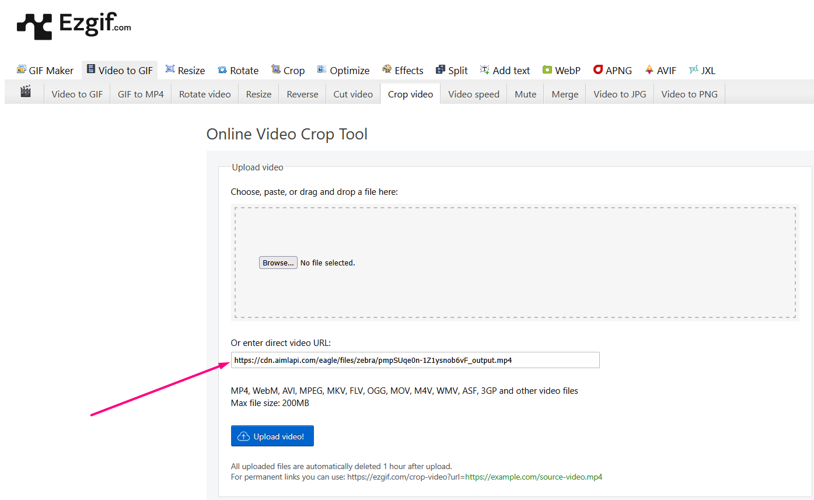
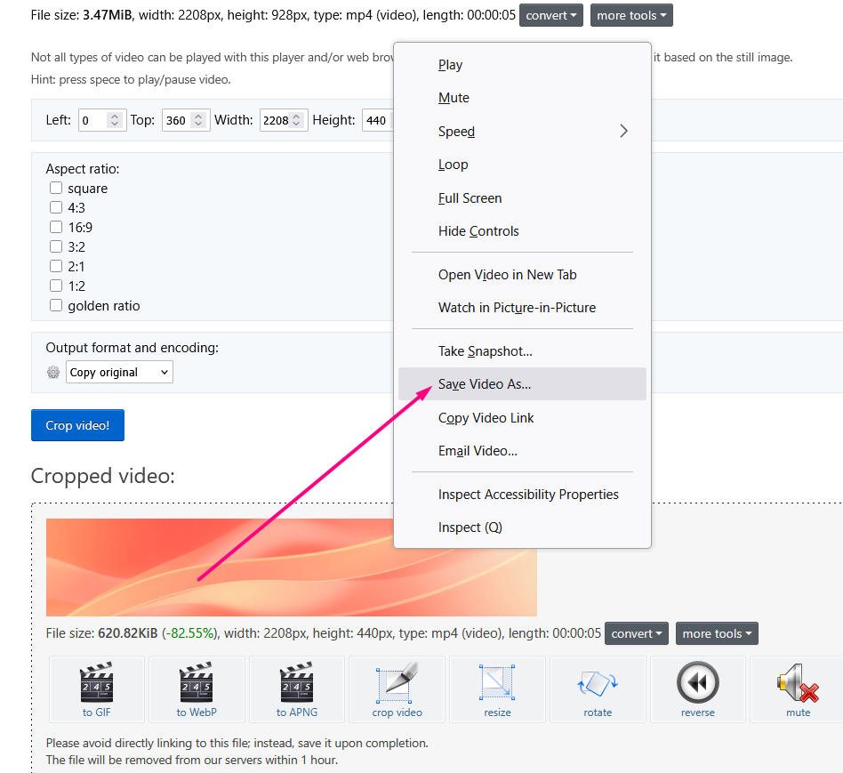
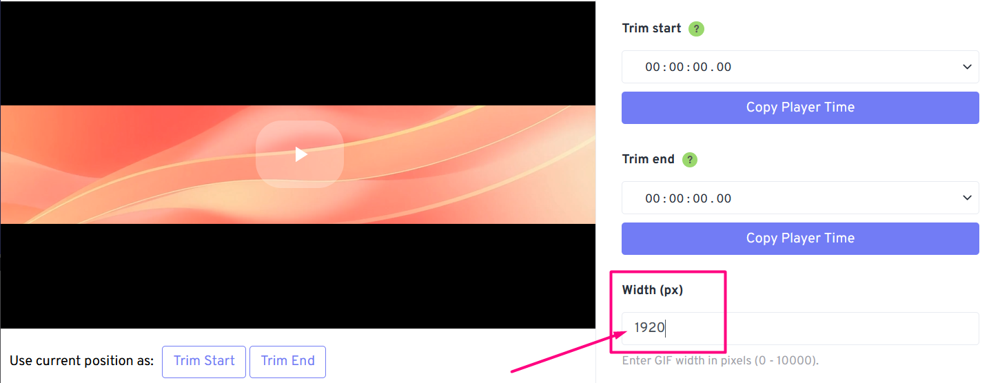
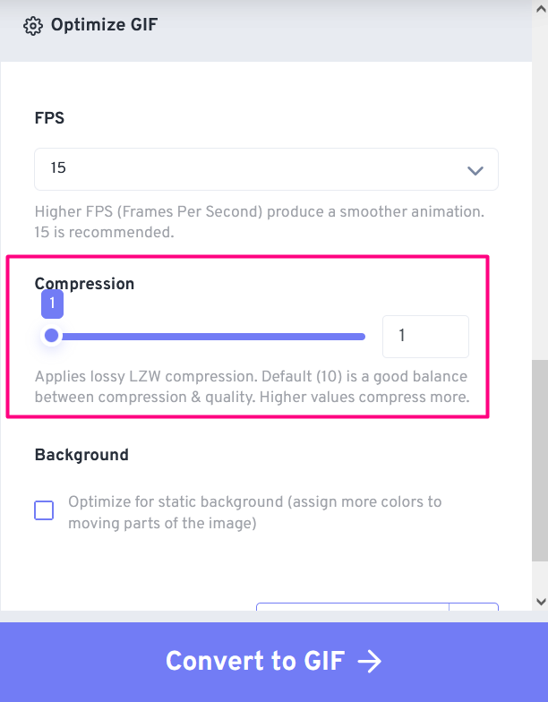

# Create a Looped GIF for a Web Banner

## Idea and Step-by-Step Plan

In this use case, we create an animated banner by combining image generation, video animation, and basic editing. Here’s the plan:

1. **Generating a Reference Image**\
   We are going to use one of our image models to create a picture based on a prompt (which is our business idea).
2. **Animating the Image**\
   We will pass the generated image to a video model that creates a smooth, perfectly looped animation.
3. **Adjusting the Video Size**\
   We will use a free online service to crop the video to the desired banner dimensions.
4. **Convert to GIF**\
   We will transform the final video into a GIF format for easy integration into websites.

## Full Walkthrough <a href="#full-walkthrough" id="full-walkthrough"></a>

1. **Generating a Reference Image**

We chose a very fast image model [**flux/schnell**](../api-references/image-models/flux/flux-schnell.md), provided a prompt for an abstract image ("_slightly dim banner with abstract lines, base colors are coral, yellow, and magenta_"), and specified dimensions as close as possible to the sizes we needed for the website.


Unfortunately, it's not always possible to simply set the exact dimensions we need due to model limitations. For example, most image models require that both height and width values be multiples of 32. \
Video models may have minimum and maximum input size restrictions, and sometimes specific requirements for the aspect ratio as well.


<details>

<summary>Code (Python)</summary>


```python
import requests


def main():
    response = requests.post(
        "https://api.aimlapi.com/v1/images/generations",
        headers={
            "Authorization": "Bearer <YOUR_AIMLAPI_KEY>",
            "Content-Type": "application/json",
        },
        json={
            "prompt": "slightly dim banner with abstract lines, base colors are coral, yellow and magenta",
            "model": "flux/schnell",
            "image_size": {
                "width": 1536,
                "height": 640
            }            
        }
    )

    data = response.json()

    print("Generation:", data)


if __name__ == "__main__":
    main()
```


</details>

<details>

<summary>Model response &#x26; Generated image preview</summary>


```json5
Generation: {'images': [{'url': 'https://cdn.aimlapi.com/eagle/files/kangaroo/k6KvRjgHGF98TanFAf89x.png', 'width': 1536, 'height': 640, 'content_type': 'image/jpeg'}], 'timings': {'inference': 0.4465899569913745}, 'seed': 2166405766, 'has_nsfw_concepts': [False], 'prompt': 'slightly dim banner with abstract lines, base colors are coral, yellow and magenta'}
```


Image preview:

<figure><figcaption></figcaption></figure>

</details>

2. **Animating the Image**

Not all video models are capable of creating looped videos (where the last frame matches the first one). We chose model [kling-video/v1.6/pro/image-to-video](../api-references/video-models/Kling-AI/v1.6-pro-image-to-video.md). It accepts the first and last frames separately, using the parameters `image_url` and `tail_image_url` respectively.

For the video generation prompt, we used _"slow fluid-like motion of patterns of the image."_ \
Feel free to experiment with effects, as long as they match the video looping!


Don't worry: the code below is long because it automates the process of requesting the ready video from the server every 10 seconds, so you don't have to do it manually. Enter your [AIMLAPI key](https://aimlapi.com/app/keys) in the second line, and all the necessary parameters are passed in the first function, `generate_video()`.


<details>

<summary>Code (Python)</summary>


```python
base_url = "https://api.aimlapi.com"
api_key = "<YOUR_AIMLAPI_KEY>"

url = f"{base_url}/v2/generate/video/kling/generation"

# Creating and sending a video generation task to the server
def generate_video():
    
    # Here's our image url
    input_url = "https://cdn.aimlapi.com/eagle/files/kangaroo/k6KvRjgHGF98TanFAf89x.png"

    payload = {
        "model": "kling-video/v1.6/pro/image-to-video",
        "image_url": input_url,  # it will be the 1st video frame
        "tail_image_url": input_url, # it will be the last video frame
        "duration": 5, # Length of the generated video in seconds
        "prompt": "slow fluid-like motion of patterns of the image" 
    }
    headers = {"Authorization": f"Bearer {api_key}", "Content-Type": "application/json"}

    response = requests.post(url, json=payload, headers=headers)
    
    if response.status_code >= 400:
        print(f"Error: {response.status_code} - {response.text}")
    else:
        response_data = response.json()
        print(response_data)
        return response_data
    

# Requesting the result of the task from the server using the generation_id
def get_video(gen_id):
    url = f"{base_url}/v2/generate/video/kling/generation"
    params = {
        "generation_id": gen_id,
    }
    
    # Insert your AIML API Key instead of <YOUR_AIMLAPI_KEY>:
    headers = {
        "Authorization": f"Bearer {api_key}", 
        "Content-Type": "application/json"
        }

    response = requests.get(url, params=params, headers=headers)
    # print("Generation:", response.json())
    return response.json()


def main():
    
    # Generate video
    gen_response = generate_video()
    gen_id = gen_response.get("id")
    print("Gen_ID:  ", gen_id)

    # Try to retrieve the video from the server every 10 sec
    if gen_id:
        start_time = time.time()

        timeout = 600
        while time.time() - start_time < timeout:
            response_data = get_video(gen_id)

            if response_data is None:
                print("Error: No response from API")
                break
        
            status = response_data.get("status")
            print("Status:", status)

            if status == "waiting" or status == "active" or  status == "queued" or status == "generating":
                print("Still waiting... Checking again in 10 seconds.")
                time.sleep(10)
            else:
                print("Processing complete:\n", response_data)
                return response_data
   
        print("Timeout reached. Stopping.")
        return None     


if __name__ == "__main__":
    main()

```


</details>

<details>

<summary>Model response &#x26; Generated video preview</summary>


```json5
{'id': '36f1c11f-e0ab-4048-9b2d-60e413ebb64c:kling-video/v1.6/pro/image-to-video', 'status': 'queued'}
Gen_ID:   36f1c11f-e0ab-4048-9b2d-60e413ebb64c:kling-video/v1.6/pro/image-to-video
Status: generating
Still waiting... Checking again in 10 seconds.
Status: generating
Still waiting... Checking again in 10 seconds.
Status: generating
Still waiting... Checking again in 10 seconds.
Status: generating
Still waiting... Checking again in 10 seconds.
Status: generating
Still waiting... Checking again in 10 seconds.
Status: generating
Still waiting... Checking again in 10 seconds.
Status: generating
Still waiting... Checking again in 10 seconds.
Status: generating
Still waiting... Checking again in 10 seconds.
Status: generating
Still waiting... Checking again in 10 seconds.
Status: generating
Still waiting... Checking again in 10 seconds.
Status: generating
Still waiting... Checking again in 10 seconds.
Status: generating
Still waiting... Checking again in 10 seconds.
Status: generating
Still waiting... Checking again in 10 seconds.
Status: generating
Still waiting... Checking again in 10 seconds.
Status: generating
Still waiting... Checking again in 10 seconds.
Status: generating
Still waiting... Checking again in 10 seconds.
Status: generating
Still waiting... Checking again in 10 seconds.
Status: generating
Still waiting... Checking again in 10 seconds.
Status: completed
Processing complete:\n {'id': '36f1c11f-e0ab-4048-9b2d-60e413ebb64c:kling-video/v1.6/pro/image-to-video', 'status': 'completed', 'video': {'url': 'https://cdn.aimlapi.com/eagle/files/zebra/pmpSUqe0n-1Z1ysnob6vF_output.mp4', 'content_type': 'video/mp4', 'file_name': 'output.mp4', 'file_size': 3643207}}
```


Very small video preview:

<div data-full-width="true"><figure><figcaption></figcaption></figure></div>

</details>

3. **Adjusting the Video Size**

For video cropping, we used the [free web service](https://ezgif.com/crop-video).

<details>

<summary>Settings</summary>

Select the **Crop video** tab and enter the URL of your video.

<figure><figcaption></figcaption></figure>

Using the preset aspect ratios or manual settings, adjust the area of your video that you want to turn into a GIF banner. Then click **Set**, and after that — **Crop video**.

<figure><figcaption></figcaption></figure>

After a few seconds of processing, a window with the cropped video fragment will appear below. Right-click on it and select **Save**.

<figure><figcaption></figcaption></figure>

</details>

4. **Convert to GIF**

For this step, we used another [free web service](https://www.freeconvert.com/convert/video-to-gif).

<details>

<summary>Settings</summary>

Click **Choose Files** and upload your cropped video. After that, the output GIF settings will become available. Set your desired width.

<figure><figcaption></figcaption></figure>

Scroll down in the settings to find the GIF compression parameter. We set it to minimum for better image quality, but for larger videos, feel free to experiment with different values. \
Then click **Convert to GIF**.

<figure><figcaption></figcaption></figure>

All that's left is to upload the finished GIF file. In the next section, you can see it in action.&#x20;

</details>

## Results

<details>

<summary>Animated Looped Web Banner</summary>

<figure><figcaption></figcaption></figure>

***

</details>

You can use such banners in the website header or overlay your promotional text on a transparent background in a website builder to make it look like a single element. \
Best of luck with your implementation!
