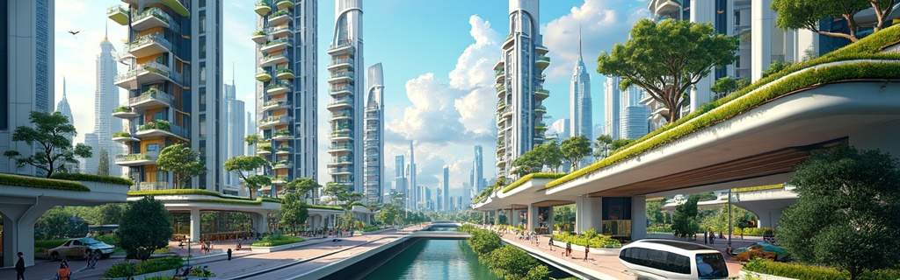

# Create Images: Illustrate an Article

## Idea and Step-by-Step Plan

This workflow allows you to generate an illustration based on a piece of text.

1. **Provide the Text Snippet**\
   Input a short descriptive or narrative passage.
2. **Choose a Chat Model and Generate a Prompt for an Image Model**\
   Select a language model (e.g., [GPT-4](../api-references/text-models-llm/OpenAI/gpt-4.md), [GPT-4o](../api-references/text-models-llm/OpenAI/gpt-4o.md)) that will process the text and suggest a visual interpretation. Ask the chat model to prepare a visual prompt. If needed, tweak the generated prompt before sending it to the image model. Then, pass that prompt to an image generation model (e.g., [DALL·E](../api-references/image-models/OpenAI/dall-e-3.md)).
3. **Generate the Image**\
   Use the selected image model to produce the final illustration and insert it into the text.

## Full Walkthrough

1. **Provide the Text Snippet**\
   As a text example, we'll provide the following one:

<details>

<summary>Expand</summary>

_**Futuristic Cities**_

_Cities of the future promise to radically transform how people live, work, and move. Instead of sprawling layouts, we’ll see vertical structures that integrate residential, work, and public spaces into single, self-sustaining ecosystems. Architecture will adapt to climate conditions, and buildings will be energy-efficient—generating power through solar panels, wind turbines, and even foot traffic._

_Transportation will be fully autonomous and silent. Streets will be freed from traffic and pollution, with ground-level space given back to pedestrians and greenery. Drones, magnetic levitation pods, and underground tunnels will handle most transit. Artificial intelligence will manage traffic flow and energy distribution in real time, ensuring maximum efficiency and comfort._

_Digital technology will be woven into every part of urban life. Smart homes will adapt to residents’ habits, while city services will respond instantly to citizen needs. Virtual and augmented reality will blur the line between physical and digital spaces. These cities won’t just be places to live—they’ll be flexible, sustainable environments where technology truly serves people._

</details>

2. **Choose a Chat Model and Generate a Prompt for an Image Model**\
   We decided to use the GPT-4o chat model to generate the prompt. As input, we’ll provide it with a brief instruction: `"Read this article and generate a short prompt for illustration generation (no need to output the words like Prompt):"` along with our text snippet from the previous step.


```python
from openai import OpenAI


def complete_chat():
    # Insert your AIML API Key instead of <YOUR_AIMLAPI_KEY>:
    api_key = '<YOUR_AIMLAPI_KEY>'
    client = OpenAI(
        base_url='https://api.aimlapi.com',
        api_key=api_key,
    )    

    response = client.chat.completions.create(
        model="gpt-4o",
        messages=[
            {
                "role": "user",
                "content": "Read this article and generate a short prompt for illustration generation (no need to output the words like Prompt): Futuristic Cities. Cities of the future promise to radically transform how people live, work, and move. Instead of sprawling layouts, we’ll see vertical structures that integrate residential, work, and public spaces into single, self-sustaining ecosystems. Architecture will adapt to climate conditions, and buildings will be energy-efficient—generating power through solar panels, wind turbines, and even foot traffic. Transportation will be fully autonomous and silent. Streets will be freed from traffic and pollution, with ground-level space given back to pedestrians and greenery. Drones, magnetic levitation pods, and underground tunnels will handle most transit. Artificial intelligence will manage traffic flow and energy distribution in real time, ensuring maximum efficiency and comfort. Digital technology will be woven into every part of urban life. Smart homes will adapt to residents’ habits, while city services will respond instantly to citizen needs. Virtual and augmented reality will blur the line between physical and digital spaces. These cities won’t just be places to live—they’ll be flexible, sustainable environments where technology truly serves people.",
            },
        ],
    )
    print(response.choices[0].message.content)

if __name__ == "__main__":
    complete_chat()
```


<details>

<summary>Response</summary>


```
A vibrant illustration of a futuristic cityscape featuring sleek vertical skyscrapers blending residential, work, and public spaces into cohesive ecosystems. Highlight eco-friendly architecture with integrated solar panels, wind turbines, and energy harvested from foot traffic. Show autonomous vehicles, including drones and magnetic levitation pods, gracefully gliding through the air and sleek underground tunnels, while lush greenery and pedestrian-friendly pathways replace conventional streets. Incorporate AI-managed digital interfaces in homes and public spaces, with augmented reality elements blurring physical and digital boundaries, creating a harmonious, tech-driven urban environment.
```


</details>

3. **Generate the Image**

Using the supporting Text-to-Image [**flux-pro**](../api-references/image-models/flux/flux-pro.md) model from [Flux](../api-references/image-models/flux/):


```python
import requests


def main():
    response = requests.post(
        "https://api.aimlapi.com/v1/images/generations",
        headers={
            # Insert your AIML API Key instead of <YOUR_AIMLAPI_KEY>:
            "Authorization": "Bearer <YOUR_AIMLAPI_KEY>",
            "Content-Type": "application/json",
        },
        json={
            "prompt": """
A vibrant illustration of a futuristic cityscape featuring sleek vertical skyscrapers blending residential, work, and public spaces into cohesive ecosystems. Highlight eco-friendly architecture with integrated solar panels, wind turbines, and energy harvested from foot traffic. Show autonomous vehicles, including drones and magnetic levitation pods, gracefully gliding through the air and sleek underground tunnels, while lush greenery and pedestrian-friendly pathways replace conventional streets. Incorporate AI-managed digital interfaces in homes and public spaces, with augmented reality elements blurring physical and digital boundaries, creating a harmonious, tech-driven urban environment.
""",
            "model": "flux-pro",
            'image_size': {
                "width": 1024,
                "height": 320
            }
        }
    )

    response.raise_for_status()
    data = response.json()

    print("Generation:", data)


if __name__ == "__main__":
    main()
```


<details>

<summary>Response &#x26; Generated Image</summary>


```json5
Generation: {'images': [{'url': 'https://cdn.aimlapi.com/squirrel/files/rabbit/Ip_fxJ-7WScVVNKOrAt11_6a31476ee9e44e74a831dfcec6e0cab3.jpg', 'width': 1024, 'height': 320, 'content_type': 'image/jpeg'}], 'timings': {}, 'seed': 550911681, 'has_nsfw_concepts': [False], 'prompt': '\nA vibrant illustration of a futuristic cityscape featuring sleek vertical skyscrapers blending residential, work, and public spaces into cohesive ecosystems. Highlight eco-friendly architecture with integrated solar panels, wind turbines, and energy harvested from foot traffic. Show autonomous vehicles, including drones and magnetic levitation pods, gracefully gliding through the air and sleek underground tunnels, while lush greenery and pedestrian-friendly pathways replace conventional streets. Incorporate AI-managed digital interfaces in homes and public spaces, with augmented reality elements blurring physical and digital boundaries, creating a harmonious, tech-driven urban environment.\n'}
```


Image (preview):

<figure><figcaption></figcaption></figure>

</details>

## Results

Let's insert the generated illustration into the text and check it out!

<details>

<summary>Illustrated Text</summary>

_**Futuristic Cities**_

_Cities of the future promise to radically transform how people live, work, and move. Instead of sprawling layouts, we’ll see vertical structures that integrate residential, work, and public spaces into single, self-sustaining ecosystems. Architecture will adapt to climate conditions, and buildings will be energy-efficient—generating power through solar panels, wind turbines, and even foot traffic._

<figure><figcaption></figcaption></figure>

_Transportation will be fully autonomous and silent. Streets will be freed from traffic and pollution, with ground-level space given back to pedestrians and greenery. Drones, magnetic levitation pods, and underground tunnels will handle most transit. Artificial intelligence will manage traffic flow and energy distribution in real time, ensuring maximum efficiency and comfort._

_Digital technology will be woven into every part of urban life. Smart homes will adapt to residents’ habits, while city services will respond instantly to citizen needs. Virtual and augmented reality will blur the line between physical and digital spaces. These cities won’t just be places to live—they’ll be flexible, sustainable environments where technology truly serves people._

</details>
