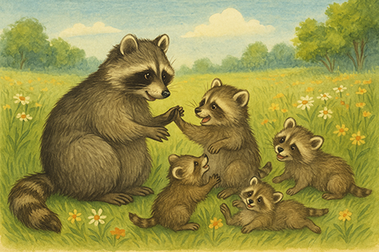

# Read Text Aloud and Describe Images: Support People with Visual Impairments

## Idea and Step-by-Step Plan

1. **Upload the PDF to extract all the text**\
   Provide a PDF file with text and illustrations to be processed by a text model and converted into an audiobook. The model reads the PDF, extracts all textual content page by page, and describes each illustration it encounters.
2. **Send the text to a TTS model to create an audio version**\
   The extracted text is sent to a TTS (Text-to-Speech) model via a second API call. The model streams the generated audio, and the script saves the audio file locally.

As a result, you will receive an audio version of the original PDF text, saved as a `.wav` file.&#x20;

***

## Full Walkthrough

1. **Upload the PDF to extract all the text**

As a text example, we'll use the following one, which you might already recognize from our [use case about illustration animation](animate-images-a-childrens-encyclopedia.md). The original PDF file you can download from [here](https://drive.google.com/file/d/1Os1k8Oi6ZkQX7HsXpxs107pAWVseSlBP/view?usp=sharing).

<details>

<summary>PDF Content Preview</summary>

***

#### _What Are Raccoons?_

_Raccoons are small, furry animals with fluffy striped tails and black “masks” around their eyes. They live in forests, near rivers and lakes—and sometimes even close to people in towns and cities. Raccoons are very clever, curious, and quick with their paws._

<figure><figcaption></figcaption></figure>

_One of the raccoon's most famous habits is "washing" its food. But raccoons aren’t really cleaning their meals. They just love to roll and rub things between their paws, especially near water. Scientists believe this helps them understand what they’re holding._

_Raccoons eat almost anything: berries, fruits, nuts, insects, fish, and even bird eggs. They're nocturnal, which means they go out at night to look for food and sleep during the day in cozy tree hollows._

<figure><figcaption></figcaption></figure>

_Raccoons are very social. Young raccoons love to play—tumbling in the grass, hiding behind trees, and exploring everything around them. And sometimes, if they feel safe, raccoons might even come closer to where people are—especially if there's a snack nearby!_

_Even though they can be a little mischievous, raccoons play an important role in nature. They help spread seeds and keep insect populations in check._

_So next time you see a raccoon, remember: it’s not just a fluffy animal—it’s a real forest explorer!_

***

</details>

We use [gpt-4o](../api-references/text-models-llm/OpenAI/gpt-4o.md) model to extract text from the document, sending the PDF as base64. Here's the code:

<details>

<summary>Code Example</summary>


```python
import base64
from openai import OpenAI


aimlapi_key = "<YOUR_AIMLAPI_KEY>"

client = OpenAI(
    base_url = "https://api.aimlapi.com",
    api_key = aimlapi_key, 
)

# Put your filename here. The file must be in the same folder as your Python script.
your_file_name = "What Are Raccoons.pdf"

with open(your_file_name, "rb") as f:
    data = f.read()

# We encode the entire file into a single string to send it to the model
base64_string = base64.b64encode(data).decode("utf-8")


def get_text():
    response = client.chat.completions.create(
    model="gpt-4o",
    messages=[
        {
            "role": "user",
            "content": [
                {
                    # Sending our file to the model
                    "type": "file",
                    "file": {
                        "filename": your_file_name,
                        "file_data": f"data:application/pdf;base64,{base64_string}",
                    }
                },
                {
                    # Providing the model with detailed instructions for extracting text and adding descriptions for illustrations
                    "type": "text",
                    "text": "Extract all the text from this file. Don't add to text something like /Page 1:/ or /Image Description/. If there's an image, insert a description of it instead, exactly in the place of text where the illustration was. The description is intended for those who cannot see, so describe accurately and vividly, but do not add anything that is not present in the image. 3 sentences per image at least. Before every image description, you can add something like: Here is an illustration. It shows... (but try to vary these announcements)",
                },
            ],
        },
    ]
)
    print(response.choices[0].message.content)
    return response.choices[0].message.content

def main():
     # Running text preparing
     our_text = get_text()
     

if __name__ == "__main__":
    main()
```


</details>

<details>

<summary>Prepared Text</summary>


```
What Are Raccoons?

Raccoons are small, furry animals with fluffy striped tails and black “masks” around their eyes. They live in forests, near rivers and lakes—and sometimes even close to people in towns and cities. Raccoons are very clever, curious, and quick with their paws.

Here is an illustration. It shows a raccoon by a small stream surrounded by rocks and grass. The raccoon has its paws in the water, seemingly engaged in its typical “washing” behavior. The setting is peaceful with green foliage in the background, creating a sense of the raccoon's natural habitat.

One of the raccoon's most famous habits is "washing" its food. But raccoons aren’t really cleaning their meals. They just love to roll and rub things between their paws, especially near water. Scientists believe this helps them understand what they’re holding. Raccoons eat almost anything: berries, fruits, nuts, insects, fish, and even bird eggs. They're nocturnal, which means they go out at night to look for food and sleep during the day in cozy tree hollows.

Here is another illustration. It depicts a family of raccoons in a grassy area, with three young raccoons playfully interacting. The adult raccoon is sitting nearby, seemingly watching over the young ones. The background is filled with green trees and grass, giving the scene a lively and natural atmosphere.

Raccoons are very social. Young raccoons love to play—tumbling in the grass, hiding behind trees, and exploring everything around them. And sometimes, if they feel safe, raccoons might even come closer to where people are—especially if there's a snack nearby! Even though they can be a little mischievous, raccoons play an important role in nature. They help spread seeds and keep insect populations in check. So next time you see a raccoon, remember: it’s not just a fluffy animal—it’s a real forest explorer!
```


</details>

2. **Send the text to a TTS model to create an audio version**

We decided to implement two Text-to-Speech processing options to let our models compete!

We compared a specialized TTS model ([Aura](../api-references/speech-voice-models/tts/Deepgram/aura.md) by Deepgram) with a chat model that has audio capabilities ([GPT-4o Audio Preview](../api-references/text-models-llm/openai/gpt-4o-audio-preview.md) by OpenAI).&#x20;

For the chat model, we had to tweak the settings — like increasing [`max_completion_tokens`](#user-content-fn-1)[^1] — and come up with a smart prompt that left no room for the model to creatively rephrase the original text: _"You are just a speaker. You read text aloud without any distortions or additions. Read from the very beginning, including all the headers"_.

The TTS model was much easier to use: just pick a voice and send the text.

Below, you'll find the complete Python code for each option (including the text generation part). Under each example, you can listen to the audio output  (saved under the name `original_pdf_filename.wav`).

<details>

<summary>TTS Response</summary>


```python
Audio saved to: c:\Users\user\Documents\Python Scripts\What Are Raccoons.pdf.wav
```


</details>

## Full Code Example

### TTS model: [Aura](../api-references/speech-voice-models/tts/Deepgram/aura.md)

:white\_check\_mark: Advantages of the model: it's more affordable and provides a total of 12 voices, covering both male and female types.

<details>

<summary>Code</summary>

<pre class="language-python" data-overflow="wrap"><code class="lang-python">from openai import OpenAI
import base64
import os

aimlapi_key = "&#x3C;YOUR_AIMLAPI_KEY>"

client = OpenAI(
    base_url = "https://api.aimlapi.com",
    api_key = aimlapi_key, 
)
<strong>
</strong># Put your filename here. The file must be in the same folder as your Python script.
your_file_name = "What Are Raccoons.pdf"

with open(your_file_name, "rb") as f:
    data = f.read()

# We encode the entire file into a single string to send it to the model
base64_string = base64.b64encode(data).decode("utf-8")


def get_text():
    response = client.chat.completions.create(
    model="gpt-4o",
    messages=[
        {
            "role": "user",
            "content": [
                {
                    # Sending our file to the model
                    "type": "file",
                    "file": {
                        "filename": your_file_name,
                        "file_data": f"data:application/pdf;base64,{base64_string}",
                    }
                },
                {
                    # Providing the chat model with detailed instructions for extracting text and adding descriptions for illustrations
                    "type": "text",
                    "text": "Extract all the text from this file. Don't add to text something like /Page 1:/ or /Image Description/. If there's an image, insert a description of it instead, exactly in the place of text where the illustration was. The description is intended for those who cannot see, so describe accurately and vividly, but do not add anything that is not present in the image. 3 sentences per image at least. Before every image description, you can add something like: Here is an illustration. It shows... (but try to vary these announcements)",
                },
            ],
        },
    ]
)
    print(response.choices[0].message.content)
    return response.choices[0].message.content


def read_aloud(text_to_read_aloud):
    url = "https://api.aimlapi.com/v1/tts"
    headers = {
        "Authorization": f"Bearer {aimlapi_key}",
    }
    payload = {
        "model": "#g1_aura-zeus-en",
        "text": text_to_read_aloud,
    }

    response = requests.post(url, headers=headers, json=payload, stream=True)
    
    result = os.path.abspath(f"{your_file_name}.wav")

    with open(result, "wb") as write_stream:
        for chunk in response.iter_content(chunk_size=8192):
            if chunk:
                write_stream.write(chunk)

    print("Audio saved to:", result)


def main():
     # Running text extraction and TTS process
     our_text = get_text()
     read_aloud(our_text)
     

if __name__ == "__main__":
    main()
</code></pre>

</details>

Here’s the original audio, generated by the Aura model — you can listen to it at [this link](https://drive.google.com/file/d/1b0zsKaPrWIsuT6xh7hwfwfUZNTlrOUPZ/view?usp=sharing).

***

### TTS model: [gpt-4o-audio-preview](../api-references/text-models-llm/openai/gpt-4o-audio-preview.md)

:white\_check\_mark: Advantages of the model: although only a single voice is available, it features much more natural intonation and a slower, more pleasant reading style that suits audiobooks well.

<details>

<summary>Code</summary>


```python
from openai import OpenAI
import base64
import os

aimlapi_key = "YOUR_AIMLAPI_KEY"

client = OpenAI(
    base_url = "https://api.aimlapi.com",
    api_key = aimlapi_key, 
)


# Put your filename here. The file must be in the same folder as your Python script
your_file_name = "What Are Raccoons.pdf"

with open(your_file_name, "rb") as f:
    data = f.read()

# We encode the entire file into a single string to send it to the model
base64_string = base64.b64encode(data).decode("utf-8")


def get_text():
    response = client.chat.completions.create(
    model="gpt-4o",
    messages=[
        {
            "role": "user",
            "content": [
                {
                    # Sending our file to the model
                    "type": "file",
                    "file": {
                        "filename": your_file_name,
                        "file_data": f"data:application/pdf;base64,{base64_string}",
                    }
                },
                {
                    # Providing the chat model with detailed instructions for extracting text and adding descriptions for illustrations
                    "type": "text",
                    "text": "Extract all the text from this file. Don't add to text something like /Page 1:/ or /Image Description/. If there's an image, insert a description of it instead, exactly in the place of text where the illustration was. The description is intended for those who cannot see, so describe accurately and vividly, but do not add anything that is not present in the image. 3 sentences per image at least. Before every image description, you can add something like: Here is an illustration. It shows... (but try to vary these announcements)",
                },
            ],
        },
    ]
)
    print(response.choices[0].message.content)
    return response.choices[0].message.content


def read_aloud(text_to_read_aloud):
    response = client.chat.completions.create(
        model="gpt-4o-audio-preview",
        modalities=["text", "audio"],
        audio={"voice": "alloy", "format": "wav"},
        messages=[
            {
                # Providing the TTS model with detailed instructions for reading the text aloud
                "role": "system",
                "content": "You are just a speaker. You read text aloud without any distortions or additions. Read from the very beginning, including all the headers"
            },
            {
                "role": "user",
                "content": text_to_read_aloud
            }
        ],
        max_tokens=6000,  
    )

    wav_bytes = base64.b64decode(response.choices[0].message.audio.data)
    with open(f"{your_file_name}.wav", "wb") as f:
        f.write(wav_bytes)
    dist = os.path.abspath(f"{your_file_name}.wav")
    print("Audio saved to:", dist)


def main():
     # Running text extraction and TTS process
     our_text = get_text()
     read_aloud(our_text)
     

if __name__ == "__main__":
    main()
```


</details>

You can listen to the original audio, generated by the GPT-4o Audio Preview model, at [this link](https://drive.google.com/file/d/1PBK9HpDDywo93OV6KDPZWFntQbs_VOTo/view?usp=sharing).

***

Copy the code, insert your AIMLAPI key, specify the path to your document in the code, and give it a try yourself!

[^1]: A more recent name for the older, now deprecated OpenAI parameter `max_tokens`. Both are currently supported in parallel and perform the same function.
